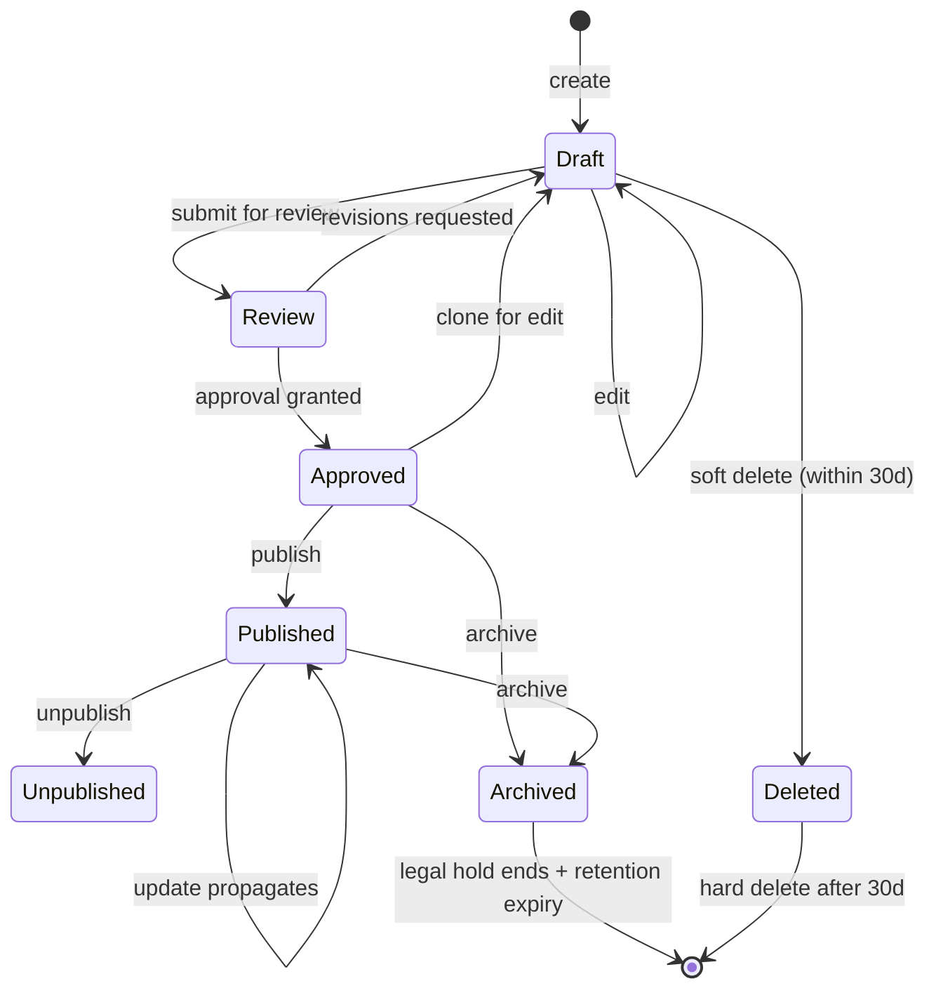
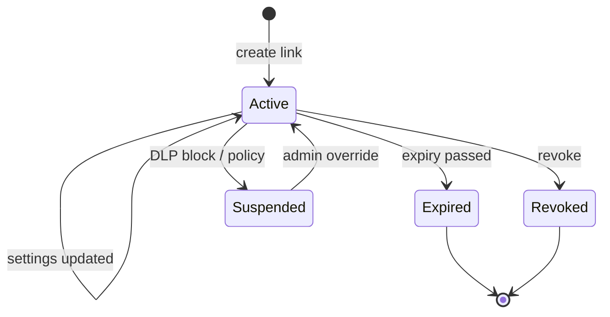
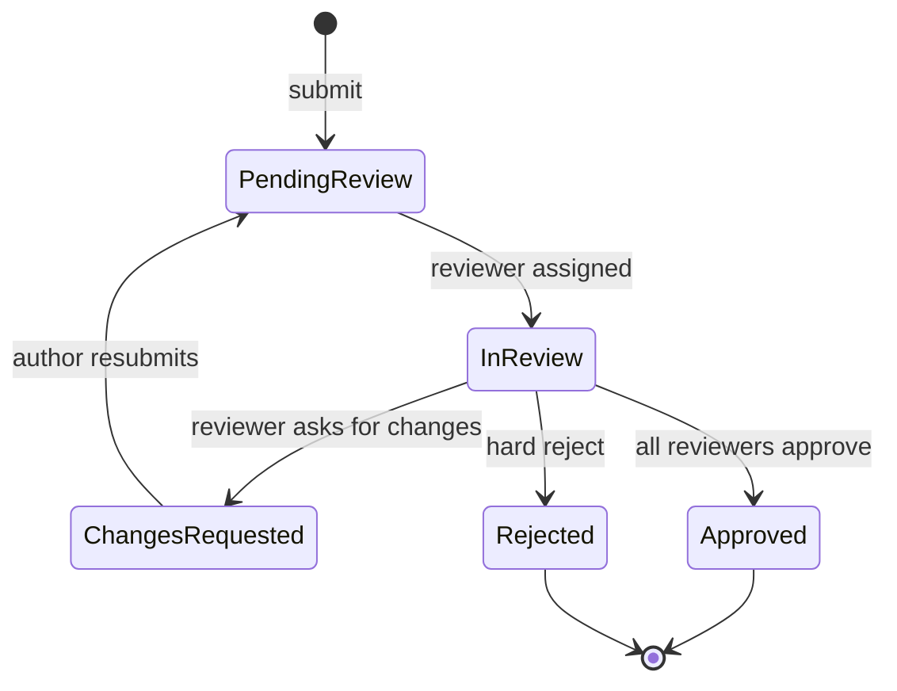
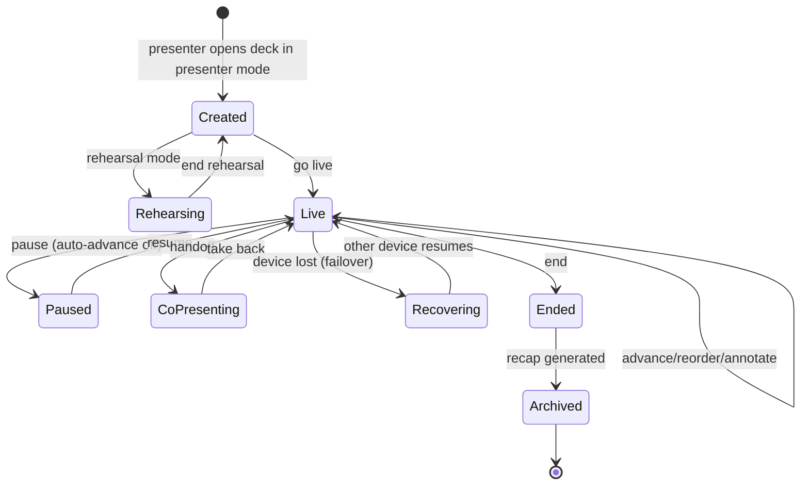
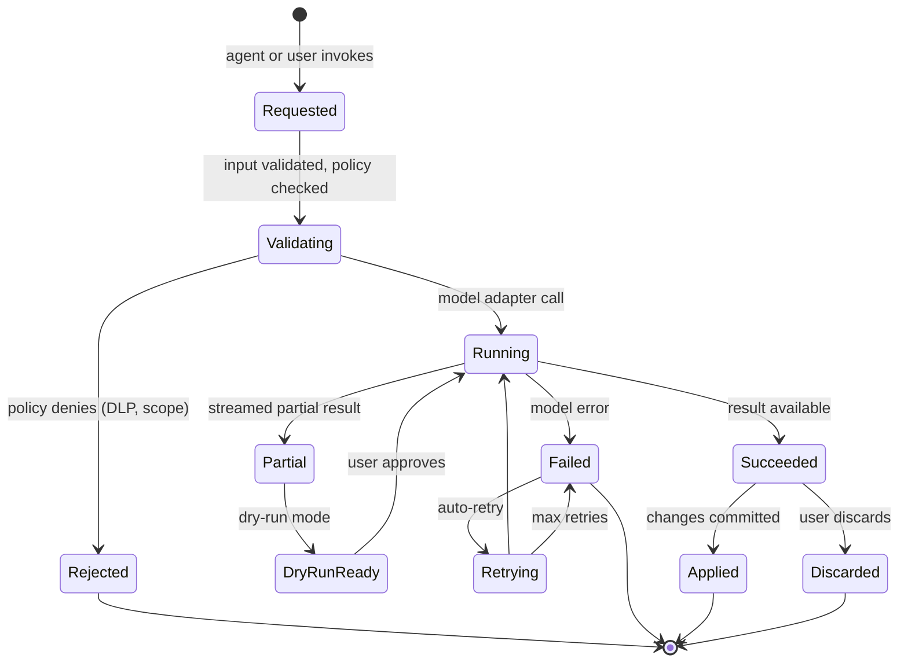

# 02 — Requirements Engineering

> **Status:** Canonical FR/NFR list for engineering. Feature-domain docs (under `docs/`) own design details; this document owns _what must be true_. Backed by `feature-list.md` (the source list of 240 features). Every FR ID and NFR ID is stable; new IDs prepend, never reuse.
> **Assumptions:**
>
> - All 240 features (1-219, 221-240) from `feature-list.md` remain in scope (see `10-project-team-planning.md` for staged delivery).
> - Feature ranges → FR IDs mapping is stable: ranges CAN (1-22), CMP (23-36), THM (37-47), DAT (48-64), MED (65-84), ANI (85-95), PRO (96-107), AI (108-125), PRE (126-141), AUD (142-154), PUB (155-168), ANL (169-178), COL (179-192), ENT (193-204), NOV (205-219), AGT (221-240).
> - Acceptance criteria Given/When/Then format is mandatory.
> - State machines apply to: CRDT sync, multiplayer, approval workflow, deck branching/merge, publish pipeline (5 named in §2.6).
>   **Owner:** Domain PM (per row) + tech lead; cross-domain FRs owned by principal architect.
>   **Last reviewed:** 2026-07-29.

---

> **Purpose:** turn every feature in `feature-list.md` into a traceable, testable, contract-shaped requirement, with state machines for the five systems that have one, full NFRs, acceptance-criteria templates, and explicit release gates.
> **Source of truth:** this document is the canonical FR/NFR list for engineering. Feature-domain docs (`docs/editor-canvas.md`, `docs/live-data-charts.md`, etc.) own _design_ details; this document owns _what must be true_.
> **Cross-references:** `01-problem-product-definition.md` (personas, success metrics), `03-ux-interface-planning.md` (flows), `04-system-architecture.md` (contracts), `05-data-database-design.md` (entities), `06-technology-stack.md` (choices), `07-security-planning.md` (controls), `09-testing-strategy.md` (verification).

---

## 2.0 Conventions

- **FR IDs:** `FR-<domain>-<n>`. Domains: `CAN` (canvas), `CMP` (components), `THM` (theming), `DAT` (live data/charts), `MED` (3D/media), `ANI` (animation), `PRO` (prototyping), `AI` (copilot), `PRE` (presenter), `AUD` (audience), `PUB` (publishing), `ANL` (analytics), `COL` (collaboration), `ENT` (enterprise), `NOV` (novel/frontier), `AGT` (agentic).
- **Feature ranges** map to FR IDs by stable ranges so reviewers can audit traceability.
- **NFR IDs:** `NFR-<area>-<n>`. Areas: `PERF`, `SCALE`, `AVAIL`, `DURA`, `OFFL`, `A11Y`, `I18N`, `SEC`, `PRIV`, `OBS`, `MAINT`, `PORT`.
- **Acceptance criteria** use **Given/When/Then** with measurable thresholds.
- **State machines** are described in §2.6.
- **Domain events** are described in §2.7.

---

## 2.1 Functional Requirements by Domain

### 2.1.1 Editor & Canvas (#1–22) → `docs/editor-canvas.md`

| FR ID     | Feature # | Requirement                                                                      | Acceptance criterion (Given/When/Then)                                                                                                                                                                               |
| --------- | --------- | -------------------------------------------------------------------------------- | -------------------------------------------------------------------------------------------------------------------------------------------------------------------------------------------------------------------- |
| FR-CAN-01 | #1        | Infinite canvas with 16:9/4:3/9:16/ultrawide/LED-wall custom-ratio slide frames. | Given a workspace, when a user inserts a slide, then the system creates a slide frame at the chosen ratio and the canvas accepts pan/zoom outside frame bounds.                                                      |
| FR-CAN-02 | #2        | Drag-and-drop WYSIWYG with pixel-perfect and snap-to-grid modes.                 | Given a snap-to-grid setting of 8px, when a user drags an element, then its x/y snaps to multiples of 8 unless Alt is held (pixel-perfect override).                                                                 |
| FR-CAN-03 | #3        | Smart alignment guides and spacing hints.                                        | Given three selected rectangles, when the user drags one, then yellow guides appear when any edge aligns with another; spacing hints show pixel gaps to nearest neighbors.                                           |
| FR-CAN-04 | #4        | Multi-select, group/ungroup, lock, hide layers.                                  | Given a multi-selection, when the user presses ⌘G, then a group is created; ⌘⇧G ungroups. Lock prevents selection via canvas but keeps the layer selectable in the layers panel.                                     |
| FR-CAN-05 | #5        | Layers panel with drag-reorder, search, filter.                                  | Given a deck with 200 layers, when the user types "chart" in the search box, then the panel shows only matching layers within 100ms.                                                                                 |
| FR-CAN-06 | #6        | Frames-within-frames (nested components).                                        | Given a frame containing a button and label, when the user converts it to a component, then instances of the component exist with independent overrides.                                                             |
| FR-CAN-07 | #7        | Auto-layout containers (flexbox-like reflow).                                    | Given an auto-layout frame with horizontal direction and 8px gap, when a child resizes, then siblings reflow without overlap; padding is honored.                                                                    |
| FR-CAN-08 | #8        | Constraints (pin to edges/center for responsive scaling).                        | Given a frame with a child pinned top-right, when the frame is resized, then the child's top and right distance to frame edges is preserved.                                                                         |
| FR-CAN-09 | #9        | Vector pen tool, boolean ops, shape editing.                                     | Given two overlapping vector paths, when the user applies Union, then the result is a single closed path with merged geometry.                                                                                       |
| FR-CAN-10 | #10       | Rulers, guides, customizable grids (columns, baseline).                          | Given a 12-column grid, when the user drags a guide, then it snaps to the nearest column boundary unless Alt is held.                                                                                                |
| FR-CAN-11 | #11       | Zoom 2%–6400% with GPU-accelerated rendering.                                    | Given a deck with 10k elements, when the user zooms from 100% to 6400%, then the canvas maintains ≥30 FPS on a mid-tier laptop.                                                                                      |
| FR-CAN-12 | #12       | Unlimited undo/redo with visual history timeline.                                | Given 1,000 sequential edits, when the user opens history, then they can step to any past state with a visual preview; the timeline loads in ≤200ms.                                                                 |
| FR-CAN-13 | #13       | Keyboard-first workflow + command palette (Cmd+K).                               | Given any focus state, when the user presses Cmd+K, then the palette opens with fuzzy search over all actions within 100ms.                                                                                          |
| FR-CAN-14 | #14       | Copy/paste styles, format painter, paste-to-match-destination.                   | Given a styled text element, when the user uses format painter on a second element, then font/family/color/spacing are copied; paste-to-match-destination additionally overrides size/position to match destination. |
| FR-CAN-15 | #15       | Eyedropper color picking from anywhere on screen.                                | Given a cursor over an off-canvas color, when the user activates eyedropper, then the screen is sampled and the color is applied.                                                                                    |
| FR-CAN-16 | #16       | Right-click contextual menus per element type.                                   | Given a chart element, when right-clicked, then menu items "Edit data," "Duplicate," "Bring forward," "Send backward," "Reset to default style," "Convert to image" appear.                                          |
| FR-CAN-17 | #17       | Multiplayer live editing with cursors, selections, presence.                     | Given two users editing the same slide, when one moves an element, then the other sees a ghost move at ≤120ms p95 round-trip.                                                                                        |
| FR-CAN-18 | #18       | Cursor chat and pointer ping.                                                    | Given a multiplayer session, when user A pings user B's cursor, then B's screen shows a brief animation and "Ping from A" toast.                                                                                     |
| FR-CAN-19 | #19       | Branching and merging decks (Git-like).                                          | Given a deck on main, when user A creates branch "investor-pitch-q3," then edits there, then opens a merge request, then the system produces a 3-way visual diff; conflicts resolve via element-level merge UI.      |
| FR-CAN-20 | #20       | Version history with named checkpoints, diffs, restore.                          | Given 50 named checkpoints, when the user opens history, then they can diff any two; restore creates a new checkpoint rather than deleting history.                                                                  |
| FR-CAN-21 | #21       | Offline editing with CRDT-based conflict-free sync.                              | Given no network, when the user edits, then changes are persisted to local CRDT store and synced on reconnect with zero data loss.                                                                                   |
| FR-CAN-22 | #22       | Autosave every keystroke; no save button.                                        | Given any edit, when the user pauses typing ≥400ms or moves focus, then the change is committed to durable storage and to CRDT sync within 250ms p95.                                                                |

### 2.1.2 Components & Templates (#23–36) → `docs/components-templates.md`

| FR ID     | Feature # | Requirement                                                                                               | Acceptance criterion                                                                                                                                                                  |
| --------- | --------- | --------------------------------------------------------------------------------------------------------- | ------------------------------------------------------------------------------------------------------------------------------------------------------------------------------------- |
| FR-CMP-23 | #23       | 10,000+ pre-built components across cards/stats/timelines/org charts/quotes/agendas/comparisons/roadmaps. | Given the gallery, when the user searches "timeline," then ≥10 curated components render with previews.                                                                               |
| FR-CMP-24 | #24       | Component variants (light/dark, sizes, states).                                                           | Given a button component, when the user switches variant to "primary/dark/disabled," then props update and visuals change.                                                            |
| FR-CMP-25 | #25       | Smart components with editable props panel.                                                               | Given a KPI card, when the user opens the props panel, then fields for value, trend, icon, unit appear; changing value updates only the value cell, not layout.                       |
| FR-CMP-26 | #26       | User-created components.                                                                                  | Given a selection, when the user clicks "Create component," then a master is saved and any instances propagate updates unless overridden.                                             |
| FR-CMP-27 | #27       | Shared team component libraries with publish/subscribe.                                                   | Given a team library "Brand Kit v3," when a designer publishes a new component, then subscribed orgs receive a notification and can accept/reject.                                    |
| FR-CMP-28 | #28       | Community marketplace with creator revenue share.                                                         | Given a creator listing a theme, when a buyer purchases, then the system splits revenue per the marketplace fee schedule and pays out via approved aggregator (BD) or Stripe Connect. |
| FR-CMP-29 | #29       | Template gallery by use case.                                                                             | Given a use case filter "pitch deck," then ≥20 templates render with thumbnails, previews, and metadata.                                                                              |
| FR-CMP-30 | #30       | Full deck templates with placeholder logic.                                                               | Given a template with {{Company Name}} placeholders, when the user fills the form, then every occurrence is replaced; unfilled placeholders remain visible and flagged.               |
| FR-CMP-31 | #31       | Section templates (insert a complete section).                                                            | Given a section template "Financials," when inserted, then a 5-slide section appears at the insertion point with editable placeholders.                                               |
| FR-CMP-32 | #32       | Icon library (100k+ icons, recolorable).                                                                  | Given the icon picker, when the user types "arrow," then ≥30 results render; recolor changes stroke and fill.                                                                         |
| FR-CMP-33 | #33       | Stock photo/video/illustration integrations (Unsplash, Pexels, etc.).                                     | Given a search for "office," then ≥50 results load with license indicators (free/commercial).                                                                                         |
| FR-CMP-34 | #34       | GIF and Lottie animation library.                                                                         | Given a Lottie file, when inserted, then it plays inline with controls; frame-step is supported.                                                                                      |
| FR-CMP-35 | #35       | Sticker/annotation packs.                                                                                 | Given a sticker pack, when applied, then the sticker can be recolored, resized, and sent to back/front.                                                                               |
| FR-CMP-36 | #36       | Brand-locked templates (admin-marked non-editable regions).                                               | Given a brand-locked region, when a non-admin tries to edit, then the system blocks the edit and shows a tooltip; admins can override with audit log entry.                           |

### 2.1.3 Theming & Branding (#37–47) → `docs/theming-branding.md`

| FR ID     | Feature # | Requirement                                                              | Acceptance criterion                                                                                                                                             |
| --------- | --------- | ------------------------------------------------------------------------ | ---------------------------------------------------------------------------------------------------------------------------------------------------------------- |
| FR-THM-37 | #37       | Design token system (color, type, spacing, radii).                       | Given a token set, when the user updates `color.brand.primary`, then every element bound to that token re-themes within the same render frame.                   |
| FR-THM-38 | #38       | One-click theme swap.                                                    | Given a deck, when the user applies theme "Aurora Dark," then all token-bound elements re-theme; layout is preserved.                                            |
| FR-THM-39 | #39       | Brand kit (logos, palettes, fonts, imagery rules).                       | Given a brand kit, when applied to a new deck, then colors, fonts, and approved logos are auto-applied; non-kit fonts are flagged.                               |
| FR-THM-40 | #40       | Brand extraction from URL (AI).                                          | Given a URL, when the user clicks "Extract brand," then the system returns colors, fonts, logo candidates with confidence scores; user confirms before applying. |
| FR-THM-41 | #41       | Multi-brand support (agency client brands).                              | Given an agency workspace with 5 brands, when the user creates a deck, then they pick which brand kit applies.                                                   |
| FR-THM-42 | #42       | Custom font upload with fallback and licensing checks.                   | Given a font upload, when accepted, then license metadata is required; if missing, a warning is shown; fallback fonts are configured.                            |
| FR-THM-43 | #43       | Dark/light variants from one source.                                     | Given a theme, when the user generates a dark variant, then contrast ratios are auto-checked against WCAG AA.                                                    |
| FR-THM-44 | #44       | Accessibility-aware theming (contrast checks, colorblind-safe palettes). | Given a token set with two colors, when the user pairs them, then the system reports contrast ratio; suggestions for AA-compliant pairs are shown.               |
| FR-THM-45 | #45       | Theme marketplace with live preview.                                     | Given a marketplace theme, when previewed, then a sample deck renders with the theme applied in <2s.                                                             |
| FR-THM-46 | #46       | Style linting (off-brand colors/fonts).                                  | Given a deck, when the user runs lint, then a report lists off-brand elements; one-click fixes are offered where safe.                                           |
| FR-THM-47 | #47       | Per-slide theme overrides with inheritance.                              | Given a slide override, when applied, then child elements inherit unless explicitly pinned to the deck theme.                                                    |

### 2.1.4 Live Data & Charts (#48–64) → `docs/live-data-charts.md`

| FR ID     | Feature # | Requirement                                                                                                                         | Acceptance criterion                                                                                                                                                 |
| --------- | --------- | ----------------------------------------------------------------------------------------------------------------------------------- | -------------------------------------------------------------------------------------------------------------------------------------------------------------------- |
| FR-DAT-48 | #48       | Live data connections (Sheets, Excel, Airtable, Notion, Postgres, MySQL, BigQuery, Snowflake, REST, GraphQL).                       | Given a configured source, when the deck opens, then data is fetched with the cache policy; auth secrets live in the data-binding service, never exposed to viewers. |
| FR-DAT-49 | #49       | Charts alive during presentation (filter, drill, hover, zoom).                                                                      | Given a live chart on stage, when the presenter hovers a data point, then a tooltip appears with the underlying value and any pinned annotations.                    |
| FR-DAT-50 | #50       | Full chart library (bar, line, area, pie, scatter, funnel, sankey, treemap, heatmap, waterfall, gauge, radar, candlestick, bullet). | Given a chart type filter, then each supported chart type renders a sample.                                                                                          |
| FR-DAT-51 | #51       | Data refresh on stage ("as of this morning").                                                                                       | Given presenter mode open, when ≥60s elapses or user clicks refresh, then data is re-fetched; a "last refreshed at HH:MM" indicator is shown.                        |
| FR-DAT-52 | #52       | Cross-chart filtering (dashboard behavior inside a slide).                                                                          | Given a master chart and a dependent chart on the same slide, when the user clicks a region on the master, then the dependent chart filters within 200ms.            |
| FR-DAT-53 | #53       | What-if sliders (financial model recalculation).                                                                                    | Given a slider bound to a formula cell, when the slider moves, then every dependent chart and number ticker updates live.                                            |
| FR-DAT-54 | #54       | Formula engine (spreadsheet-style computed fields).                                                                                 | Given a formula `=SUM(B2:B10)*1.15`, then it evaluates correctly with cell references and arithmetic; cycle errors are reported.                                     |
| FR-DAT-55 | #55       | Data tables with sorting, pagination, conditional formatting, sparklines.                                                           | Given a data table, when the user clicks a column header, then sort toggles ASC/DESC; pagination loads 50 rows per page by default.                                  |
| FR-DAT-56 | #56       | Mock data generator by schema.                                                                                                      | Given a schema `name: string, age: int`, when the user generates mock data, then 100 realistic rows appear with locale-aware names.                                  |
| FR-DAT-57 | #57       | Scenario switcher (Base/Bull/Bear).                                                                                                 | Given three scenario datasets, when the user toggles scenario, then every dependent number/chart/text callout swaps datasets within 300ms.                           |
| FR-DAT-58 | #58       | Number ticker animations and animated chart builds.                                                                                 | Given a chart, when presenter mode enters, then bars animate from 0 to value over a configurable duration with physics easing.                                       |
| FR-DAT-59 | #59       | Data annotations pinned to data points.                                                                                             | Given a chart, when the user pins an annotation, then hovering the data point shows the note; annotations are stored on the deck, not the chart type.                |
| FR-DAT-60 | #60       | Threshold alerts (KPI restyle).                                                                                                     | Given a KPI with a red threshold, when the live value crosses, then the KPI callout restyles (color, badge, optional sound).                                         |
| FR-DAT-61 | #61       | Currency/unit localization on the fly.                                                                                              | Given a deck with USD/EUR variants, when the user picks a locale, then all numbers re-render in that currency with locale-aware grouping and decimal marks.          |
| FR-DAT-62 | #62       | Embedded live dashboards (Looker, Tableau, Power BI, Grafana).                                                                      | Given an embed URL, when inserted, then it renders in a sandboxed iframe with auth passthrough (signed URL or token exchange).                                       |
| FR-DAT-63 | #63       | Stale-data indicators (last synced).                                                                                                | Given a chart, when the source is older than the freshness threshold, then a "stale as of HH:MM" badge appears.                                                      |
| FR-DAT-64 | #64       | Data source access control (viewers never see raw credentials).                                                                     | Given a viewer, when they open the deck, then the system never exposes source credentials; only the rendered values and approved embeddings are delivered.           |

### 2.1.5 3D, Motion & Rich Media (#65–84) → `docs/3d-motion-media.md`

| FR ID     | Feature # | Requirement                                                    | Acceptance criterion                                                                                                                          |
| --------- | --------- | -------------------------------------------------------------- | --------------------------------------------------------------------------------------------------------------------------------------------- |
| FR-MED-65 | #65       | Native 3D embedding (glTF/GLB/USDZ).                           | Given a GLB file, when inserted, then it renders in the canvas with controls to rotate/zoom; annotations are stored as scene-graph objects.   |
| FR-MED-66 | #66       | 3D scene editor (lighting, camera, materials, env maps).       | Given a 3D scene, when the user opens the editor, then they can adjust lights and cameras with live preview.                                  |
| FR-MED-67 | #67       | Camera keyframes between slides.                               | Given two slides sharing a 3D object, when the user sets a camera keyframe on each, then the inter-slide transition is a smooth camera move.  |
| FR-MED-68 | #68       | 3D data viz (globe, 3D bars, point clouds, network).           | Given a globe plot dataset, when inserted, then it renders with WebGL/WebGPU and pan/zoom controls.                                           |
| FR-MED-69 | #69       | Exploded-view animations.                                      | Given an assembly model, when the user triggers explode, then parts separate along defined axes with easing.                                  |
| FR-MED-70 | #70       | CAD import (STEP/FBX → web 3D).                                | Given a STEP file, when imported, then it is converted to glTF with material approximation; conversion status is shown.                       |
| FR-MED-71 | #71       | Physics-enabled elements.                                      | Given physics-enabled objects, when the presenter triggers "release," then objects fall/bounce/collide with configurable gravity.             |
| FR-MED-72 | #72       | Particle systems and shader backgrounds.                       | Given a shader background, when applied, then it animates with a configurable max-FPS cap to avoid burning GPU.                               |
| FR-MED-73 | #73       | Scroll/click-driven 3D storytelling.                           | Given a scroll-mode deck with 3D scenes, when the user scrolls, then the camera moves along a defined path.                                   |
| FR-MED-74 | #74       | AR handoff (QR → phone AR).                                    | Given a 3D model, when the user clicks "View in AR," then a QR appears that opens the model in the phone's AR viewer.                         |
| FR-MED-75 | #75       | Video editing (trim, crop, speed, captions, chapters).         | Given an inserted video, when the user edits, then trim handles appear; captions can be authored inline; chapters appear as timeline markers. |
| FR-MED-76 | #76       | Video that plays segments per click.                           | Given a video with chapters, when the presenter advances, then the next segment plays from the chapter start.                                 |
| FR-MED-77 | #77       | Background video with smart text contrast.                     | Given a video background with overlay text, when contrast is insufficient, then the system suggests a scrim or shifts text to a safe area.    |
| FR-MED-78 | #78       | Audio tracks, voiceover per slide, ambient sounds.             | Given a slide with voiceover, when presenter mode enters, then the audio plays; volume and ducking are configurable.                          |
| FR-MED-79 | #79       | Lottie/Rive interactive vector animations with state machines. | Given a Lottie file, when the user adds a state, then the animation transitions on the configured trigger.                                    |
| FR-MED-80 | #80       | Screen-recording capture (in-editor).                          | Given a recording session, when the user clicks stop, then the clip appears in the media library.                                             |
| FR-MED-81 | #81       | Live app embedding (iframe sandbox).                           | Given an embed URL, when inserted, then it renders in a sandboxed iframe with capability tokens; CSP is enforced.                             |
| FR-MED-82 | #82       | Code blocks (highlight, line-step, runnable JS sandboxes).     | Given a JS code block, when the user clicks "Run," then it executes in a sandboxed iframe with a time/memory cap; output is shown below.      |
| FR-MED-83 | #83       | Math/LaTeX rendering.                                          | Given a LaTeX expression, when the user types it, then KaTeX/MathJax renders it.                                                              |
| FR-MED-84 | #84       | Interactive maps (zoom/pan/markers/choropleths).               | Given a map layer, when the user inserts it, then pan/zoom and markers work with live data binding.                                           |

### 2.1.6 Animation & Transitions (#85–95) → `docs/animation-transitions.md`

| FR ID     | Feature # | Requirement                                                        | Acceptance criterion                                                                                                              |
| --------- | --------- | ------------------------------------------------------------------ | --------------------------------------------------------------------------------------------------------------------------------- |
| FR-ANI-85 | #85       | Timeline-based animation editor (keyframe, easing, delay).         | Given a timeline, when the user adds a keyframe at t=0 and t=1s, then the property interpolates with the chosen easing curve.     |
| FR-ANI-86 | #86       | Magic move between slides.                                         | Given two slides with a shared element id, when transitioning, then position/size/style morph with a physics-based curve.         |
| FR-ANI-87 | #87       | Entrance/exit/emphasis presets with physics easing.                | Given an emphasis preset, when applied, then a default duration/easing is set; the user can override.                             |
| FR-ANI-88 | #88       | Per-element triggers (on click, enter, hover, data change, timer). | Given a chart, when the data changes, then a configured animation triggers.                                                       |
| FR-ANI-89 | #89       | Staggered list/grid reveals.                                       | Given a 10-item grid, when stagger is applied, then items reveal with 50ms offset by default.                                     |
| FR-ANI-90 | #90       | Scroll-linked animations for web-shared deck.                      | Given scroll mode, when the user scrolls, then linked animations play at their scroll-progress thresholds.                        |
| FR-ANI-91 | #91       | Slide transitions (morph, push, fade, 3D flip, cube, portal).      | Given a chosen transition, when the presenter advances, then the transition runs at 60 FPS.                                       |
| FR-ANI-92 | #92       | Animation curve library + custom bezier editor.                    | Given a bezier editor, when the user drags handles, then the curve is visualized and saved.                                       |
| FR-ANI-93 | #93       | Reduced-motion mode auto-respecting OS preferences.                | Given prefers-reduced-motion, when the deck plays, then non-essential animations are reduced; critical status changes remain.     |
| FR-ANI-94 | #94       | Animation copy/paste between elements/slides.                      | Given a configured animation, when pasted, then it copies keyframes, easing, and trigger with offset support.                     |
| FR-ANI-95 | #95       | GIF/video export of any animated slide.                            | Given an animated slide, when the user clicks "Export GIF," then a ≤10s loop is generated; MP4 is available for longer durations. |

### 2.1.7 Prototyping & Interactivity (#96–107) → `docs/prototyping-interactivity.md`

| FR ID      | Feature # | Requirement                                                 | Acceptance criterion                                                                                                         |
| ---------- | --------- | ----------------------------------------------------------- | ---------------------------------------------------------------------------------------------------------------------------- | -------------------------------------------------------------------------------- |
| FR-PRO-96  | #96       | Clickable hotspots/links between slides.                    | Given a hotspot, when clicked in presenter/viewer, then the linked slide opens with optional transition.                     |
| FR-PRO-97  | #97       | Interactive branching (audience choice).                    | Given a branch node, when an audience member votes, then the deck path follows the winning choice at the configured cadence. |
| FR-PRO-98  | #98       | Overlay states (modals, tooltips, drawers).                 | Given an overlay trigger, when fired, then the overlay opens with backdrop and focus trap.                                   |
| FR-PRO-99  | #99       | Component states & interactions (hover/pressed/toggled).    | Given a button component, when in prototype mode, then hover/pressed/toggled states are previewable.                         |
| FR-PRO-100 | #100      | Variables & conditional logic.                              | Given a variable `plan` with values `monthly                                                                                 | annual`, when set to `annual`, then the configured annual-pricing overlay shows. |
| FR-PRO-101 | #101      | Form inputs inside slides.                                  | Given a text field, when the user types, then the value binds to a variable and downstream expressions update.               |
| FR-PRO-102 | #102      | Embedded calculators (ROI).                                 | Given an ROI calculator slide, when the user enters inputs, then computed outputs update live and can be exported.           |
| FR-PRO-103 | #103      | Device frames (mobile flow inside iPhone frame).            | Given an iPhone frame, when the user taps a button, then the embedded app flow advances.                                     |
| FR-PRO-104 | #104      | Prototype user-testing mode (record clicks).                | Given a shared prototype link, when viewers click, then click events are recorded with timestamps and rendered as a heatmap. |
| FR-PRO-105 | #105      | Mini-games/quiz mechanics (drag-to-match, hotspot quizzes). | Given a drag-to-match quiz, when the user drags correctly, then a success animation plays; a score is recorded.              |
| FR-PRO-106 | #106      | Timed auto-advance with pause/resume.                       | Given auto-advance at 30s, when the presenter pauses, then auto-advance halts; resume continues from the current slide.      |
| FR-PRO-107 | #107      | Deep-linkable slide states.                                 | Given a URL `?slide=7&scenario=bear`, when opened, then the deck lands on slide 7 with the bear scenario active.             |

### 2.1.8 AI Copilot (#108–125) → `docs/ai-copilot.md`

| FR ID     | Feature # | Requirement                                                  | Acceptance criterion                                                                                                                             |
| --------- | --------- | ------------------------------------------------------------ | ------------------------------------------------------------------------------------------------------------------------------------------------ |
| FR-AI-108 | #108      | Full deck generation from prompt/doc/transcript.             | Given a prompt, when the user clicks "Generate," then an outline is proposed first; after approval, designed slides are produced with citations. |
| FR-AI-109 | #109      | Doc-to-deck with citations per slide.                        | Given a PDF/Word/Notion doc, when imported, then slides are produced with source citations visible on each slide.                                |
| FR-AI-110 | #110      | Data-to-story (AI finds narrative).                          | Given a dataset, when the user clicks "Find narrative," then the system returns 3 narrative threads with supporting data points.                 |
| FR-AI-111 | #111      | AI slide designer (describe → 4 layouts).                    | Given a description, then 4 layout options render in ≤10s with content adapted to each.                                                          |
| FR-AI-112 | #112      | AI redesign (preserves content).                             | Given a selected slide, when "Redesign" is clicked, then on-brand redesigns are offered; content is preserved.                                   |
| FR-AI-113 | #113      | Copy assistant (shorten, punch up, tone, translate).         | Given a paragraph, when "Shorten" is applied, then a shorter variant is offered with diff; "Translate" preserves layout.                         |
| FR-AI-114 | #114      | AI image generation + background removal.                    | Given a prompt, when "Generate image" is run, then ≥1 variant renders; background removal works on user uploads.                                 |
| FR-AI-115 | #115      | Voice-to-deck (talk through idea → structure).               | Given a 3-minute voice memo, then a deck outline is produced with slide-level summaries.                                                         |
| FR-AI-116 | #116      | AI speaker notes from slide content.                         | Given a slide, when "Generate notes" is run, then speaker notes appear; the user can accept/edit/reject.                                         |
| FR-AI-117 | #117      | AI rehearsal coach (camera/mic).                             | Given a rehearsal, when the user runs through the deck, then feedback covers pace, filler words, eye contact, time per slide, and stumble flags. |
| FR-AI-118 | #118      | AI-anticipated Q&A.                                          | Given a slide, when "Anticipate Q&A" is run, then likely tough questions and suggested answers appear.                                           |
| FR-AI-119 | #119      | Smart summarization (exec summary + TL;DR).                  | Given a deck, when "Summarize" is run, then an exec summary slide and a one-page TL;DR are produced.                                             |
| FR-AI-120 | #120      | Audience-adaptive versions (5-min, exec, technical).         | Given a deck, then three derivative decks render with content adapted; structure is preserved.                                                   |
| FR-AI-121 | #121      | Layout repair (overflow/misalignment/orphans).               | Given a deck, when "Repair layout" is run, then fixes are previewed as a diff before applying.                                                   |
| FR-AI-122 | #122      | Accessibility AI (alt text, reading order, captions).        | Given media, then alt text and captions are produced; reading order is verified.                                                                 |
| FR-AI-123 | #123      | AI chart selection ("this would be clearer as a waterfall"). | Given a dataset, then the system suggests a chart type with a rationale and previews the result.                                                 |
| FR-AI-124 | #124      | Semantic deck search ("find slide mentioning churn").        | Given a query, then matching slides across the workspace render with highlighting.                                                               |
| FR-AI-125 | #125      | AI content freshness checker.                                | Given a deck with cited stats, then a report flags outdated or unverifiable claims.                                                              |

### 2.1.9 Presenter Experience (#126–141) → `docs/presenter-experience.md`

| FR ID      | Feature # | Requirement                                                                   | Acceptance criterion                                                                                                                      |
| ---------- | --------- | ----------------------------------------------------------------------------- | ----------------------------------------------------------------------------------------------------------------------------------------- |
| FR-PRE-126 | #126      | Presenter view (current+next, notes, timer, audience preview, second screen). | Given presenter mode, when the user opens it, then current/next slide, notes, and timer render; a second-window mirror option exists.     |
| FR-PRE-127 | #127      | Phone as remote + confidence monitor.                                         | Given a QR code, when scanned, then the phone shows next slide, notes, and a laser pointer synced to the laptop.                          |
| FR-PRE-128 | #128      | Live annotation (pen, highlighter, spotlight, zoom, blur).                    | Given presenter mode, when annotation is on, then strokes render over slides and are not saved unless "Save annotations" is clicked.      |
| FR-PRE-129 | #129      | On-the-fly reorder/hide slides in presenter view.                             | Given presenter mode, when the user drags slide 12 up, then the audience never sees a seam; the next-slide indicator updates immediately. |
| FR-PRE-130 | #130      | "Jump to slide" grid with thumbnail search.                                   | Given presenter mode, when Cmd+J is pressed, then a grid renders with thumbnails; fuzzy search filters by title.                          |
| FR-PRE-131 | #131      | Rehearsal mode (per-slide time tracking + pacing targets).                    | Given a rehearsal, when the user runs through, then per-slide times are recorded and pacing is scored against targets.                    |
| FR-PRE-132 | #132      | Teleprompter mode (scrolling notes overlay).                                  | Given teleprompter on, then notes scroll at adjustable speed; eye-line indicator is optional.                                             |
| FR-PRE-133 | #133      | Live "parking lot" (audience questions → wrap-up slide).                      | Given an audience question, when submitted, then it appears in the parking lot; a wrap-up slide auto-assembles.                           |
| FR-PRE-134 | #134      | Picture-in-picture presenter camera bubble.                                   | Given presenter mode, then a camera bubble renders; position, style, and virtual background are configurable.                             |
| FR-PRE-135 | #135      | Multi-presenter handoff.                                                      | Given two presenters, when handoff is initiated, then control transfers seamlessly; the audience sees no glitch.                          |
| FR-PRE-136 | #136      | Presenter failover (phone resume).                                            | Given the laptop dies, when the user opens the phone remote, then the deck resumes at the exact slide and state within 5s.                |
| FR-PRE-137 | #137      | Offline presenting mode (cached, snapshot fallback).                          | Given no internet, when presenter mode opens, then the deck and a data snapshot are available; live-data fallback uses snapshot.          |
| FR-PRE-138 | #138      | 4K/LED-wall output profiles + dual-screen mirroring.                          | Given an LED-wall profile, then the deck outputs at the configured resolution and dual-screen options are honored.                        |
| FR-PRE-139 | #139      | Countdown/agenda timers (presenter/audience optional).                        | Given a countdown, when enabled for audience, then a discreet timer appears in the audience view.                                         |
| FR-PRE-140 | #140      | Backstage whisper (private notes mid-presentation).                           | Given a co-presenter, when they send a whisper, then the presenter sees a discreet overlay; the audience never sees it.                   |
| FR-PRE-141 | #141      | Post-presentation instant recap.                                              | Given a session, when ended, then a recap shows slides shown/skipped, annotations, time per slide, and audience engagement.               |

### 2.1.10 Audience Participation (#142–154) → `docs/audience-participation.md`

| FR ID      | Feature # | Requirement                                                | Acceptance criterion                                                                                                            |
| ---------- | --------- | ---------------------------------------------------------- | ------------------------------------------------------------------------------------------------------------------------------- |
| FR-AUD-142 | #142      | Audience joins via QR on phone (no app).                   | Given a QR code, when scanned, then the audience view opens with the session code and a name field.                             |
| FR-AUD-143 | #143      | Live polls with real-time result charts on slide.          | Given a poll on stage, when votes come in, then a chart updates in ≤500ms with a vote-count animation.                          |
| FR-AUD-144 | #144      | Word clouds built live from audience input.                | Given a word cloud prompt, when audience types words, then the cloud updates in ≤1s.                                            |
| FR-AUD-145 | #145      | Q&A with upvoting and anonymous submission.                | Given a Q&A board, when questions are submitted, then they appear with upvote counts; the presenter can mark "answered."        |
| FR-AUD-146 | #146      | Live quizzes with leaderboards.                            | Given a quiz, when answers are submitted, then a leaderboard updates with correct-answer bonus.                                 |
| FR-AUD-147 | #147      | Emoji reactions floating over the presentation.            | Given a reaction, when sent, then an emoji floats up on the audience view; presenters see density indicators.                   |
| FR-AUD-148 | #148      | Audience-driven navigation votes.                          | Given a "what next?" vote, when the audience votes, then the presenter sees the result and may accept.                          |
| FR-AUD-149 | #149      | Slider sentiment inputs (1–10).                            | Given a slider, when audience moves, then an aggregate updates; outliers are visible.                                           |
| FR-AUD-150 | #150      | Raise-hand queue for hybrid/remote.                        | Given a raise-hand, when triggered, then the presenter sees a queue; "next" brings the next hand up.                            |
| FR-AUD-151 | #151      | Per-audience personalized handout links at end.            | Given a session, when ended, then each audience member gets a unique link to a personalized handout (with the slides they saw). |
| FR-AUD-152 | #152      | Attendance and engagement capture for training/compliance. | Given a training session, then attendance + per-slide engagement are captured; export to CSV/SCORM-compatible xAPI.             |
| FR-AUD-153 | #153      | Live translation captions (per audience language).         | Given a presenter speaking English, when an audience member picks Bangla, then real-time captions appear in Bangla within 2s.   |
| FR-AUD-154 | #154      | Post-session feedback forms with per-slide ratings.        | Given a session, when ended, then a feedback form appears; ratings are aggregated per slide.                                    |

### 2.1.11 Sharing & Publishing (#155–168) → `docs/sharing-publishing.md`

| FR ID      | Feature # | Requirement                                                                 | Acceptance criterion                                                                                                           |
| ---------- | --------- | --------------------------------------------------------------------------- | ------------------------------------------------------------------------------------------------------------------------------ |
| FR-PUB-155 | #155      | Every deck is a responsive web page with its own URL.                       | Given a deck, when published, then it renders at `deck.domio.app/{slug}` with responsive layout.                               |
| FR-PUB-156 | #156      | Scroll mode (scrollytelling web page).                                      | Given a deck, when "Scroll mode" is enabled, then it renders as a scrollytelling page; animations are scroll-linked.           |
| FR-PUB-157 | #157      | Sharing levels (password, domain, SSO, public).                             | Given a sharing setting, when applied, then access is enforced at the link layer; SSO-gated requires IdP auth.                 |
| FR-PUB-158 | #158      | Expiring links and per-viewer watermarking.                                 | Given a link with expiry, when the date passes, then the link returns 410 Gone; per-viewer watermarks show email/time.         |
| FR-PUB-159 | #159      | Per-link content control (slide-level visibility per link).                 | Given two links from one deck, when a viewer opens link A, then only slides allowed for that link are visible.                 |
| FR-PUB-160 | #160      | Custom domains (deck.yourcompany.com) and white-label viewer.               | Given a custom domain, when verified, then the deck serves on it; viewer chrome is white-labeled.                              |
| FR-PUB-161 | #161      | Embeds anywhere (Notion, websites, docs) with live interactivity preserved. | Given an embed code, when inserted into Notion, then interactivity (polls, scenarios) works; auth passthrough where needed.    |
| FR-PUB-162 | #162      | Narrated auto-play (recorded voiceover + interactive).                      | Given a recorded voiceover, when auto-play is on, then the deck advances on the recorded timeline while remaining interactive. |
| FR-PUB-163 | #163      | Video export (MP4 with animations + narration).                             | Given a deck, when "Export MP4" is run, then a headless-rendered MP4 is produced; narration is muxed in.                       |
| FR-PUB-164 | #164      | PDF/PPTX export with graceful degradation.                                  | Given an interactive slide, when exported to PDF, then a static snapshot appears with a QR back to the live version.           |
| FR-PUB-165 | #165      | SEO-ready public decks.                                                     | Given a public deck, when indexed, then meta tags, structured data, and a sitemap entry are present.                           |
| FR-PUB-166 | #166      | Social preview cards auto-generated.                                        | Given a deck, then OG image and Twitter card are auto-generated; per-slide preview is supported.                               |
| FR-PUB-167 | #167      | Print-optimized handout layouts (notes pages, 4-up grids).                  | Given a deck, when "Print handout" is chosen, then a layout matching the choice is exported to PDF.                            |
| FR-PUB-168 | #168      | Deck update propagation (no more "final_v7.pptx").                          | Given a published deck, when the source is updated, then every shared link reflects the update.                                |

### 2.1.12 Analytics (#169–178) → `docs/analytics.md`

| FR ID      | Feature # | Requirement                                                       | Acceptance criterion                                                                                                           |
| ---------- | --------- | ----------------------------------------------------------------- | ------------------------------------------------------------------------------------------------------------------------------ |
| FR-ANL-169 | #169      | Per-viewer, per-slide analytics.                                  | Given a deck, when viewed, then each slide-view event is recorded with viewer id, duration, drop-off point, and click targets. |
| FR-ANL-170 | #170      | Interactive element analytics (which scenario, which calculator). | Given an interactive element, then interactions are recorded with timestamp, value, and viewer.                                |
| FR-ANL-171 | #171      | Attention heatmaps for scroll-mode decks.                         | Given a scroll-mode deck, then a heatmap renders over the layout with attention density.                                       |
| FR-ANL-172 | #172      | Sales-mode notifications (reopen alerts).                         | Given a notification rule, when a viewer reopens, then the salesperson receives an alert within 30s.                           |
| FR-ANL-173 | #173      | A/B testing two deck versions.                                    | Given two variants, when traffic is split, then engagement metrics are compared with statistical significance.                 |
| FR-ANL-174 | #174      | Team analytics (templates/components driving engagement).         | Given a workspace, then a dashboard shows top templates/components by engagement and reuse.                                    |
| FR-ANL-175 | #175      | Presentation delivery analytics.                                  | Given a live session, then attendance, poll participation, question volume, and dropout are recorded.                          |
| FR-ANL-176 | #176      | CRM sync (engagement → Salesforce/HubSpot).                       | Given a contact with email, when a viewer opens the deck, then a timeline event is written to the CRM.                         |
| FR-ANL-177 | #177      | Funnel view (sent → opened → completed → replied).                | Given a deck, then the funnel renders with stage counts and time-in-stage medians.                                             |
| FR-ANL-178 | #178      | Benchmarks ("decks like yours average 62% completion").           | Given a deck, then a benchmark cohort is computed and shown with a confidence band.                                            |

### 2.1.13 Collaboration & Workflow (#179–192) → `docs/collaboration-workflow.md` (referenced)

| FR ID      | Feature # | Requirement                                                                     | Acceptance criterion                                                                                                            |
| ---------- | --------- | ------------------------------------------------------------------------------- | ------------------------------------------------------------------------------------------------------------------------------- |
| FR-COL-179 | #179      | Comments pinned to elements/slides with threads, mentions, resolve.             | Given a comment, when the user mentions @priya, then Priya receives a notification; resolve hides the thread from default view. |
| FR-COL-180 | #180      | Review/approval workflows (legal sign-off required).                            | Given an approval gate, when a non-legal user tries to publish externally, then the system requires an approver.                |
| FR-COL-181 | #181      | Slide-level assignments ("Priya owns slides 4–7").                              | Given an assignment, when Priya opens the deck, then her slides show a status badge.                                            |
| FR-COL-182 | #182      | Suggestion mode (propose edits without changing).                               | Given suggestion mode, when a user edits, then a suggestion is created; the owner can accept/reject with diff.                  |
| FR-COL-183 | #183      | Deck merge requests with visual diffing.                                        | Given a branch, when a merge request is opened, then a visual diff is rendered; conflicts are highlighted per element.          |
| FR-COL-184 | #184      | Team workspaces with folders, projects, permissions.                            | Given a workspace, then folders and projects are scoped to permissions (view/comment/edit/admin).                               |
| FR-COL-185 | #185      | Slide library (governed pool of approved slides).                               | Given a slide library, when a user inserts a slide, then provenance is recorded; updates propagate.                             |
| FR-COL-186 | #186      | Auto-updating shared slides (legal disclaimer update → all decks).              | Given a master slide, when legal updates it, then all linked decks see the update; staleness badges appear if overridden.       |
| FR-COL-187 | #187      | Content expiry policies (auto-flag for review).                                 | Given an expiry policy, when due, then the slide is flagged for owner review.                                                   |
| FR-COL-188 | #188      | Meeting-tool integrations (Zoom/Meet/Teams) with participation features intact. | Given a meeting, when the user presents inside Zoom, then audience join, polls, and Q&A still work.                             |
| FR-COL-189 | #189      | Slack/Teams notifications (comments, approvals, viewer activity).               | Given a notification rule, when a trigger fires, then a message is posted in the configured channel.                            |
| FR-COL-190 | #190      | Calendar integration (deck opens in presenter mode at meeting time).            | Given a calendar event with a deck link, when the meeting time arrives, then the deck auto-opens in presenter mode.             |
| FR-COL-191 | #191      | Task-manager integrations (Asana/Jira/Linear) for deck pipelines.               | Given an integration, when a task is created from a slide, then the task appears in the configured system with deep link back.  |
| FR-COL-192 | #192      | Guest collaborators with scoped, expiring access.                               | Given a guest invite, when accepted, then the guest has the scoped role for the configured duration.                            |

### 2.1.14 Enterprise & Governance (#193–204) → `docs/enterprise-governance.md`

| FR ID      | Feature # | Requirement                                                                              | Acceptance criterion                                                                                                     |
| ---------- | --------- | ---------------------------------------------------------------------------------------- | ------------------------------------------------------------------------------------------------------------------------ |
| FR-ENT-193 | #193      | SSO (SAML/OIDC), SCIM provisioning, role hierarchies.                                    | Given an IdP, when a user is provisioned via SCIM, then they receive the role mapping; SSO enforces auth at the gateway. |
| FR-ENT-194 | #194      | Brand governance dashboard (on-brand score, violations).                                 | Given a workspace, then the dashboard shows on-brand score and violation reports by team.                                |
| FR-ENT-195 | #195      | Content DLP rules (block flagged terms externally).                                      | Given a DLP rule, when a deck with flagged terms is shared externally, then the share is blocked with a reason.          |
| FR-ENT-196 | #196      | Audit logs (every view, edit, share, export).                                            | Given an audit policy, then every event is recorded with actor, target, action, timestamp, IP.                           |
| FR-ENT-197 | #197      | Data residency + SOC 2 / GDPR tooling.                                                   | Given a residency setting, then all data is stored in the configured region; compliance evidence is exportable.          |
| FR-ENT-198 | #198      | Legal hold and retention on decks.                                                       | Given a legal hold, then the deck is retained immutably until release; retention policies are honored otherwise.         |
| FR-ENT-199 | #199      | Usage-based seat analytics for admins.                                                   | Given a workspace, then seat usage is reported with last-active timestamps.                                              |
| FR-ENT-200 | #200      | Public API + SDK (programmatic deck generation).                                         | Given an API call, when invoked, then a deck is created/edited via the SDK with idempotency keys.                        |
| FR-ENT-201 | #201      | Webhooks (deck viewed, comment added, approval granted).                                 | Given a webhook subscription, when the event fires, then a signed payload is delivered to the configured URL.            |
| FR-ENT-202 | #202      | Plugin architecture (third-party canvas plugins, data connectors, exporters).            | Given a published plugin, when installed, then it appears in the canvas with capability tokens; sandboxing is enforced.  |
| FR-ENT-203 | #203      | Custom component dev kit (build interactive components in code, publish to org library). | Given an SDK, when a developer publishes a component, then it appears in the org library after admin review.             |
| FR-ENT-204 | #204      | Headless rendering service (deck → image/PDF/video via API).                             | Given an API call, when invoked, then the deck is rendered headlessly to image/PDF/MP4 with the configured profile.      |

### 2.1.15 Novel & Frontier (#205–219) → `docs/novel-frontier.md`

| FR ID      | Feature # | Requirement                                                             | Acceptance criterion                                                                                                                         |
| ---------- | --------- | ----------------------------------------------------------------------- | -------------------------------------------------------------------------------------------------------------------------------------------- |
| FR-NOV-205 | #205      | Presentation state timeline (replay entire meeting).                    | Given a session, when ended, then a replay timeline is generated with all interactions and scenarios.                                        |
| FR-NOV-206 | #206      | Living documents (QBR deck that is permanently alive).                  | Given a living doc, then numbers refresh on view; comments accumulate; no "v2" is needed.                                                    |
| FR-NOV-207 | #207      | Gaze-guided highlighting (presenter eye-tracking spotlights region).    | Given gaze-tracking on, when the presenter looks at a region, then the slide subtly spotlights it; opt-in only.                              |
| FR-NOV-208 | #208      | Gesture control (hand gestures advance slides).                         | Given a gesture mapping, when the gesture is detected, then the configured action triggers; confirmation guard prevents accidental triggers. |
| FR-NOV-209 | #209      | Voice-triggered slide states ("let's look at the bear case").           | Given a voice trigger, when the phrase is detected, then the system asks for confirmation before switching state.                            |
| FR-NOV-210 | #210      | Ambient boardroom mode (deck idles with live dashboard before meeting). | Given ambient mode, then the deck displays a live branded dashboard; transitions to presenter mode seamlessly.                               |
| FR-NOV-211 | #211      | Two-way slides (both sides adjust sliders, converge).                   | Given a two-way slide, when both sides adjust, then the converged value is recorded.                                                         |
| FR-NOV-212 | #212      | Deck inheritance trees (push updates selectively).                      | Given a tree, when the master updates, then child decks can opt-in to inherit by element.                                                    |
| FR-NOV-213 | #213      | Real-time co-presenting with synced audience views across continents.   | Given co-presenting, when one presenter advances, then all synced audience views update sub-second.                                          |
| FR-NOV-214 | #214      | AI meeting listener (opt-in) — surfaces relevant slides.                | Given opt-in, when a question is detected, then a candidate slide surfaces in presenter view with a confidence score.                        |
| FR-NOV-215 | #215      | Component "provenance" chips (source, query, owner, last verified).     | Given a stat, when hovered, then a chip shows provenance; provenance is also queryable via MCP.                                              |
| FR-NOV-216 | #216      | Deck-to-podcast (two-voice audio discussion).                           | Given a deck, when "Generate podcast" is run, then a two-voice audio file is produced.                                                       |
| FR-NOV-217 | #217      | Haptic remote feedback (phone vibrates at pacing checkpoints).          | Given rehearsal pacing targets, when the presenter reaches a checkpoint, the phone vibrates.                                                 |
| FR-NOV-218 | #218      | Kiosk mode (trade-show loops with touch interactivity, auto-reset).     | Given kiosk mode, then the deck loops with a touch-friendly layer; auto-resets after idle.                                                   |
| FR-NOV-219 | #219      | Cross-deck knowledge graph (every slide that cites NPS, freshness).     | Given a query, then a graph view shows every deck and slide citing the entity, with freshness.                                               |

### 2.1.16 Agentic & Programmable Interfaces (#221–240) → `docs/agentic-interfaces.md`

| FR ID      | Feature # | Requirement                                                                  | Acceptance criterion                                                                                                           |
| ---------- | --------- | ---------------------------------------------------------------------------- | ------------------------------------------------------------------------------------------------------------------------------ |
| FR-AGT-221 | #221      | MCP server (first-class).                                                    | Given an MCP client, when connected, then the server lists tools and resources matching the published schema.                  |
| FR-AGT-222 | #222      | Full MCP tool surface (create_deck, add_slide, edit_element, …).             | Given any tool call, when invoked with valid args, then the action is applied and a structured result returned.                |
| FR-AGT-223 | #223      | Structured deck schema (JSON/YAML) as source of truth.                       | Given a schema file, when edited, then the canvas reflects the change in ≤500ms; the inverse (canvas edit) updates the schema. |
| FR-AGT-224 | #224      | Deck-as-code mode (text/YAML, git-friendly, two-way sync).                   | Given a code editor with the file open, when the user edits, then the live deck reflects the change and vice versa.            |
| FR-AGT-225 | #225      | Agent-scoped permissions (deck-only, read-only, data-binding only, etc.).    | Given a scoped API key, when used, then the agent can only perform allowed actions; violations return 403.                     |
| FR-AGT-226 | #226      | Semantic element addressing (stable IDs).                                    | Given `slide[3].chart[revenue_by_region]`, when slides are reordered, then the address still resolves to the same element.     |
| FR-AGT-227 | #227      | Tool-call transcript / agent audit trail.                                    | Given an agent edit, then the audit log shows it distinct from human edits with agent metadata.                                |
| FR-AGT-228 | #228      | Dry-run / preview mode for agent edits.                                      | Given a dry-run, then a diff is returned; the user approves before applying.                                                   |
| FR-AGT-229 | #229      | Webhooks → agent triggers (data source update → agent workflow).             | Given a webhook + agent workflow, when the trigger fires, then the workflow runs and changes are flagged for review.           |
| FR-AGT-230 | #230      | Agent-to-agent handoff (research → deck-builder → brand-compliance → coach). | Given a pipeline, when each agent finishes, then the next is invoked with context; the pipeline is inspectable.                |
| FR-AGT-231 | #231      | CLI (deckctl).                                                               | Given `deckctl create --from-yaml foo.yaml`, then the deck is created; CI scripts can run the CLI.                             |
| FR-AGT-232 | #232      | Local-first / offline SDK mode (self-hostable engine).                       | Given a self-host install, then the core engine runs without the SaaS backend; sync is optional.                               |
| FR-AGT-233 | #233      | Function-calling-ready component props (JSON Schema).                        | Given a smart component, then a JSON Schema describes editable props; LLMs can fill via structured output.                     |
| FR-AGT-234 | #234      | Natural-language patch API (`/decks/{id}/patch {"instruction": …}`).         | Given an instruction, then a structured change proposal is returned; the user approves.                                        |
| FR-AGT-235 | #235      | Agent-readable deck comprehension endpoint (`get_deck_summary`).             | Given a call, then a structured summary is returned (no OCR required).                                                         |
| FR-AGT-236 | #236      | Capability discovery (`list_tools`, `describe_schema`).                      | Given a call, then a discoverable, versioned capability manifest is returned.                                                  |
| FR-AGT-237 | #237      | Deck "linting for agents".                                                   | Given a lint call, then validation results cover broken bindings, orphaned components, off-brand, a11y.                        |
| FR-AGT-238 | #238      | Confidence/uncertainty surfacing for AI claims.                              | Given a generated narrative, then claims are flagged with confidence (data-supported vs inferential).                          |
| FR-AGT-239 | #239      | Simulation mode for scenario testing (sweep what-if sliders).                | Given a sweep, then a results matrix is returned with computed values.                                                         |
| FR-AGT-240 | #240      | Deck diffing API for agents.                                                 | Given two deck versions, then a structured diff is returned (element-level, semantic).                                         |

### 2.1.17 Cross-cutting FR summaries (extension ideas already folded in)

| Extension idea                                      | Folded into FR                                     |
| --------------------------------------------------- | -------------------------------------------------- |
| Agent-writable data layer (#48 extension)           | FR-DAT-48 (read+write), FR-AGT-225 (scoped perms)  |
| Cross-deck semantic search via MCP (#124 extension) | FR-AGT-236 (capability discovery) + FR-AI-124      |
| Public API merge with MCP (#200 extension)          | FR-AGT-221, FR-AGT-222, FR-ENT-200 (SDK wraps MCP) |
| Provenance queryable by agents (#216 extension)     | FR-NOV-215 + FR-AGT-236                            |
| Agent-initiated generation (#108 extension)         | FR-AI-108 + FR-AGT-222                             |

### 2.1.18 Cross-cutting Persona × Feature Matrix (excerpt)

This is the audit table that drives release gates. Each cell states the minimum feature level at which the persona's JTBD is satisfied. Full matrix is in `10-project-team-planning.md` §10.7.

| Persona                  | Critical feature groups | First "persona acceptable" milestone |
| ------------------------ | ----------------------- | ------------------------------------ |
| P1 Designer              | #1–22, #23–36, #37–47   | M3 (Editor + Components + Theming)   |
| P2 Exec/Presenter        | #126–141                | M5 (Presenter)                       |
| P3 Sales/Trainer/Teacher | #126–154                | M6 (Audience)                        |
| P4 Analyst               | #48–64, #205, #215      | M4 (Live Data)                       |
| P5 Educator              | #142–154                | M6 + M7                              |
| P6 Marketer              | #155–178, #200–204      | M7 (Sharing/Analytics)               |
| P7 Reviewer/Approver     | #179–192                | M8 (Collaboration)                   |
| P8 Admin                 | #193–204, #37–47        | M9 (Enterprise)                      |
| P9 Creator               | #28, #45, marketplace   | M10 (Marketplace)                    |
| P10 Developer/Agent      | #221–240                | M11 (Agentic)                        |

---

## 2.2 Non-Functional Requirements

### 2.2.1 Performance

| NFR ID      | Area                                        | Metric  | Target                     |
| ----------- | ------------------------------------------- | ------- | -------------------------- |
| NFR-PERF-01 | Editor keystroke-to-pixel p50               | latency | ≤ 50 ms                    |
| NFR-PERF-02 | Editor keystroke-to-pixel p95               | latency | ≤ 150 ms                   |
| NFR-PERF-03 | Editor keystroke-to-pixel p99               | latency | ≤ 300 ms                   |
| NFR-PERF-04 | Canvas FPS (10k elements, mid-tier laptop)  | fps     | ≥ 30 p95                   |
| NFR-PERF-05 | Canvas FPS (1k elements, mid-tier laptop)   | fps     | ≥ 60 p95                   |
| NFR-PERF-06 | CRDT sync round-trip p95                    | latency | ≤ 120 ms                   |
| NFR-PERF-07 | Presenter mode cold start (mid-tier laptop) | time    | ≤ 2 s                      |
| NFR-PERF-08 | Audience join to first slide p95            | time    | ≤ 3 s                      |
| NFR-PERF-09 | Data refresh on stage p95                   | time    | ≤ 1 s                      |
| NFR-PERF-10 | AI generation median                        | time    | ≤ 8 s for layout proposals |
| NFR-PERF-11 | Headless render (single slide) p95          | time    | ≤ 4 s                      |
| NFR-PERF-12 | Web bundle initial JS (gzipped)             | size    | ≤ 350 KB on cold load      |
| NFR-PERF-13 | Image-heavy deck initial paint              | size    | ≤ 1.5 MB total first paint |

### 2.2.2 Scalability

| NFR ID       | Area                                       | Metric     | Target                                   |
| ------------ | ------------------------------------------ | ---------- | ---------------------------------------- |
| NFR-SCALE-01 | Concurrent editors per deck                | count      | 50                                       |
| NFR-SCALE-02 | Concurrent viewers per deck (asynchronous) | count      | 100k                                     |
| NFR-SCALE-03 | Concurrent audience per live session       | count      | 10k                                      |
| NFR-SCALE-04 | Elements per deck                          | count      | 50k soft limit, 100k hard limit          |
| NFR-SCALE-05 | Decks per workspace                        | count      | 100k                                     |
| NFR-SCALE-06 | Workspaces per tenant                      | count      | 1k                                       |
| NFR-SCALE-07 | Tenants                                    | count      | 100k                                     |
| NFR-SCALE-08 | AI tokens/sec across fleet                 | throughput | configurable, default 50k TPM per region |
| NFR-SCALE-09 | Realtime connections concurrent            | count      | 1M per region                            |
| NFR-SCALE-10 | Object storage scale                       | bytes      | unlimited (S3-class)                     |

### 2.2.3 Availability & Durability

| NFR ID       | Area                             | Metric    | Target                      |
| ------------ | -------------------------------- | --------- | --------------------------- |
| NFR-AVAIL-01 | Control plane monthly uptime     | %         | 99.95                       |
| NFR-AVAIL-02 | Realtime presence monthly uptime | %         | 99.9                        |
| NFR-AVAIL-03 | Audience channel monthly uptime  | %         | 99.9                        |
| NFR-AVAIL-04 | RTO (control plane)              | time      | 1 h                         |
| NFR-AVAIL-05 | RPO (control plane)              | time      | 5 min                       |
| NFR-AVAIL-06 | RTO (realtime)                   | time      | 15 min                      |
| NFR-AVAIL-07 | RPO (realtime)                   | time      | 0 (ephemeral)               |
| NFR-DURA-01  | Object storage durability        | 11 9s     | yes                         |
| NFR-DURA-02  | Postgres durability              | RPO       | ≤ 1 min via WAL streaming   |
| NFR-DURA-03  | Audit log durability             | retention | 7 years (configurable)      |
| NFR-DURA-04  | Backup frequency                 | schedule  | continuous + daily snapshot |

### 2.2.4 Offline

| NFR ID      | Area                          | Metric         | Target                                     |
| ----------- | ----------------------------- | -------------- | ------------------------------------------ |
| NFR-OFFL-01 | Local edit persistence        | data loss      | 0                                          |
| NFR-OFFL-02 | Offline-to-online convergence | correctness    | CRDT convergence proven                    |
| NFR-OFFL-03 | Offline duration supported    | time           | unlimited (local store)                    |
| NFR-OFFL-04 | Offline presenter mode        | feature parity | full slides; live data → snapshot fallback |
| NFR-OFFL-05 | Service worker coverage       | %              | 100% of read-only surfaces                 |

### 2.2.5 Accessibility (WCAG 2.2 AA)

| NFR ID      | Area                         | Metric         | Target                          |
| ----------- | ---------------------------- | -------------- | ------------------------------- |
| NFR-A11Y-01 | Color contrast (normal text) | ratio          | ≥ 4.5:1                         |
| NFR-A11Y-02 | Color contrast (large text)  | ratio          | ≥ 3:1                           |
| NFR-A11Y-03 | Keyboard navigation coverage | %              | 100% of P1 surfaces             |
| NFR-A11Y-04 | Screen reader compatibility  | tools          | NVDA, VoiceOver, JAWS, TalkBack |
| NFR-A11Y-05 | Focus visibility             | always visible | yes                             |
| NFR-A11Y-06 | prefers-reduced-motion       | honored        | yes                             |
| NFR-A11Y-07 | Alt text coverage            | media          | auto + manual                   |
| NFR-A11Y-08 | Reading order                | correct        | yes                             |
| NFR-A11Y-09 | Live region announcements    | presenter mode | yes                             |
| NFR-A11Y-10 | Touch target size            | minimum        | 44×44 CSS px                    |

### 2.2.6 Internationalization

| NFR ID      | Area                 | Metric           | Target                                           |
| ----------- | -------------------- | ---------------- | ------------------------------------------------ |
| NFR-I18N-01 | Tier-1 locales       | list             | en, bn, es, pt-BR, fr, ar (RTL reserved), ja, hi |
| NFR-I18N-02 | Bangla UI            | complete         | yes                                              |
| NFR-I18N-03 | Bangla numerals      | toggleable       | yes                                              |
| NFR-I18N-04 | Date/time storage    | tz               | UTC; display per locale                          |
| NFR-I18N-05 | Currency storage     | minor units      | integer; display per locale                      |
| NFR-I18N-06 | Text direction       | LTR/RTL          | LTR for v1; data model supports RTL              |
| NFR-I18N-07 | Sortable collation   | locale-aware     | yes                                              |
| NFR-I18N-08 | Number formatting    | grouping/decimal | locale-aware                                     |
| NFR-I18N-09 | Translation source   | format           | ICU MessageFormat                                |
| NFR-I18N-10 | Pseudo-locale for QA | available        | yes (en-XA, ar-XB)                               |

### 2.2.7 Security & Privacy (cross-refs `07-security-planning.md`)

| NFR ID      | Area                    | Metric                      | Target                            |
| ----------- | ----------------------- | --------------------------- | --------------------------------- |
| NFR-SEC-01  | Auth                    | MFA enforced for admins     | yes                               |
| NFR-SEC-02  | Auth                    | SSO enforced for enterprise | yes                               |
| NFR-SEC-03  | Auth                    | Passkey support             | yes                               |
| NFR-SEC-04  | Transport               | TLS                         | 1.3 only                          |
| NFR-SEC-05  | At-rest encryption      | everywhere                  | yes                               |
| NFR-SEC-06  | Tenant isolation        | RLS                         | yes                               |
| NFR-SEC-07  | Rate limit (public API) | per minute                  | configurable; default 600/min/key |
| NFR-SEC-08  | DLP coverage            | external share              | required for enterprise           |
| NFR-SEC-09  | Audit log immutability  | append-only                 | yes                               |
| NFR-PRIV-01 | DSR fulfillment         | days                        | ≤ 30 (PDPA)                       |
| NFR-PRIV-02 | Consent logging         | per purpose                 | yes                               |
| NFR-PRIV-03 | Children's data         | not collected               | v1: minimum age 16                |
| NFR-PRIV-04 | Cross-border transfer   | SCC-equivalent              | yes (PDPA Art. 24+)               |

### 2.2.8 Observability

| NFR ID     | Area                | Metric             | Target                       |
| ---------- | ------------------- | ------------------ | ---------------------------- |
| NFR-OBS-01 | Structured logging  | format             | JSON                         |
| NFR-OBS-02 | Distributed tracing | coverage           | all control-plane services   |
| NFR-OBS-03 | RUM (browser)       | sample rate        | 1% prod, 100% synth          |
| NFR-OBS-04 | SLO dashboards      | per service        | yes                          |
| NFR-OBS-05 | Synthetic checks    | interval           | 1 min critical, 5 min others |
| NFR-OBS-06 | Alert routing       | severity → on-call | yes                          |

### 2.2.9 Maintainability

| NFR ID       | Area                   | Metric       | Target                      |
| ------------ | ---------------------- | ------------ | --------------------------- |
| NFR-MAINT-01 | Module cycle detection | CI gate      | zero cycles                 |
| NFR-MAINT-02 | Test coverage (unit)   | threshold    | 80% lines on critical paths |
| NFR-MAINT-03 | Deprecation window     | external API | ≥ 6 months announced        |
| NFR-MAINT-04 | ADRs                   | required for | any cross-module decision   |
| NFR-MAINT-05 | Doc freshness          | enforced     | docs CI lint; stale → block |

### 2.2.10 Portability

| NFR ID      | Area                      | Metric             | Target                     |
| ----------- | ------------------------- | ------------------ | -------------------------- |
| NFR-PORT-01 | Self-host K8s             | supported          | yes                        |
| NFR-PORT-02 | Self-host single-node     | supported          | yes (Docker Compose)       |
| NFR-PORT-03 | Data export               | full               | JSON + scene graph + media |
| NFR-PORT-04 | Import (legacy PPTX)      | beta then GA       | yes                        |
| NFR-PORT-05 | Vendor lock-in mitigation | abstraction layers | object storage, search, AI |

---

## 2.3 Acceptance Criteria Templates

Use these templates for FRs not yet broken out above and for derivative stories.

### 2.3.1 Feature-level acceptance template

```text
Title: <feature>
Actor: <persona>
Given <precondition>
  And <state>
When <action>
Then <outcome>
  And <measurable>
  And <no negative side effects>
```

### 2.3.2 Performance-bound acceptance template

```text
Given <workload>
When <user action>
Then <p50 outcome> in ≤ X ms
  And <p95 outcome> in ≤ Y ms
  And no memory regression > Z% over baseline
```

### 2.3.3 Accessibility-bound acceptance template

```text
Given <element type>
When rendered
Then it is announced by <screen reader> as <exact phrase>
  And is reachable via keyboard in ≤ N tab stops
  And meets WCAG 2.2 AA contrast
```

### 2.3.4 Cross-locale acceptance template

```text
Given locale = bn-BD
When the UI renders
Then Bangla strings appear without truncation
  And Bangla numerals toggle works
  And currency displays in BDT with proper grouping
```

### 2.3.5 Security-bound acceptance template

```text
Given an unauthenticated caller
When the protected endpoint is hit
Then 401 is returned with no body leak
  And the attempt is rate-limited and logged
```

---

## 2.4 Out-of-Scope / Non-Goals (Engineering-Level)

In addition to `01` §1.5.2, these engineering non-goals are binding:

1. **No full video editor.** Limited to in-editor trim/crop/captions.
2. **No end-to-end encryption** in v1.
3. **No native mobile editor app** in v1 (web responsive only).
4. **No self-host bare-metal support** in v1 (K8s and single-node Docker Compose only).
5. **No offline-first AI generation** in v1 (online only).
6. **No multi-user cursor chat persisted** beyond the session.
7. **No marketplace for AI models** in v1 (adapters only).

---

## 2.5 Requirements Traceability Matrix (sample; full matrix lives in repo appendix)

> The full matrix is generated from `feature-list.md` + this doc and lives in `docs/appendices/traceability.md` (to be generated by CI). The sample below shows the format and covers all 16 ranges.

| Feature range | Count | FR IDs          | NFR touchpoints          | Domain doc                   |
| ------------- | ----- | --------------- | ------------------------ | ---------------------------- |
| 1–22          | 22    | FR-CAN-01..22   | PERF-01..06, OFFL-01..02 | editor-canvas.md             |
| 23–36         | 14    | FR-CMP-23..36   | A11Y-03, MAINT-02        | components-templates.md      |
| 37–47         | 11    | FR-THM-37..47   | A11Y-01..02, I18N-04..05 | theming-branding.md          |
| 48–64         | 17    | FR-DAT-48..64   | PERF-09, SEC-06          | live-data-charts.md          |
| 65–84         | 20    | FR-MED-65..84   | PERF-04..05              | 3d-motion-media.md           |
| 85–95         | 11    | FR-ANI-85..95   | PERF-05, A11Y-06         | animation-transitions.md     |
| 96–107        | 12    | FR-PRO-96..107  | A11Y-03, SEC-06          | prototyping-interactivity.md |
| 108–125       | 18    | FR-AI-108..125  | PERF-10, PRIV-02..03     | ai-copilot.md                |
| 126–141       | 16    | FR-PRE-126..141 | PERF-07, A11Y-09         | presenter-experience.md      |
| 142–154       | 13    | FR-AUD-142..154 | SCALE-03                 | audience-participation.md    |
| 155–168       | 14    | FR-PUB-155..168 | PERF-13, SEC-04          | sharing-publishing.md        |
| 169–178       | 10    | FR-ANL-169..178 | OBS-01..03               | analytics.md                 |
| 179–192       | 14    | FR-COL-179..192 | SEC-09                   | collaboration-workflow.md    |
| 193–204       | 12    | FR-ENT-193..204 | SEC-01..03, PRIV-01..04  | enterprise-governance.md     |
| 205–219       | 15    | FR-NOV-205..219 | PRIV-03, A11Y-06         | novel-frontier.md            |
| 221–240       | 20    | FR-AGT-221..240 | SEC-05..07, MAINT-03     | agentic-interfaces.md        |

### 2.5.1 Feature-range coverage check

Every range 1–219 and 221–240 maps to at least one FR ID. The gap ranges (220) in `feature-list.md` are intentional (extension-idea prose, folded into adjacent FRs). Gaps in the source list are explicitly noted:

| Range   | Status | Notes                                 |
| ------- | ------ | ------------------------------------- |
| 1–22    | mapped | FR-CAN-01..22                         |
| 23–36   | mapped | FR-CMP-23..36                         |
| 37–47   | mapped | FR-THM-37..47                         |
| 48–64   | mapped | FR-DAT-48..64                         |
| 65–84   | mapped | FR-MED-65..84                         |
| 85–95   | mapped | FR-ANI-85..95                         |
| 96–107  | mapped | FR-PRO-96..107                        |
| 108–125 | mapped | FR-AI-108..125                        |
| 126–141 | mapped | FR-PRE-126..141                       |
| 142–154 | mapped | FR-AUD-142..154                       |
| 155–168 | mapped | FR-PUB-155..168                       |
| 169–178 | mapped | FR-ANL-169..178                       |
| 179–192 | mapped | FR-COL-179..192                       |
| 193–204 | mapped | FR-ENT-193..204                       |
| 205–219 | mapped | FR-NOV-205..219                       |
| 220     | none   | prose-only section in feature-list.md |
| 221–240 | mapped | FR-AGT-221..240                       |

---

## 2.6 State Machines

### 2.6.1 Deck lifecycle (per-deck)



### 2.6.2 Share link lifecycle



### 2.6.3 Review/approval workflow



### 2.6.4 Presentation session lifecycle



### 2.6.5 AI run lifecycle



---

## 2.7 Domain Events (event bus topics)

| Topic                       | Producer          | Consumer(s)                         | Schema sketch                                    |
| --------------------------- | ----------------- | ----------------------------------- | ------------------------------------------------ |
| `deck.created`              | deck-service      | analytics, search, audit            | `{deckId, tenantId, workspaceId, actor, ts}`     |
| `deck.updated`              | editor / sync     | search-indexer, ai-freshness, audit | `{deckId, rev, actor, ts, elementCount}`         |
| `deck.published`            | publish-service   | CDN, analytics, CRM                 | `{deckId, slug, visibility, ts}`                 |
| `deck.shared`               | share-service     | audit, DLP                          | `{deckId, linkId, audience, ts}`                 |
| `data.refreshed`            | data-binding      | live-data, audit                    | `{bindingId, sourceId, rows, ts}`                |
| `ai.run.completed`          | ai-service        | audit, freshness                    | `{runId, agent, tool, ts}`                       |
| `presenter.session.started` | presenter-service | analytics                           | `{sessionId, deckId, presenter, ts}`             |
| `presenter.session.ended`   | presenter-service | analytics, recap                    | `{sessionId, slidesShown, annotationsCount, ts}` |
| `audience.joined`           | audience-service  | analytics                           | `{sessionId, viewerId, ts}`                      |
| `comment.created`           | collab-service    | notify, audit                       | `{deckId, elementId, author, ts}`                |
| `approval.granted`          | workflow-service  | audit, notify                       | `{deckId, approver, ts}`                         |
| `plugin.installed`          | plugin-service    | audit, security                     | `{pluginId, orgId, ts}`                          |
| `mcp.tool.called`           | mcp-gateway       | audit (agent trail)                 | `{tool, agent, argsHash, ts}`                    |
| `dws.export.completed`      | headless-render   | notify, audit                       | `{jobId, deckId, format, ts}`                    |
| `legal_hold.applied`        | governance        | audit, retention                    | `{deckId, holdId, ts}`                           |

All events are JSON, versioned by schema id (e.g., `deck.created.v1`), immutable on the bus, and retained per audit policy.

---

## 2.8 Release Gates (per stage)

Every release candidate must pass:

1. **Correctness gate:** all FRs in the milestone pass their acceptance criteria; no Sev1/Sev2 open.
2. **Performance gate:** NFR-PERF-01..13 within targets on synthetic + canary RUM.
3. **Accessibility gate:** axe CI clean on P1 surfaces; manual NVDA/VoiceOver pass on key flows.
4. **Security gate:** no Sev1/Sev2 findings from SAST/DAST/SCA; threat-model walk-through updated.
5. **Privacy gate:** DSR process runnable; consent logs verified; data residency honored.
6. **Localization gate:** all tier-1 locales pass pseudo-locale + native-speaker smoke.
7. **Reliability gate:** chaos drill passed for the milestone; load test for scaled surfaces.
8. **Documentation gate:** ADRs up to date; API docs published; runbooks current.

A milestone may ship if and only if all eight gates pass. See `10-project-team-planning.md` §10.5 for milestone definitions.

---

## 2.9 Open Decisions

| ID        | Decision needed                                                                                              | Owner             | Deadline       |
| --------- | ------------------------------------------------------------------------------------------------------------ | ----------------- | -------------- |
| OD-REQ-01 | Is `docs/collaboration-workflow.md` present? If not, this doc references a missing file.                     | Engineering lead  | Before M1 lock |
| OD-REQ-02 | Whether #108 (full deck generation) requires an approval gate before publish for v1, or only for enterprise. | Product           | M3             |
| OD-REQ-03 | Whether #214 (AI meeting listener) ships as opt-in v1 or experimental v2.                                    | Privacy + Product | M6             |
| OD-REQ-04 | Confirm target locales list beyond en + bn.                                                                  | i18n lead         | M2             |

---

_End of 02-requirements-engineering.md._
