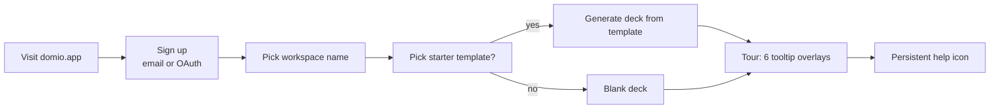
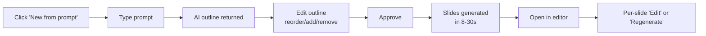
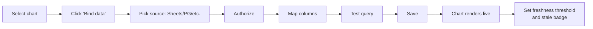
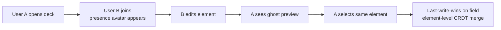
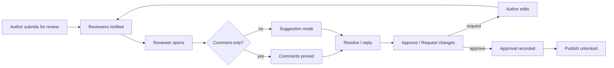
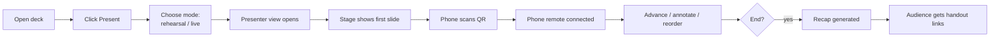
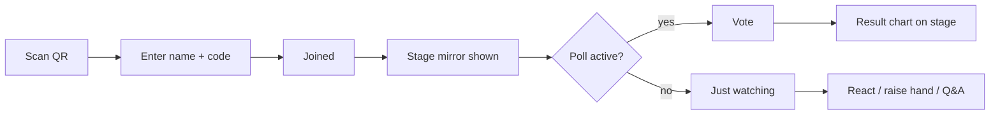
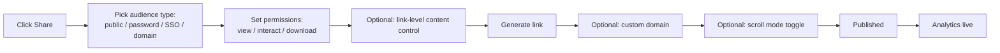
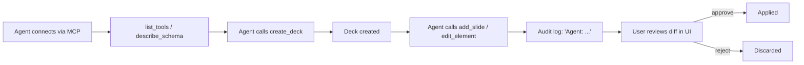
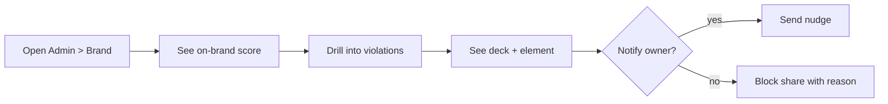

# 03 — UX & Interface Planning

> **Status:** Authoritative for IA, design tokens, accessibility patterns, copy voice, and locale conventions across all surfaces (editor, presenter, audience, admin, marketplace, CLI/API docs). Surfaces share tokens and components but each has its own IA expression.
> **Assumptions:**
>
> - The product is a _suite_ of coordinated surfaces (9 named in §3.0), not a single app.
> - WCAG 2.2 AA is the floor; AAA where achievable.
> - Bangla is a first-class locale from day one; UI strings, sample content, numerals toggle, font fallback (Noto Sans Bengali → SolaimanLipi → system Bengali).
> - `prefers-reduced-motion` is respected across all surfaces.
> - Mobile-first for audience join and presenter remote; desktop-first for editor and admin.
>   **Owner:** Design director + UX research lead.
>   **Last reviewed:** 2026-07-29.

---

> **Purpose:** define the information architecture, key user flows (with empty/loading/error/offline/conflict states), wireframe-level layout descriptions, design-system conventions, copy/voice, keyboard & screen-reader strategy, localization rules, and accessibility/usability verification.
> **Surface inventory:** web editor, presenter view, audience join view, admin console, marketplace portal, MCP/CLI/API docs surfaces.
> **Cross-references:** `01` (personas, JTBD), `02` (FRs, NFR-A11Y, NFR-I18N), `04` (real-time channels), `06` (stack), `09` (a11y tests).

---

## 3.0 Surfaces (the product is a _suite_)

Domio is not one app — it is a coordinated set of surfaces. Each surface has its own IA, design system _expression_, and a11y profile, but they share tokens, components, and copy voice.

| Surface                                 | Primary users                       | Devices        | Primary use                  |
| --------------------------------------- | ----------------------------------- | -------------- | ---------------------------- |
| **Editor (web)**                        | P1 Designer, P4 Analyst, P9 Creator | desktop        | Author/edit deck             |
| **Presenter view (web + phone remote)** | P2 Exec, P3 Speaker                 | laptop + phone | Present                      |
| **Audience join (mobile web)**          | Audience members (no account)       | phone          | Participate                  |
| **Viewer / shared deck (web)**          | Viewers (public, password, SSO)     | any            | Read/watch/interact          |
| **Admin console**                       | P8 Admin                            | desktop        | Govern org                   |
| **Marketplace portal**                  | P9 Creator + buyers                 | desktop        | Discover/sell/purchase       |
| **CLI / API / MCP docs**                | P10 Developer/Agent                 | desktop        | Drive the engine             |
| **Phone remote (mobile web)**           | P2/P3                               | phone          | Clicker + confidence monitor |
| **Ops console (internal)**              | Internal SRE/on-call                | desktop        | Operate the platform         |

---

## 3.1 Information Architecture

### 3.1.1 Editor IA (top-level)

```
- Workspace switcher (top-left, persistent)
  - Workspaces (org/team)
    - Projects (folders)
      - Decks
        - Slides
          - Elements (canvas + layers + outline)
- Top bar (deck-wide)
  - Title + presence avatars + share + present + ⋯ menu
- Left rail
  - Pages (slide thumbnails)
  - Sections (folders within deck)
- Right rail (context-sensitive panels)
  - Design (properties, components, tokens)
  - Prototype (interactions, variables)
  - Animate (timeline, easing)
  - Data (bindings, scenarios)
  - Inspect (code/schema, AI assistant, plugin panel)
  - Comments
- Bottom bar
  - Zoom controls + presentation profile + FPS overlay (dev)
- Center
  - Canvas (infinite)
  - Overlay panels (Cmd+K, jump-to-slide grid, suggestion diff)
```

### 3.1.2 Presenter IA

```
- Stage (full-bleed, audience view)
- Presenter window (separate screen or window)
  - Current slide + next slide + speaker notes
  - Timer (current slide + total)
  - Audience view preview
  - Annotation tools
  - Slide grid (Cmd+J)
  - Chat (audience Q&A) + parking lot
  - Backstage whisper
  - Phone remote QR
- Phone remote
  - Clicker (advance/back)
  - Notes
  - Laser pointer
  - Timer
```

### 3.1.3 Audience join IA

```
- Join screen
  - Session code input + name (or SSO)
  - Optional: language picker for captions
- Live view
  - Stage mirror (polls, Q&A, quizzes)
  - Reactions toggle
  - Raise hand
- Post-session
  - Personalized handout link
  - Feedback form
```

### 3.1.4 Admin IA

```
- Org overview
- Identity (SSO/SCIM, roles)
- Brand (brand kits, governance score, violations)
- Data (residency, retention, legal hold)
- Security (DLP, audit, alerts)
- Usage (seats, billing)
- Marketplace (org library, plugins)
- API & webhooks
```

### 3.1.5 MCP/API docs IA

```
- Overview
- Authentication
- Tools (alphabetical + grouped)
- Resources
- Schemas (versioned)
- Examples (runnable in browser via "Try it")
- Webhooks
- SDKs (TS, Python, Go, Ruby)
- Changelog / migration
```

---

## 3.2 Navigation

| Surface     | Primary nav pattern                       | Notes                                                        |
| ----------- | ----------------------------------------- | ------------------------------------------------------------ |
| Editor      | Persistent left/right rails + top bar     | Cmd+K palette for everything                                 |
| Presenter   | Bottom toolbar (autohide) + Cmd shortcuts | Mouse stays out of the way                                   |
| Audience    | Hidden chrome; minimal bottom bar         | Distraction-free; bottom bar only if interactive features on |
| Admin       | Sidebar (collapsible)                     | Multi-section tabs                                           |
| Marketplace | Top nav + grid                            | Standard SaaS pattern                                        |
| Docs        | Sidebar + content + right TOC             | Verbatim from `06` docs site                                 |

**Keyboard reachability:** every interactive element is reachable in N tab stops where N ≤ 7 from any starting focus. The Cmd+K palette is the universal "I don't know where this is" escape hatch.

**Back/forward:** the editor uses spatial history (back = undo focus, forward = redo focus) for canvas navigation; a separate browser history is used for panel switches (so deep-link to "Animations tab on slide 4" works).

---

## 3.3 Editor Layout (wireframe description)

```
┌─────────────────────────────────────────────────────────────────────────┐
│ [WS ▾] Domio • Q3 Board Deck ▾ • auto-saved 2s ago  👤👤👤+2  [Share] [Present ▸] │
├─────┬─────────────────────────────────────────────────────────┬───────┤
│     │                                                         │       │
│ Pg  │                                                         │  Tabs │
│  1  │                                                         │ ─────│
│  2  │                                                         │ Dsn  │
│  3  │                  INFINITE CANVAS                        │ Pro  │
│  4◀ │                                                         │ Ani  │
│  5  │                                                         │ Dat  │
│  6  │   ┌──────────────────────────┐                          │ Insp │
│     │   │  Slide 4 frame (16:9)    │                          │ 💬   │
│     │   │  ┌──┐ Title              │                          │       │
│     │   │  │  │ "Q3 Highlights"     │                          │ Props│
│     │   │  └──┘                   │                          │ ─────│
│     │   │  ┌──────┐ ┌──────┐      │                          │ x: 24│
│     │   │  │ chart│ │ chart│      │                          │ y: 64│
│     │   │  └──────┘ └──────┘      │                          │ w:…  │
│     │   └──────────────────────────┘                          │ …    │
│     │                                                         │       │
├─────┴─────────────────────────────────────────────────────────┴───────┤
│  100% ▾  + −  |  fit   60 FPS  |  • Outline  |  Profile: 1920×1080     │
└─────────────────────────────────────────────────────────────────────────┘
```

Notes:

- Left rail collapses to icons; right rail collapses to icons; both can be hidden entirely (Zen mode).
- Tabs in the right rail are vertically stacked (vertical tabs) to maximize canvas height.
- FPS and profile shown in dev builds; hidden by default in production.

---

## 3.4 Responsive Viewer Layout (web-shared deck)

Breakpoints (mobile-first):

- `xs` ≤ 480px (audience join)
- `sm` ≤ 768px (scroll-mode)
- `md` ≤ 1280px (slide-mode, scaled)
- `lg` ≤ 1920px (slide-mode, native)
- `xl` > 1920px (LED-wall profile)

Layout for `xs–sm`: scroll mode default; slide mode opt-in.
Layout for `md+`: slide mode default; controls auto-hide.

Touch targets ≥ 44×44 CSS px on all breakpoint surfaces.

---

## 3.5 Presenter View Layout

```
┌─────────────────────────────────────┬──────────────────────────┐
│                                     │ Current slide (big)      │
│  Next slide                         │  ┌────────────────────┐  │
│  ┌────────────────────┐             │  │                    │  │
│  │                    │             │  │     Slide 7        │  │
│  │      Slide 8       │             │  │                    │  │
│  └────────────────────┘             │  └────────────────────┘  │
│                                     │ Speaker notes            │
│  Timer: 4:32 / 30:00                │ • Emphasize the APAC…   │
│  Audience: 247 joined (8 votes)     │ • Pause for questions   │
│  Parking lot: 5                     │                          │
│  Annotations: pen | spotlight | off │ Q&A (3 unanswered)       │
│  Stage controls: ◁ ▷ ⏸ ⏹ ⤢ ⌗       │ ─────────────────────── │
│  Slide grid (Cmd+J)                 │ Whisper (1 unread)       │
└─────────────────────────────────────┴──────────────────────────┘
```

- The presenter window opens in a separate browser window or display; the audience view fills the main display.
- A second physical screen can be set as the stage; the presenter window mirrors or stays separate.
- On phone remote, the layout is vertically stacked: clicker, next slide, notes (collapsible), timer.

---

## 3.6 Audience Join Layout

```
┌──────────────────────────┐
│  Join "Q3 Board"         │
│  ┌────────────────────┐  │
│  │  Name              │  │
│  └────────────────────┘  │
│  ┌────────────────────┐  │
│  │  Session code      │  │
│  └────────────────────┘  │
│  [Join]                  │
│  Language: [English ▾]   │
└──────────────────────────┘
```

After join: stage mirror fills viewport; polls/Q&A/reactions appear in a bottom drawer; the audience can collapse it. Raise-hand lives in a persistent top-right chip.

---

## 3.7 Admin / Marketplace / API Surfaces

### 3.7.1 Admin

- Left sidebar with sections from §3.1.4; main pane is data tables + filters.
- Brand governance: heatmap of violations by team; click to drill into deck.
- Audit: filterable table (actor, action, target, date); CSV export.
- DLP: rule builder (pattern, scope, action); preview affected decks.

### 3.7.2 Marketplace

- Top nav: Discover / Themes / Components / Templates / Plugins / Sellers.
- Grid view with filters (price, locale, license, rating).
- Live preview on hover (deferred load); in-modal preview on click.
- Seller dashboard: listings, sales, payouts, ratings, takedowns.

### 3.7.3 API / MCP docs

- Two-pane: nav sidebar + content + right TOC.
- Code samples in TS, Python, cURL.
- "Try it" for every tool: real call against a sandboxed workspace.
- OpenAPI + MCP schema are the same source of truth, generated from a single internal schema.

---

## 3.8 Key User Flows (with states)

> Each flow lists: **happy path**, **empty state**, **loading state**, **error state**, **offline state**, **conflict state** (where relevant), **a11y notes**.

### 3.8.1 Onboarding (P1/P6 — designer/marketer)



- **Empty state:** first-run deck shows a friendly "Pick a starting point" panel with templates, AI prompt, and "from doc" import.
- **Loading:** signup creates a default workspace; spinner on workspace name with optimistic UI.
- **Error:** email taken → inline error; OAuth failure → retry with email.
- **Offline:** signup is queued and retried on reconnect; offline state banner shown.
- **A11y:** the tour is keyboard-navigable; Esc skips; focus is restored after each step.

### 3.8.2 Create a deck from a prompt (P1/P6 — AI assist)



- **Empty:** prompt box has a "Show examples" link; clicking fills a sample prompt.
- **Loading:** skeleton outlines; per-slide "Generating…" with progress.
- **Error:** rate-limit → "Try again in 30s"; safety block → clear reason; partial failure → retry remaining slides only.
- **Offline:** feature unavailable; banner explains; user can build manually.
- **A11y:** progress is announced via aria-live="polite"; cancel button always reachable.

### 3.8.3 Live-data binding (P4 — analyst)



- **Empty:** source list shows recommended sources first; one-click OAuth.
- **Loading:** query test runs in a sandboxed workspace; spinner with cancel.
- **Error:** schema mismatch → diff viewer; auth expired → re-auth flow.
- **Offline:** bind is local-only; sync attempted on reconnect.
- **A11y:** mapping UI uses accessible listboxes; column types announced.

### 3.8.4 Collaboration — multiplayer edit (P1/P10)



- **Empty:** no collaborators → "Invite" CTA.
- **Loading:** presence loads from realtime service; offline → "Offline — your edits are saved locally."
- **Error:** sync drop → reconnect banner with retry/backoff; offline edits are queued.
- **Conflict:** field-level merge; element-level history is preserved; user can open history and resolve.
- **A11y:** all collaborative updates are announced ("Priya edited the chart title to 'Revenue Q3'"); focus is never stolen from a typing user.

### 3.8.5 Review & approval (P7)



- **Empty:** no pending reviews → "Nothing waiting."
- **Loading:** submit transitions to "Pending"; spinner until server confirms.
- **Error:** submit fails → toast with retry; offline → queued.
- **A11y:** comments are reachable in reading order; mention autocomplete is keyboard-navigable.

### 3.8.6 Presenting (P2/P3)



- **Empty:** no audience yet → "Waiting for audience… 0 joined" with QR.
- **Loading:** presenter window opens ≤ 2s; stage buffered.
- **Error:** phone loses connection → reconnect banner; laptop dies → phone resumes (failover).
- **Offline:** cached deck + snapshot data; live data shows "Snapshot from HH:MM."
- **Conflict:** none expected in presenter mode (single source of truth).
- **A11y:** annotations have keyboard equivalents (spotlight via Tab/Enter); laser pointer optional; live region announces slide changes.

### 3.8.7 Audience participation (P3's audience)



- **Empty:** no active features → "Just watching" minimal chrome.
- **Loading:** join handshake with timeout + retry.
- **Error:** wrong code → "Code not found" with retry.
- **Offline:** QR-join requires one-time internet; once joined, the session survives short disconnects via service worker.

### 3.8.8 Sharing & publishing (P6)



- **Empty:** no audience yet → "No one has viewed."
- **Error:** DLP rule blocks share → reason shown with remediation.
- **Offline:** publish is queued; share draft saved locally.
- **A11y:** share dialog is keyboard-complete; audience types are announced.

### 3.8.9 MCP-driven edit (P10)



- **Dry-run mode** is the default for any new agent connection; user upgrades to "apply" after trust is established.

### 3.8.10 Admin: governance review (P8)



### 3.8.11 Empty / loading / error / offline — universal rules

| State    | Rule                                                                                  |
| -------- | ------------------------------------------------------------------------------------- |
| Empty    | Always provide a next action ("Create your first deck" rather than "Nothing here").   |
| Loading  | Skeleton matches the shape of the final content; never show a spinner alone.          |
| Error    | Plain-language cause; remediation; link to docs; never raw stack traces in UI.        |
| Offline  | Banner: "You're offline — changes are saved locally."; sync state visible in top bar. |
| Conflict | Visible diff; user picks; CRDT ensures no silent overwrites.                          |

---

## 3.9 Design System Conventions

### 3.9.1 Foundations

- **Type scale:** modular scale 1.250 (Major Third). Font sizes 12, 14, 16, 20, 24, 32, 40, 56.
- **Spacing scale:** 4, 8, 12, 16, 24, 32, 48, 64, 96. (4-base.)
- **Radius scale:** 4, 8, 12, 16, 24, 999 (pill).
- **Elevation:** three levels (1: subtle, 2: popover, 3: modal).
- **Color tokens:** `--color-bg`, `--color-fg`, `--color-fg-muted`, `--color-accent`, `--color-success`, `--color-warning`, `--color-danger`, `--color-info`. Dark mode tokens are first-class.
- **Brand override:** brand tokens (`--brand-primary`, `--brand-fg`, etc.) compose with system tokens. Designers override brand tokens; the system tokens remain consistent.

### 3.9.2 Components

A shared library (token-named, no hard-coded colors):

- Button (primary, secondary, ghost, danger; sizes sm/md/lg)
- Input (text, number, color, select, combobox, date)
- Popover, Dialog, Toast, Tooltip, DropdownMenu
- Tabs (horizontal + vertical)
- Table (with virtualization)
- Avatar, Badge, Chip, Tag
- Toast / Snackbar
- Skeleton (per shape variant)
- EmptyState (icon + title + description + action)
- Stepper
- Tree (file/folder)
- Timeline
- Card (variant: data, media, list)
- Color swatch, Font picker
- Charts (visualizations are part of the design system, not bolt-ons)

### 3.9.3 Iconography

- 24×24 base, 1.75px stroke, 1.5 grid.
- Library: Lucide-style open icons plus custom product icons.
- Color: `currentColor` by default; recolor via token.
- Icon picker (#32) is a sub-component of the library; supports search and recolor.

### 3.9.4 Motion

- Easing: standard (cubic-bezier(0.2, 0, 0, 1)), decel (cubic-bezier(0, 0, 0, 1)), accel (cubic-bezier(0.3, 0, 1, 1)).
- Durations: 100ms (micro), 200ms (small), 300ms (medium), 500ms (large).
- Respect prefers-reduced-motion: any non-essential motion becomes instant.

### 3.9.5 Brand customization

- Theme tokens are editable in admin (P8) and design surface (P1).
- Live preview with WCAG AA checks.
- Brand lint surfaces violations with one-click fixes.

---

## 3.10 Copy & Voice

### 3.10.1 Voice principles

1. **Plain language, no jargon.** "Reorder slides" not "manipulate presentation vector."
2. **Action-oriented buttons.** "Add slide," "Bind data," "Start presenting." Never "Submit."
3. **Friendly errors.** "We can't reach the data source right now. Try again, or use a snapshot." Not "Network error 0x80072."
4. **Respectful feedback.** Rehearsal coach: "Try pausing a beat after each point" not "You said 'um' 27 times."
5. **Inclusive examples.** Names and content use diverse, non-stereotyped examples. Bangla-first examples when BD is detected.

### 3.10.2 Microcopy inventory

- Empty states: title (12 words max), description (24 words max), primary action.
- Toasts: short, single sentence; success and error variants.
- Errors: cause → what we tried → what you can do.
- Confirmations: destructive actions require typed-confirmation for org-level destruction (e.g., "delete workspace").
- Status labels: presenter mode "Live · 247 joined"; offline "Offline · saved locally."

### 3.10.3 Tone per persona

| Persona         | Tone                          | Notes                                                   |
| --------------- | ----------------------------- | ------------------------------------------------------- |
| Designer        | Crisp, technical              | Trust them; reduce hand-holding.                        |
| Exec            | Calm, confident               | "Everything's under control."                           |
| Sales/Trainer   | Energetic, encouraging        | "Let's go!" energy in audience prompts.                 |
| Analyst         | Precise, factual              | Numbers and units are precise; no rounding for clarity. |
| Educator        | Patient, accessible           | Use classroom analogies; avoid jargon.                  |
| Marketer        | Outcome-focused               | Tie UX to measurable results.                           |
| Reviewer        | Diplomatic, neutral           | Frame suggestions, not commands.                        |
| Admin           | Authoritative, audit-friendly | Clear boundaries; no surprises.                         |
| Creator         | Encouraging, commercial       | Highlight revenue and reach.                            |
| Developer/Agent | Technical, exact              | No fluff; show code.                                    |

---

## 3.11 Keyboard Strategy

### 3.11.1 Universal shortcuts

| Combo                      | Action                                                      |
| -------------------------- | ----------------------------------------------------------- |
| `Cmd/Ctrl + K`             | Open command palette                                        |
| `Cmd/Ctrl + Z` / `Shift+Z` | Undo / redo                                                 |
| `Cmd/Ctrl + S`             | No-op (auto-save) — but binds to "Save snapshot" in history |
| `?`                        | Open shortcut cheatsheet                                    |
| `Esc`                      | Close dialog / exit mode                                    |

### 3.11.2 Editor shortcuts

| Combo                      | Action                                                       |
| -------------------------- | ------------------------------------------------------------ |
| `V`                        | Select tool                                                  |
| `T`                        | Text tool                                                    |
| `F`                        | Frame tool                                                   |
| `R`                        | Rectangle                                                    |
| `O`                        | Ellipse                                                      |
| `L`                        | Line                                                         |
| `P`                        | Pen                                                          |
| `C`                        | Comment tool                                                 |
| `Cmd/Ctrl + D`             | Duplicate                                                    |
| `Cmd/Ctrl + G` / `Shift+G` | Group / ungroup                                              |
| `Cmd/Ctrl + Shift + K`     | Open components                                              |
| `Cmd/Ctrl + ;`             | Open comments                                                |
| `Cmd/Ctrl + Alt + T`       | Insert token                                                 |
| `Cmd/Ctrl + Alt + B`       | Bind data                                                    |
| `[` / `]`                  | Send back / bring forward                                    |
| `Space + drag`             | Pan canvas                                                   |
| `Cmd/Ctrl + 1..9`          | Switch tab (Design, Prototype, Animate, Data, Inspect, etc.) |

### 3.11.3 Presenter shortcuts

| Combo                   | Action               |
| ----------------------- | -------------------- |
| `→` / `Space` / `Click` | Next                 |
| `←` / `Backspace`       | Previous             |
| `B`                     | Blackout             |
| `W`                     | Whiteout             |
| `Cmd/Ctrl + J`          | Slide grid           |
| `Cmd/Ctrl + L`          | Laser pointer toggle |
| `Cmd/Ctrl + P`          | Pen                  |
| `Cmd/Ctrl + H`          | Hide slide           |
| `Cmd/Ctrl + Shift + R`  | Reorder (modal)      |
| `Esc`                   | End                  |

### 3.11.4 Audience shortcuts

| Combo  | Action            |
| ------ | ----------------- |
| `R`    | Raise hand toggle |
| `1..5` | React with emoji  |
| `?`    | Open help         |

### 3.11.5 Focus management rules

- Modal opens trap focus and return focus on close.
- Cmd+K palette keeps focus in the input; arrow keys navigate.
- Slide change never steals focus from a typing user.
- Live regions (`aria-live="polite"`) used for non-critical updates (e.g., presence joins).

---

## 3.12 Screen Reader Strategy

- **Roles:** landmarks (banner, navigation, main, complementary, contentinfo) on every surface.
- **Labels:** every interactive control has an accessible name; icons get `aria-label`.
- **Live regions:** polite for non-critical status; assertive only for genuine emergencies (e.g., "Connection lost; attempting reconnect").
- **Decorative content:** `aria-hidden="true"` on purely decorative SVG/emoji.
- **Charts:** every chart has a hidden tabular fallback that screen readers can read.
- **Form errors:** associated with inputs via `aria-describedby`.
- **Focus order:** matches visual order.

### 3.12.1 Screen reader scripts (per surface)

- **Editor on open:** "Domio editor, deck Q3 Board, 12 slides, autosaved 2 seconds ago. Press Cmd+K for commands."
- **Slide change (presenter):** "Slide 4 of 12: Q3 Highlights. Subtitle: Revenue up 40% driven by APAC."
- **Audience join:** "You joined session Q3 Board as Priya. Slide 4 of 12."
- **Comment added:** "New comment from Alex on slide 4 chart: verify the APAC number."

---

## 3.13 Localization Rules

### 3.13.1 Locale strategy

- Tier-1 locales: en (default), bn, es, pt-BR, fr, ar (RTL — data-ready, UI later), ja, hi.
- Bangla is **first-class**: not a translation of English, but designed-in.
- Pseudo-locales for QA: `en-XA` (accented), `ar-XB` (RTL).
- Locale picker is prominent on first run; persistent in settings.

### 3.13.2 Formatting

- Dates: ISO 8601 in storage; locale-aware display (e.g., `২৯ জুলাই ২০২৬` in bn-BD).
- Numbers: locale-aware grouping and decimal marks; toggle for Bangla numerals.
- Currency: integer minor units in storage; display per locale; BDT and USD supported natively.
- Collation: locale-aware sort (handled in DB collation per locale).
- Names: do not split or reorder; render as-is.

### 3.13.3 Bangla-specific

- Unicode (NFC normalized).
- Bengali numerals option (`০১২…`).
- Font fallback chain: Noto Sans Bengali → SolaimanLipi → system Bengali.
- Diacritics, conjuncts, and ligatures render correctly.
- Sample content uses Bangla names, examples, and contexts.
- Voice prompts in audience features support Bangla.

### 3.13.4 RTL readiness (data layer only in v1)

- `dir="rtl"` reserved; no RTL UI in v1.
- Schema and token names are direction-agnostic.
- Mirroring logic prepared in component library for future flip.

### 3.13.5 Translation pipeline

- Source strings in repo (`/locales/en.json`).
- Crowdin / Lokalise integration for human translation.
- Pluralization via ICU MessageFormat.
- Glossaries maintained for product terminology.
- Translation memory across products.
- Every string has a unique key; no concatenation in code.

---

## 3.14 Usability & Accessibility Test Plan

### 3.14.1 Automated (in CI)

- **axe-core** runs on every PR for editor, presenter, audience, admin, marketplace surfaces.
- **ESLint** with `jsx-a11y` rules.
- **Color contrast** checks via `colorthief` + tokens; CI fails on ratios below AA.
- **Pseudo-locale** tests catch untranslated strings and hard-coded text.
- **i18n message extraction** validates all keys exist in target locales.
- **Keyboard-only smoke test** (Playwright) covers tab order on key surfaces.

### 3.14.2 Manual (pre-release)

- **Screen reader pass:** NVDA on Windows + Firefox, VoiceOver on macOS + Safari, JAWS on Windows + Chrome, TalkBack on Android.
- **Keyboard-only pass:** complete primary flows without a mouse.
- **Zoom pass:** at 200% zoom, no horizontal scroll on key surfaces.
- **Color blindness pass:** simulate protanopia, deuteranopia, tritanopia; verify status colors remain distinguishable via shape/label.
- **Reduced-motion pass:** verify animations are reduced when OS preference is set.
- **Bangla QA:** native speaker review of full editor + presenter surfaces.
- **High-contrast / Windows High Contrast** pass.

### 3.14.3 User testing

- Quarterly moderated tests with 5–8 participants per persona.
- Task-based scenarios with success criteria.
- Remote unmoderated tests via UserTesting / maze.co for higher volume.
- Accessibility-specific recruitment (screen reader users, switch users, low-vision users).

### 3.14.4 Continuous

- RUM captures focus errors, dead clicks, rage clicks.
- Surveys after key flows (NPS + open-ended).
- Bug-bash before each release.
- Accessibility bugs classified as Sev1-equivalent (block release).

---

## 3.15 Cross-surface Consistency

- **Top bar** is the system identity layer (workspace switcher, deck title, presence, share, present).
- **Toast** is the universal system notification; no in-page banners for ephemeral info.
- **Empty/Error/Loading** patterns are shared across surfaces.
- **Tokens** are the only place colors/fonts/spacing live.
- **Voice** is governed by a single style guide; copy review on every PR that adds strings.

---

## 3.16 Open Decisions

| ID       | Decision                                                                          | Owner                | Deadline |
| -------- | --------------------------------------------------------------------------------- | -------------------- | -------- |
| OD-UX-01 | Whether the editor ships with a vertical or horizontal right rail by default.     | Design lead          | M2       |
| OD-UX-02 | Whether audience join uses SSO for enterprise sessions by default or email alias. | Product + Enterprise | M6       |
| OD-UX-03 | Whether RTL UI ships in v1 or only data-readiness.                                | i18n lead            | M3       |
| OD-UX-04 | Final Bangla font fallback chain.                                                 | Design + i18n        | M3       |
| OD-UX-05 | Voice defaults for AI rehearsal coach: warm vs. neutral.                          | AI product           | M5       |

---

_End of 03-ux-interface-planning.md._
