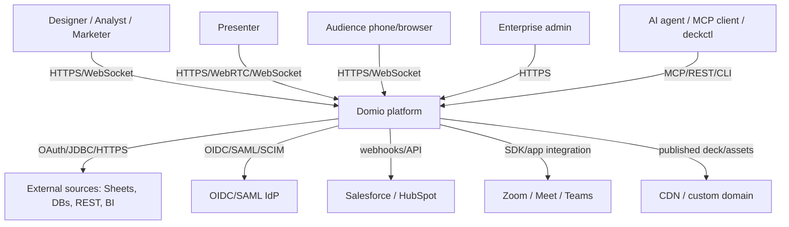
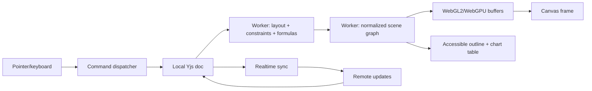
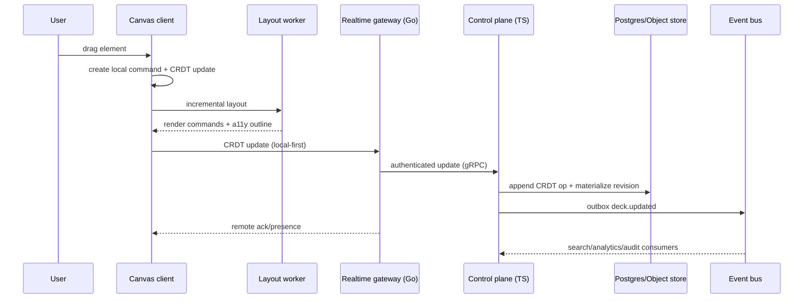
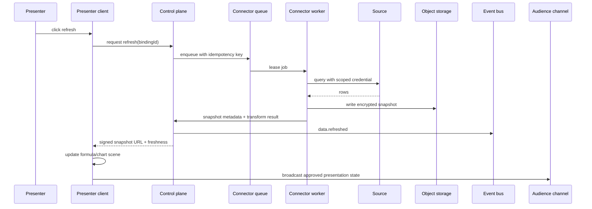
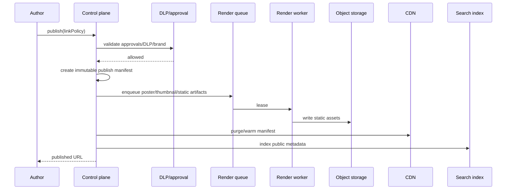

# 04 — System Architecture

> **Status:** Authoritative for architectural invariants, module boundaries, communication patterns, and decision-drivers. Module-by-module detail is elaborated in feature-domain docs. ADRs that change architecture must cite this doc.
> **Assumptions — backend is intentionally polyglot:**
> - **Control plane:** modular monolith on TypeScript (Node 22 + Hono), single deployable per business capability, table-per-service inside one Postgres. Split into separate services only when measurable benefit emerges (see §4.3.2).
> - **Realtime gateway:** Go service (gorilla/websocket + NATS), independently scalable from the control plane. Adapter allows Liveblocks/Ably as managed fallback.
> - **CPU workers:** Go primary; Rust allowed via ADR for raw throughput or memory determinism.
> - **AI/data workers:** TypeScript primary; Python allowed for ML/eval.
> - **Contract rule:** every polyglot boundary speaks gRPC (internal) or REST+OpenAPI (external). Generated clients are committed. No service imports another's source code. See `06-technology-stack.md` §6.2.0.
> - **Event bus:** NATS JetStream as primary event bus; Liveblocks/Ably as managed fallback for the audience/session sharding path.
> - **CRDT:** Yjs (over Automerge) chosen per M0 benchmark results stored in `docs/adr/`.
> - **API styles:** REST + GraphQL external (with MCP server as the canonical agent surface); gRPC internal between control plane and workers, and between control plane and realtime gateway.
> - Self-host parity: same module contracts work in SaaS and Docker/Kubernetes self-host deployments; each language tier has its own Deployment so they scale independently.
> **Owner:** Principal architect.
> **Last reviewed:** 2026-07-29.

---

> **Decision summary:** Domio uses a **modular monolith control plane** with **independently scalable data-plane worker pools**, an event-driven boundary, and a CRDT-based collaboration/sync plane. We will split modules into services only when independent scaling, fault isolation, team ownership, or regulatory isolation creates a measurable benefit.
> **Feature-domain references:** `docs/editor-canvas.md`, `docs/components-templates.md`, `docs/theming-branding.md`, `docs/live-data-charts.md`, `docs/3d-motion-media.md`, `docs/animation-transitions.md`, `docs/prototyping-interactivity.md`, `docs/ai-copilot.md`, `docs/presenter-experience.md`, `docs/audience-participation.md`, `docs/sharing-publishing.md`, `docs/analytics.md`, `docs/collaboration-workflow.md`, `docs/enterprise-governance.md`, `docs/novel-frontier.md`, `docs/agentic-interfaces.md`.

---

## 4.0 Architectural Goals and Invariants

### Goals

1. **Instant canvas interaction:** the editor remains responsive even while syncing, indexing, exporting, refreshing data, or calling AI.
2. **One structured source of truth:** visual canvas, deck-as-code YAML, MCP, REST/SDK, renderer, viewer, and export all derive from the versioned deck schema.
3. **Offline convergence:** every edit can be made locally and merged without destructive conflicts.
4. **Independent scaling:** AI, data connectors, 3D conversion, rendering, analytics ingestion, and live audience traffic scale separately.
5. **Provider portability:** object storage, event bus, AI model adapters, search, and realtime are replaceable behind interfaces.
6. **Tenant isolation:** every request, event, object, index document, and worker job carries tenant/region/security context.
7. **Graceful degradation:** a failed connector does not blank a deck; a failed AI provider does not block editing; a failed analytics sink does not block presentation.
8. **Self-host parity:** the same module contracts work in SaaS and Docker/Kubernetes self-host deployments.

### Invariants

- The **canonical structured deck schema** is versioned and validated before persistence.
- Postgres is the **control-plane source of truth** for metadata, permissions, workflow, and durable state.
- The CRDT log is the **collaboration source of truth** for unmerged edits; materialized snapshots are projections.
- Object storage is authoritative for **media binaries and render artifacts**, never Postgres bytea for large objects.
- Analytics is append-only and eventually consistent; it never blocks a user edit or presentation.
- No untrusted plugin, iframe, code block, media decoder, or AI tool runs in the control-plane process.

---

## 4.1 System Context (C4-style)



---

## 4.2 Container Architecture

The platform is composed of independently deployable tiers. Each tier is a separate workload in Kubernetes (or a separate container in Docker Compose self-host) and is allowed to use the language best suited to its workload. Boundaries are described by committed contracts only.

```mermaid
flowchart LR
    subgraph Clients
      Web[Next.js web app]
      Canvas[Canvas/WebGL/WebGPU renderer]
      SW[Service worker + IndexedDB]
      Phone[Phone remote / audience PWA]
      CLI[deckctl CLI - Go binary]
    end

    subgraph Edge
      CDN[CDN/WAF]
      APIGW[API gateway]
      RTGW[Realtime gateway - Go]
      MCP[MCP gateway - TS]
    end

    subgraph ControlPlane[Control plane - TS modular monolith]
      Auth[Identity & tenancy]
      Deck[Deck/schema/version]
      Collab[Collaboration/workflow]
      Share[Share/publish]
      Data[Data binding policy]
      AI[AI orchestration]
      Ent[Enterprise/governance]
      Market[Marketplace/plugins]
      Analytics[Analytics query API]
      Notify[Notifications]
      Billing[Billing/payout]
    end

    subgraph DataPlane[Independent worker pools - polyglot]
      Sync[CRDT sync workers - Go]
      Connectors[Connector workers - TS]
      Render[Headless render workers - Go/Rust]
      Media[Media/3D transcode workers - Go]
      AIPool[AI model workers - TS/Python]
      Ingest[Analytics ingest workers - TS]
      Search[Search/knowledge indexing workers - TS]
      Export[Export workers - Go]
    end

    subgraph State
      PG[(Postgres)]
      Obj[(S3 object storage)]
      Cache[(Redis/Valkey)]
      Bus[(NATS JetStream / Redpanda)]
      SearchDB[(OpenSearch)]
      OLAP[(ClickHouse)]
      Graph[(Graph projection)]
      Vault[(KMS/Vault)]
    end

    Web --> CDN --> APIGW
    Canvas --> APIGW
    SW --> Web
    Phone --> CDN --> RTGW
    CLI --> APIGW
    APIGW --> ControlPlane
    RTGW -->|gRPC| ControlPlane
    RTGW --> Bus
    MCP --> ControlPlane
    ControlPlane --> PG
    ControlPlane --> Obj
    ControlPlane --> Cache
    ControlPlane --> Bus
    Bus --> DataPlane
    DataPlane --> PG
    DataPlane --> Obj
    DataPlane --> SearchDB
    DataPlane --> OLAP
    DataPlane --> Graph
    ControlPlane --> Vault
    DataPlane --> Vault
```



**Key boundary guarantees:**
- The realtime gateway (Go) and the control plane (TS) never import each other's source code; they speak gRPC.
- Workers (Go/TS/Python) never call the control plane's internal libraries directly; they call gRPC or REST endpoints.
- The MCP gateway is a TS service in the control plane tier; it reuses the same domain command handlers as REST.
- All cross-tier data goes through the event bus or REST/gRPC; no shared mutable in-process state.

---

## 4.3 Architectural Shape: Modular Monolith + Data Plane

### 4.3.1 Why not microservices from day one?

A pure microservice architecture would create dozens of distributed contracts before we know which boundaries matter. Domio's initial domain objects — tenant, workspace, deck, slide, element, share, workflow, data binding, AI run — have high transactional coupling. Splitting them prematurely would add network failure modes, duplicated auth/tenant checks, and cross-service consistency work without creating value.

A pure monolith would be equally wrong because:
- headless rendering and media/3D conversion are CPU/GPU-heavy and have different scaling profiles;
- connector polling requires isolated credentials, network egress controls, and per-source retries;
- AI execution requires provider quotas, GPU pools, prompt-injection isolation, and burst scaling;
- analytics ingestion must absorb spikes without back-pressuring the control plane;
- audience realtime requires long-lived connections and fan-out.

**Decision:** modular monolith for transactional control-plane modules; worker pools for data-plane workloads. The boundary is event-driven and contracts-first, so extraction remains possible.

### 4.3.2 When to split a module into a service

A module may split only when at least two of these are true:

1. It needs an independent scale profile (e.g., 90% of CPU consumption is in render jobs).
2. It has a distinct team owner and a stable API/event contract.
3. It requires fault/security/regulatory isolation.
4. It has independent deploy cadence with a material business benefit.
5. Its data access pattern can be isolated without cross-database joins.

Candidates likely to split first: realtime gateway, render service, connector service, analytics ingest/query, AI orchestration, search/knowledge graph. Candidates likely to stay in the monolith longer: deck metadata, permissions, workflow, marketplace catalog.

---

## 4.4 Module Boundaries and Ownership

| Module | Owns | Reads | Publishes events | Initial runtime | Split trigger |
|---|---|---|---|---|---|
| Identity & Tenancy | tenants, users, sessions, memberships, SCIM | policies | `user.*`, `tenant.*` | control plane (TS) | >10k auth RPS or independent compliance |
| Deck & Schema | decks, slides, schema versions, branches | component/theme IDs | `deck.*`, `slide.*` | control plane (TS) | independently versioned schema service |
| Canvas/Sync (presence fan-out) | CRDT rooms, presence channels | deck versions | `crdt.*`, `presence.*` | **realtime gateway (Go)** | >1M concurrent connections |
| Components | components, variants, props schemas, libraries | themes, decks | `component.*` | control plane (TS) | marketplace scale |
| Themes/Brand | themes, tokens, brand kits, lint | components, decks | `theme.*`, `brand.*` | control plane (TS) | none expected |
| Data Binding | sources, bindings, snapshots, formula graph | permissions | `data.*` | control plane (TS) + connector workers (TS) | source polling scale |
| Media/3D | asset metadata, processing jobs | object storage | `media.*`, `render.*` | workers (Go/Rust) | GPU demand |
| Animation | timelines, keyframes, transitions | schema | `animation.*` | control plane (TS) + render workers (Go/Rust) | export scale |
| Prototype | variables, interactions, test sessions | schema | `prototype.*` | control plane (TS) | session scale |
| AI Orchestration | runs, prompts, citations, agent scopes | all approved context | `ai.*`, `agent.*` | control plane (TS) + AI workers (TS/Python) | provider isolation/cost |
| Presenter | sessions, states, handoffs, recaps | published deck | `presenter.*` | control plane (TS) + realtime gateway (Go) | global scale |
| Audience Channels | polls, Q&A, reactions, attendance | presenter session | `audience.*` | realtime gateway (Go) + control plane (TS) | 10k+ fan-out |
| Publish/Share | links, domains, access policies, export jobs | deck versions, policies | `share.*`, `publish.*` | control plane (TS) + export workers (Go) | CDN/control plane scale |
| Analytics | event definitions + query API | ClickHouse | `analytics.*` | workers (TS) + query API (TS) | independent OLAP scale |
| Collaboration | comments, reviews, assignments, merges | deck versions | `comment.*`, `approval.*` | control plane (TS) | none expected |
| Enterprise | DLP, audit, retention, residency | all | `audit.*`, `policy.*` | control plane (TS) | regulatory isolation |
| Marketplace/Plugins | listings, installs, payouts, plugin manifests | components | `marketplace.*` | control plane (TS) + sandbox workers (TS) | marketplace volume |
| Notification | channels, templates, delivery attempts | event bus | `notification.*` | control plane (TS) + workers (TS) | delivery volume |
| Billing | plans, entitlements, invoices, payouts | tenant usage | `billing.*` | control plane (TS) | financial isolation |
| Export (PDF/PPTX/Video/GIF) | long-running export jobs | deck versions, render workers | `export.*` | workers (Go) | export volume |

The module dependency graph is acyclic by policy. Cross-module writes go through commands; cross-module notifications go through events. Direct table reads across module boundaries are forbidden except via read models explicitly registered in the module contract.

**Language-tier boundaries in the table above:**
- **control plane (TS)** = Hono on Node 22, deployed as a modular monolith. Each module is a directory in `/services/control-plane` with its own module boundary.
- **realtime gateway (Go)** = independent Deployment, talks to control plane over gRPC only.
- **workers (Go/TS/Python)** = independent Deployments, talk to control plane over gRPC for commands and over NATS for events.

---

## 4.5 Client Architecture

### 4.5.1 Web app

- **Next.js + React** shell for routing, SSR/SEO viewer pages, admin, marketplace, docs.
- **Editor app** is a client-heavy route with a service-worker-backed local store.
- **Canvas renderer** is a separate package, not coupled to React component lifecycle.
- **State layers:**
  1. server state (TanStack Query / generated API client);
  2. local UI state (Zustand or signals);
  3. deck document state (Yjs sub-documents);
  4. render state (worker-owned scene graph and GPU buffers).
- **Web worker:** parses schema, computes layout, hit-tests, prepares render commands, runs formula engine.
- **OffscreenCanvas:** used where supported; main-thread fallback preserves editability.
- **Service worker:** caches shell, published assets, editor read models, offline deck snapshots; queues mutations.
- **IndexedDB:** local CRDT updates, pending uploads, auth-scoped cache, presenter snapshot.
- **Virtualization:** layer tree, slide thumbnails, data tables, comments.

### 4.5.2 Canvas render pipeline

> **Phase 04 cross-reference:** The realtime gateway (`/services/realtime-gateway`) and the Yjs CRDT sync substrate (`/packages/yjs-shared`) are now live and implement features #17 (realtime collaboration), #19 (branching infrastructure), and #21 (offline-first sync) as specified in `phase-04-realtime-collab-crdt.md`. The `Canvas/Sync (presence fan-out)` module in §4.4 and the `deck document state (Yjs sub-documents)` layer in §4.5.1 are now operational.



**Frame budget:** 16.67ms at 60 FPS. Input and local CRDT update target ≤2ms; layout worker ≤6ms for incremental change; GPU draw ≤8ms. Long-running layout falls back to a lower-detail preview and reports status without blocking input.

### 4.5.3 Presenter / audience clients

- Presenter client uses the same renderer but preloads all slides, fonts, media poster frames, and data snapshots.
- Audience client is a minimal PWA: session state, slide snapshots, interaction controls.
- Phone remote uses a separate realtime channel with a scoped one-time token.

---

## 4.6 Backend Modules and Contracts

### 4.6.1 API gateway

Responsibilities:
- TLS termination, WAF, request IDs, rate limits, auth token verification.
- Tenant and region routing.
- API version negotiation (`Accept: application/vnd.domio.v1+json`).
- Idempotency-key enforcement for commands.
- OpenAPI validation and uniform errors.

### 4.6.2 Synchronous API

REST is the stable external API; GraphQL is available for first-party read composition only; gRPC is internal for high-throughput worker calls.

Example command contract:

```http
POST /v1/decks/{deckId}/commands
Idempotency-Key: 6e4e…
Content-Type: application/json

{
  "type": "element.update",
  "target": "slide[3].chart[revenue_by_region]",
  "patch": {"props": {"chartType": "waterfall"}},
  "expectedRevision": 184
}
```

```json
{
  "commandId": "cmd_01H…",
  "accepted": true,
  "revision": 185,
  "events": ["deck.updated.v1"],
  "warnings": []
}
```

Uniform errors:

```json
{
  "error": {
    "code": "REVISION_CONFLICT",
    "message": "The deck changed since you opened it.",
    "details": {"currentRevision": 186, "expectedRevision": 184},
    "requestId": "req_…",
    "retryable": false
  }
}
```

### 4.6.3 MCP gateway

- Authenticates MCP session and resolves agent scope.
- Calls the same domain command handlers as REST — no duplicated business logic.
- Returns JSON Schema-described tool results, dry-run diffs, and audit IDs.
- Applies prompt-injection and DLP policy before context is sent to an AI provider.
- Exposes resources: deck schema, deck summary, component schemas, provenance, version diff.

### 4.6.4 Event bus

Initial choice: NATS JetStream for low-latency events and simple self-host; Redpanda-compatible event log mode for high-volume analytics if required. See `06-technology-stack.md` §6.4.

Rules:
- Every event has `eventId`, `eventType`, `schemaVersion`, `tenantId`, `region`, `occurredAt`, `actor`, `traceId`.
- Producers use an outbox table; a publisher relays committed events.
- Consumers are idempotent using `eventId` + consumer group checkpoint.
- At-least-once delivery is default; exactly-once is not assumed.

### 4.6.5 Realtime channels (terminated in the Go realtime gateway)

The realtime gateway is the Go service that terminates every long-lived connection. It does **not** call the control plane's internal libraries; it speaks gRPC to the control plane for state changes and consumes NATS events for fan-out.

| Channel | Transport | Scope | Data | Durability |
|---|---|---|---|---|
| `deck:{id}:sync` | WebSocket/WebRTC optional | editors | CRDT updates | CRDT log |
| `deck:{id}:presence` | WebSocket | editors | cursors, selection, typing | ephemeral |
| `session:{id}:stage` | WebSocket/SSE | presenter/audience | slide state, poll/Q&A events | event log + analytics |
| `session:{id}:remote` | WebSocket | phone remote | commands + acknowledgments | ephemeral + session record |
| `session:{id}:whisper` | WebSocket | presenter/team | private notes | session record, retention policy |
| `viewer:{linkId}` | SSE/WebSocket | viewer | live data / interactions | analytics + event log |

### 4.6.6 Connector/AI/renderer worker pools

Workers are separate deployment classes with:
- workload-specific CPU/memory/GPU requests;
- queue-based autoscaling;
- per-tenant concurrency quotas;
- job leases, heartbeat, retry/backoff, dead-letter queue;
- signed artifact outputs to object storage;
- no direct client credentials (retrieve short-lived token from vault at execution time);
- OpenTelemetry trace propagation.

---

## 4.7 Data Flows

### 4.7.1 Editor edit



### 4.7.2 Live data refresh on stage



### 4.7.3 Publish



---

## 4.8 Consistency Model

| Operation | Consistency | Mechanism |
|---|---|---|
| Permissions, policy, publish gate | strong | Postgres transaction + optimistic version |
| Canvas edits | eventual across collaborators; causal within client | CRDT + server ack |
| Presence/cursors | ephemeral, best effort | realtime pub/sub |
| Live data snapshot | read-your-write for presenter, eventual for audience | snapshot id + broadcast |
| Analytics | eventual | event bus → ClickHouse |
| Search | eventual (target ≤30s) | index worker |
| Marketplace listing | strong for purchase/payout; eventual for search | Postgres + index |
| Audit log | append-only, durable | outbox + immutable store |
| Knowledge graph | eventual | event-driven projection |

### Conflict strategy

- CRDT handles concurrent edits to independent fields/elements.
- For the same scalar field, deterministic last-writer-wins by Lamport timestamp + actor ID; user-facing history keeps both values.
- Permissions and publication never resolve via CRDT; they use optimistic locking and policy checks.
- Data source writes require explicit user/agent permission and idempotency keys; no blind last-write-wins.

---

## 4.9 Idempotency, Retries, and Timeouts

### Idempotency

Required for: deck creation from API, element commands, publish, exports, data refresh, marketplace purchase, payouts, webhook delivery. Clients send `Idempotency-Key`; server stores result for 24h (financial operations 7d).

### Retry policy

| Dependency | Retry | Backoff | Circuit breaker |
|---|---|---|---|
| Postgres | transaction retry on serialization | 10/50/250ms, max 3 | no; fail fast on outage |
| Object storage | 5xx/timeout | exponential + jitter, max 5 | yes |
| AI provider | transient 429/5xx | provider `Retry-After`, max 3 | yes per provider/model |
| Data source | safe read only | exponential, max 3 | yes per connector |
| Webhook delivery | any non-2xx | 1m, 5m, 30m, 2h, 12h | dead letter after 10 |
| Realtime | reconnect | jittered capped backoff | client fallback to polling |

Timeout budgets are explicit; an upstream deadline is passed in `x-deadline-ms`. No request may wait indefinitely for a worker job — long jobs return a job ID and status endpoint.

---

## 4.10 Feature Flags and Rollout

- Flags are tenant/workspace/user/percentage scoped.
- Every risky or expensive feature has a kill switch: WebGPU, AI model, connector, audience fan-out, plugin, experimental novel feature.
- Flags are evaluated server-side for security-sensitive behavior; client flags only alter presentation.
- Flag changes are audited.
- Rollout stages: internal → design partners → 1% canary → 10% → 50% → 100%; error/SLO auto-rollback.
- Flag expiry is mandatory: every flag has owner, created date, expiry date, and removal issue.

---

## 4.11 API Versioning & Deprecation

- External REST: `/v1`, `/v2`; additive changes within a version; breaking changes require a new major.
- MCP: capability manifest version plus tool-level schema versions; old tools remain for ≥6 months after deprecation notice.
- SDKs: semantic versioning, generated from OpenAPI/JSON Schema.
- Deprecation: announce in changelog + email for affected enterprise customers; response header `Sunset`; migration guide; usage dashboard.
- Minimum support: two API majors, or 12 months (whichever is longer).
- Deck schema: schema migrations are bidirectional for at least two versions; old decks migrate lazily on read and materialize on write.

---

## 4.12 Disaster and Degradation Modes

| Failure | User-visible mode | Recovery |
|---|---|---|
| Primary Postgres unavailable | read-only cached deck viewer; editor local-only | failover/restore |
| Realtime unavailable | editor polls; presence hidden; audience uses 5s polling | reconnect |
| Connector unavailable | stale badge + last snapshot; presenter can use snapshot | retry / reauth |
| AI provider unavailable | AI actions disabled; manual editing works | provider fallback |
| Renderer queue unavailable | exports delayed; editor/presenter unaffected | queue recovery |
| Search unavailable | basic folder/title search from Postgres | index rebuild |
| CDN unavailable | origin fallback for authenticated users | CDN recovery |
| Object storage unavailable | metadata works; media placeholders; no destructive writes | provider recovery |
| Analytics unavailable | events buffer locally/edge; no UX blocking | replay buffer |
| Plugin sandbox unavailable | plugin UI disabled; base editor works | worker recovery |

---

## 4.13 Multi-region & Data Residency

- **Global control plane:** region-routed tenant data; each tenant has `home_region`.
- **Data residency:** tenant policy selects region(s); restricted data requires local synchronized copy where law demands; no cross-region worker can access without a signed data-transfer policy.
- **Realtime:** users connect to nearest edge; session state is anchored in presenter region and replicated to audience edge nodes.
- **Postgres:** regional primary + read replicas; tenant sharding by home region; global directory stores only non-sensitive routing metadata.
- **Object storage:** bucket per region/tenant class; lifecycle policies replicated only where allowed.
- **Analytics:** regional ingestion; aggregated global benchmarks use anonymized/approved data.
- **Migration:** tenant export/import and dual-write cutover; no provider-specific data format in core.

---

## 4.14 Architecture Decisions

| ID | Decision | Rationale | Alternative |
|---|---|---|---|
| ADR-ARCH-01 | Modular monolith control plane on TypeScript/Node + Hono | Transactional cohesion + type sharing with editor/MCP/SDK + fastest iteration + BD hiring pool | Microservices from day one; rejected. Pure Go / Java / .NET backends — rejected for type-sharing cost (see `06-technology-stack.md` §6.2.1). |
| ADR-ARCH-02 | Data-plane workers split by workload **and by language tier** | Independent scaling, fault isolation, **and right tool per workload** | One generic queue; rejected. Single-language polyglot; rejected for cost of CPU loops in Node. |
| ADR-ARCH-03 | Structured deck schema is canonical | Enables canvas, API, MCP, render, export parity | Canvas JSON as source; rejected |
| ADR-ARCH-04 | Yjs CRDT default | Mature ecosystem, performance | Automerge; benchmark fallback |
| ADR-ARCH-05 | Event bus with outbox | At-least-once reliable integration | Direct synchronous calls; rejected for side effects |
| ADR-ARCH-06 | REST external + GraphQL first-party reads + MCP + gRPC internal | Stable clients + agent surface + internal throughput | GraphQL-only; rejected for cache/version complexity |
| ADR-ARCH-07 | Region-routed tenant homes | Data residency and latency | Global single region; rejected |
| ADR-ARCH-08 | Degrade to snapshot for live data | Presenter safety | Blank chart on source failure; rejected |
| ADR-ARCH-09 | **Polyglot backend with Go realtime gateway, Go/Rust CPU workers, TS/Python AI workers** | Each tier uses the language best suited to its workload; contract rule keeps coupling bounded | Monolithic TS; rejected for memory/perf. Pure Go; rejected for type-sharing cost. See `06-technology-stack.md` §6.2.0–§6.2.4. |
| ADR-ARCH-10 | **No service imports another service's source code**; every polyglot boundary is a committed contract (Protobuf / OpenAPI / JSON Schema) | Prevents the polyglot structure from decaying into spaghetti; allows per-tier re-implementation without API changes | Shared internal libraries; rejected. Code generation across languages; rejected for codegen drift. |

---

## 4.15 Architecture Verification

- Contract tests for every module command and event schema.
- Architecture tests enforce no forbidden cross-module imports/table access.
- Load tests: 10k audience, 50 editors, 100k viewer deck, 1M realtime connections per-region simulation.
- Chaos tests: DB failover, event-bus partition, connector timeout, AI provider failure, CDN outage.
- Data-flow threat review for every new connector/plugin/AI tool.
- Render fidelity tests against schema fixtures (see `09-testing-strategy.md`).
- Architecture review required for any change to source-of-truth boundaries, module ownership, or tenant routing.

---

## 4.16 Open Decisions

| ID | Decision | Owner |
|---|---|---|
| OD-ARCH-01 | NATS JetStream alone vs Redpanda for analytics-grade event retention. | Platform |
| OD-ARCH-02 | Managed realtime provider vs self-hosted Go gateway at first public beta. | SRE |
| OD-ARCH-03 | Whether to use WebRTC data channels for large audience fan-out or WebSocket/SSE only. | Realtime lead |
| OD-ARCH-04 | Exact geographic regions and Bangladesh local-hosting partner. | Legal + Infrastructure |
| OD-ARCH-05 | Automerge benchmark threshold that would trigger a Yjs reconsideration. | Editor lead |
| OD-ARCH-06 | ORM for the control plane: Prisma vs Drizzle vs raw SQL/pg. | Control-plane lead |
| OD-ARCH-07 | When to introduce the first Rust CPU worker (deferred until profile data justifies). | Platform lead |
| OD-ARCH-08 | Whether the realtime gateway is split per region or kept global with edge POPs. | SRE + Realtime lead |

---

_End of 04-system-architecture.md._
