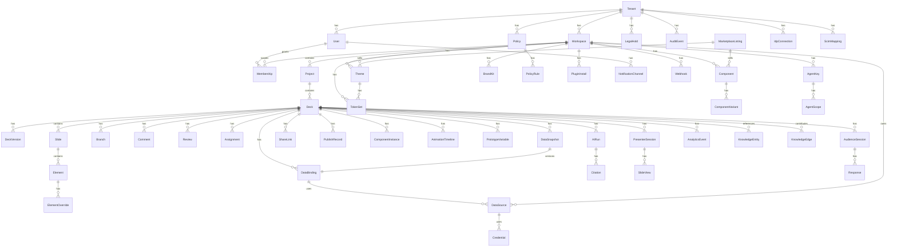

# 05 — Data & Database Design

> **Status:** Authoritative for source-of-truth boundaries, ERD, schema versioning, retention, and PII classification. Schema migrations are owned by the data platform team; changes require ADRs and are gated by 06 (technology stack) choices.
> **Assumptions:**
> - **Postgres 16** is the control-plane source of truth (tenants, identity, permissions, audit, decks, schema versions, durable state).
> - **Object storage** (S3-compatible) is authoritative for media binaries and render artifacts; never Postgres bytea for large objects.
> - **CRDT append-only logs** are the collaboration source of truth for unmerged edits; materialized snapshots are projections.
> - **ClickHouse** is the analytics OLAP; **OpenSearch** is full-text/vector search; **Redis** is ephemeral state.
> - **JSONB schema versioning** is bidirectional (N ↔ N+1) and idempotent; CRDT migration is decoupled from schema migration.
> - **Multi-tenant isolation** via Postgres RLS + tenant-context middleware; tenancy is established per request from auth claims.
> - i18n: all timestamps UTC; display per locale. Currency stored as integer minor units; display per locale. Collation locale-aware per column.
> **Owner:** Principal architect + DBA.
> **Last reviewed:** 2026-07-29.

---

> **Purpose:** specify the source-of-truth boundaries, logical ERD, detailed table/index/partition designs, JSONB schema versioning, multi-tenant isolation, i18n/currency conventions, retention/backup/migration policy, and PII classification.
> **Source of truth summary:** Postgres for transactional control plane; object storage for media and large artifacts; Redis for ephemeral state; CRDT append-only logs for collaboration; ClickHouse for analytics; OpenSearch for full-text/vector search; a graph projection for the cross-deck knowledge graph.
> **Cross-references:** `01` (success metrics), `02` (FR/NFR), `04` (architecture contracts), `06` (technology stack), `07` (security/RLS), `11` (Bangladesh residency).

---

## 5.0 Source-of-Truth Boundaries

| Domain | Authoritative store | Reads | Notes |
|---|---|---|---|
| Tenants, identity, permissions, audit | Postgres | control plane only | strict RLS |
| Decks, schema versions, branches | Postgres + CRDT log | control plane, sync, search, audit | schema version is canonical |
| Element commands / operations | Postgres (materialized) + CRDT (append-only) | editor, sync | CRDT for conflicts, Postgres for durable revision |
| Components, themes, templates, tokens | Postgres | marketplace, editor, brand kit | versioned |
| Data sources, bindings, snapshots, formulas | Postgres (metadata) + object storage (snapshot blobs) | editor, presenter, MCP | read-only sources; agent-write requires explicit consent |
| Media, 3D, render artifacts | Object storage + Postgres metadata | renderer, viewer | encrypted at rest |
| Animation, prototyping variables | In deck schema | editor, render | versioned with deck |
| AI runs, prompts, citations | Postgres + object storage (input/output blobs) | AI service, audit, freshness | agent-scope tracked |
| Presenter / audience sessions | Redis (ephemeral) + Postgres (final state) + event log | realtime, analytics | ephemeral + final |
| Shares, links, access policies | Postgres | share service, viewer | RLS |
| Analytics events | ClickHouse | analytics query API, dashboard | append-only |
| Search / knowledge graph | OpenSearch (full-text/vector) + graph projection (PG recursive CTEs or dedicated store) | search service, MCP | eventually consistent |
| Audit log | Postgres (append-only) + WORM bucket | compliance, audit | immutable |
| Marketplace | Postgres + payments aggregator | marketplace | revenue splits computed in DB |
| Notifications, webhooks | Postgres (rules) + queue | delivery workers | outbound idempotency |

Rule: a single source of truth per entity; projections are derived and explicitly labeled as projections.

---

## 5.1 Logical ERD (high-level)



---

## 5.2 Table Definitions (canonical)

> Conventions: PK = `uuid`; tables have `created_at`, `updated_at`, `created_by`, `tenant_id` unless noted; soft delete via `deleted_at`; immutable tables use only `created_at` and `created_by`.
> Indexes are explicit; partial indexes noted; partitioning noted.

### 5.2.1 Identity & Tenancy

```sql
-- tenants
create table tenants (
  id uuid primary key default gen_random_uuid(),
  name text not null,
  slug text not null unique,
  home_region text not null,         -- e.g., 'ap-south-1'
  allowed_regions text[] not null default array[]::text[],
  residency_policy text not null default 'standard',  -- standard|restricted|cii
  billing_currency text not null default 'USD',       -- ISO 4217
  locale text not null default 'en',
  created_at timestamptz not null default now(),
  deleted_at timestamptz
);
create unique index tenants_slug_unique on tenants (lower(slug)) where deleted_at is null;

-- users
create table users (
  id uuid primary key default gen_random_uuid(),
  primary_email citext not null unique,
  display_name text not null,
  preferred_locale text not null default 'en',
  preferred_currency text not null default 'USD',
  avatar_url text,
  status text not null default 'active',
  mfa_enrolled boolean not null default false,
  last_login_at timestamptz,
  created_at timestamptz not null default now(),
  deleted_at timestamptz
);

-- memberships (user in workspace with role)
create table memberships (
  id uuid primary key default gen_random_uuid(),
  user_id uuid not null references users(id) on delete restrict,
  workspace_id uuid not null references workspaces(id) on delete cascade,
  role text not null,                -- owner|admin|member|guest|reviewer
  scopes jsonb not null default '{}'::jsonb,
  invited_by uuid references users(id),
  joined_at timestamptz not null default now(),
  expires_at timestamptz
);
create unique index memberships_user_workspace_unique on memberships (user_id, workspace_id);

-- idp_connections (SSO)
create table idp_connections (
  id uuid primary key default gen_random_uuid(),
  tenant_id uuid not null references tenants(id) on delete cascade,
  type text not null,                -- saml|oidc
  metadata jsonb not null,           -- idp metadata
  default_role text not null,
  created_at timestamptz not null default now()
);

-- scim_mappings
create table scim_mappings (
  id uuid primary key default gen_random_uuid(),
  tenant_id uuid not null references tenants(id) on delete cascade,
  external_id text not null,
  user_id uuid not null references users(id) on delete cascade,
  created_at timestamptz not null default now(),
  unique (tenant_id, external_id)
);
```

### 5.2.2 Workspaces, Projects, Decks

```sql
-- workspaces
create table workspaces (
  id uuid primary key default gen_random_uuid(),
  tenant_id uuid not null references tenants(id) on delete cascade,
  name text not null,
  slug text not null,
  region text not null,              -- home region for this workspace
  settings jsonb not null default '{}'::jsonb,
  created_at timestamptz not null default now(),
  created_by uuid not null references users(id),
  deleted_at timestamptz
);
create unique index workspaces_tenant_slug_unique on workspaces (tenant_id, lower(slug)) where deleted_at is null;

-- projects (folders)
create table projects (
  id uuid primary key default gen_random_uuid(),
  workspace_id uuid not null references workspaces(id) on delete cascade,
  parent_id uuid references projects(id) on delete cascade,
  name text not null,
  path text generated always as (
    case when parent_id is null then '/' || id::text
         else (select path from projects p2 where p2.id = projects.parent_id) || '/' || id::text end
  ) stored,
  created_at timestamptz not null default now(),
  created_by uuid not null references users(id),
  deleted_at timestamptz
);
create index projects_workspace_parent_idx on projects (workspace_id, parent_id);
create index projects_path_gist_idx on projects using gist (path);

-- decks
create table decks (
  id uuid primary key default gen_random_uuid(),
  workspace_id uuid not null references workspaces(id) on delete cascade,
  project_id uuid references projects(id) on delete set null,
  title text not null,
  slug text,
  schema_version int not null,       -- version of structured deck schema
  current_revision bigint not null default 0,
  branch text not null default 'main',
  thumbnail_url text,
  settings jsonb not null default '{}'::jsonb,
  brand_kit_id uuid references brand_kits(id),
  legal_hold_id uuid references legal_holds(id),
  owner_id uuid not null references users(id),
  created_at timestamptz not null default now(),
  updated_at timestamptz not null default now(),
  deleted_at timestamptz
);
create index decks_workspace_idx on decks (workspace_id) where deleted_at is null;
create index decks_project_idx on decks (project_id) where deleted_at is null;
create index decks_updated_at_idx on decks (workspace_id, updated_at desc);

-- deck_versions (immutable)
create table deck_versions (
  deck_id uuid not null references decks(id) on delete cascade,
  revision bigint not null,
  parent_revision bigint,
  schema_version int not null,
  change_summary text,
  author_id uuid references users(id),
  crdt_log_id uuid not null,         -- pointer to CRDT log row(s)
  created_at timestamptz not null default now(),
  primary key (deck_id, revision)
);
```

### 5.2.3 Slides, Elements, Schema, Components, Themes

```sql
-- slides
create table slides (
  id uuid primary key default gen_random_uuid(),
  deck_id uuid not null references decks(id) on delete cascade,
  position int not null,             -- order within deck
  schema_version int not null,
  thumbnail_url text,
  created_at timestamptz not null default now(),
  updated_at timestamptz not null default now()
);
create unique index slides_deck_position_unique on slides (deck_id, position);
create index slides_deck_idx on slides (deck_id);

-- elements (canvas nodes)
create table elements (
  id uuid primary key default gen_random_uuid(),
  slide_id uuid not null references slides(id) on delete cascade,
  semantic_id text not null,         -- stable id (e.g., 'chart_revenue_by_region')
  type text not null,                -- shape|text|image|chart|3d|video|frame|component|...
  parent_id uuid references elements(id) on delete cascade,
  z int not null default 0,
  transform jsonb not null,          -- {x,y,w,h,rotate,...}
  props jsonb not null,              -- type-specific
  binding jsonb,                     -- data binding pointer if any
  component_instance_id uuid references component_instances(id),
  locked_by uuid references users(id),
  created_at timestamptz not null default now(),
  updated_at timestamptz not null default now()
);
create unique index elements_slide_semantic_unique on elements (slide_id, semantic_id);
create index elements_slide_idx on elements (slide_id);
create index elements_parent_idx on elements (parent_id);
create index elements_type_idx on elements (type);

-- element_overrides (for component instances)
create table element_overrides (
  element_id uuid not null references elements(id) on delete cascade,
  path text not null,
  value jsonb not null,
  primary key (element_id, path)
);

-- structured deck schema (canonical serialized)
create table deck_schemas (
  deck_id uuid not null references decks(id) on delete cascade,
  revision bigint not null,
  schema jsonb not null,             -- canonical structured deck schema
  checksum text not null,
  byte_size int not null,
  created_at timestamptz not null default now(),
  primary key (deck_id, revision)
);

-- components / component_variants
create table components (
  id uuid primary key default gen_random_uuid(),
  workspace_id uuid not null references workspaces(id) on delete cascade,
  name text not null,
  description text,
  props_schema jsonb not null,       -- JSON Schema for editable props
  master_schema jsonb not null,      -- canonical schema for the master
  thumbnail_url text,
  visibility text not null default 'workspace', -- workspace|org|public
  created_by uuid not null references users(id),
  created_at timestamptz not null default now(),
  updated_at timestamptz not null default now(),
  deleted_at timestamptz
);
create index components_workspace_idx on components (workspace_id) where deleted_at is null;

create table component_variants (
  component_id uuid not null references components(id) on delete cascade,
  variant_key text not null,         -- 'light'|'dark'|'lg'|'primary'|...
  props jsonb not null,
  primary key (component_id, variant_key)
);

create table component_instances (
  id uuid primary key default gen_random_uuid(),
  component_id uuid not null references components(id),
  master_revision bigint not null,
  overrides jsonb not null default '{}'::jsonb,
  created_at timestamptz not null default now()
);
create index component_instances_component_idx on component_instances (component_id);

-- themes, token_sets, brand_kits
create table token_sets (
  id uuid primary key default gen_random_uuid(),
  workspace_id uuid not null references workspaces(id) on delete cascade,
  name text not null,
  tokens jsonb not null,             -- color, type, spacing, radii
  version int not null default 1,
  created_at timestamptz not null default now(),
  unique (workspace_id, name, version)
);

create table themes (
  id uuid primary key default gen_random_uuid(),
  workspace_id uuid not null references workspaces(id) on delete cascade,
  name text not null,
  token_set_id uuid not null references token_sets(id),
  visibility text not null default 'workspace',
  created_at timestamptz not null default now(),
  deleted_at timestamptz
);

create table brand_kits (
  id uuid primary key default gen_random_uuid(),
  workspace_id uuid not null references workspaces(id) on delete cascade,
  name text not null,
  logos jsonb not null,              -- {primary, secondary, monochrome, ...}
  colors jsonb not null,
  typography jsonb not null,
  imagery_rules jsonb not null default '{}'::jsonb,
  voice text,
  created_at timestamptz not null default now(),
  deleted_at timestamptz
);
```

### 5.2.4 Data Sources, Bindings, Snapshots, Formulas

```sql
-- data_sources (per workspace)
create table data_sources (
  id uuid primary key default gen_random_uuid(),
  workspace_id uuid not null references workspaces(id) on delete cascade,
  type text not null,                -- google_sheets|excel_online|airtable|notion|postgres|mysql|bigquery|snowflake|rest|graphql|...
  display_name text not null,
  config jsonb not null,             -- non-secret connection metadata
  credential_ref text not null,      -- KMS/Vault ref (never inline)
  refresh_policy jsonb not null,     -- {minIntervalSeconds, maxStalenessSeconds}
  created_by uuid not null references users(id),
  created_at timestamptz not null default now(),
  deleted_at timestamptz
);
create index data_sources_workspace_idx on data_sources (workspace_id) where deleted_at is null;

-- data_bindings (per deck)
create table data_bindings (
  id uuid primary key default gen_random_uuid(),
  deck_id uuid not null references decks(id) on delete cascade,
  source_id uuid references data_sources(id) on delete restrict,
  query jsonb not null,              -- connection-specific query
  transform jsonb not null default '{}'::jsonb,
  scenario text not null default 'base',  -- base|bull|bear|custom
  status text not null default 'active',
  created_at timestamptz not null default now()
);
create index data_bindings_deck_idx on data_bindings (deck_id);

-- data_snapshots (immutable per refresh)
create table data_snapshots (
  id uuid primary key default gen_random_uuid(),
  binding_id uuid not null references data_bindings(id) on delete cascade,
  scenario text not null,
  fetched_at timestamptz not null default now(),
  row_count int not null,
  bytes int not null,
  object_key text not null,          -- object storage path
  checksum text not null,
  expires_at timestamptz,
  retention_until timestamptz
) partition by range (fetched_at);
create index data_snapshots_binding_idx on data_snapshots (binding_id, fetched_at desc);

-- scenarios
create table scenarios (
  deck_id uuid not null references decks(id) on delete cascade,
  scenario_key text not null,        -- base|bull|bear|custom
  display_name text not null,
  binding_overrides jsonb not null,  -- per-scenario overrides
  primary key (deck_id, scenario_key)
);

-- formula cells (per deck; graph-stored)
create table formula_cells (
  id uuid primary key default gen_random_uuid(),
  deck_id uuid not null references decks(id) on delete cascade,
  target jsonb not null,             -- semantic element reference
  expression text not null,
  depends_on jsonb not null default '[]'::jsonb,
  status text not null default 'valid',
  last_evaluated_at timestamptz
);
create index formula_cells_deck_idx on formula_cells (deck_id);

-- connector_jobs (audit/policy)
create table connector_jobs (
  id uuid primary key default gen_random_uuid(),
  workspace_id uuid not null references workspaces(id) on delete cascade,
  source_id uuid not null references data_sources(id) on delete cascade,
  triggered_by text not null,        -- user|agent|schedule|webhook
  actor_id uuid references users(id),
  agent_key_id uuid references agent_keys(id),
  status text not null default 'queued',
  started_at timestamptz,
  finished_at timestamptz,
  error jsonb,
  idempotency_key text
);
create index connector_jobs_workspace_status_idx on connector_jobs (workspace_id, status);
```

### 5.2.5 Media, Animation, Prototyping

```sql
-- media_assets
create table media_assets (
  id uuid primary key default gen_random_uuid(),
  workspace_id uuid not null references workspaces(id) on delete cascade,
  object_key text not null,          -- object storage path
  mime text not null,
  bytes bigint not null,
  checksum text not null,
  metadata jsonb not null default '{}'::jsonb, -- width, height, duration, gltf...
  license jsonb,                     -- {source, licenseId, expiresAt}
  created_by uuid not null references users(id),
  created_at timestamptz not null default now(),
  deleted_at timestamptz
);
create index media_assets_workspace_idx on media_assets (workspace_id);

-- animation_timelines / keyframes
create table animation_timelines (
  id uuid primary key default gen_random_uuid(),
  deck_id uuid not null references decks(id) on delete cascade,
  trigger text not null,             -- on_click|on_enter|on_hover|on_data_change|on_timer|scroll
  duration_ms int not null,
  easing text not null,
  keyframes jsonb not null
);

-- prototype_variables / interactions
create table prototype_variables (
  id uuid primary key default gen_random_uuid(),
  deck_id uuid not null references decks(id) on delete cascade,
  name text not null,
  type text not null,                -- string|number|boolean|enum
  initial_value jsonb not null,
  unique (deck_id, name)
);

create table prototype_interactions (
  id uuid primary key default gen_random_uuid(),
  deck_id uuid not null references decks(id) on delete cascade,
  from_element uuid references elements(id) on delete cascade,
  event text not null,               -- click|hover|enter|change
  action text not null,              -- navigate|set_var|open_overlay|two_way_slider|...
  target jsonb not null
);
create index prototype_interactions_deck_idx on prototype_interactions (deck_id);
```

### 5.2.6 AI Runs and Citations

```sql
create table ai_runs (
  id uuid primary key default gen_random_uuid(),
  deck_id uuid references decks(id) on delete cascade,
  agent_key_id uuid references agent_keys(id),
  initiator uuid references users(id),
  task text not null,                -- generate_deck|redesign|coach|...
  model text not null,
  status text not null,              -- queued|running|succeeded|failed|discarded
  input_object_key text,             -- object storage pointer
  output_object_key text,
  citations jsonb,                   -- [{sourceId, sourceRef, snippet, confidence}]
  confidence_summary jsonb,          -- per-claim strength (#238)
  policy_check jsonb not null,
  started_at timestamptz not null default now(),
  finished_at timestamptz
);
create index ai_runs_deck_idx on ai_runs (deck_id, started_at desc);
create index ai_runs_agent_idx on ai_runs (agent_key_id, started_at desc);

create table ai_citations (
  id uuid primary key default gen_random_uuid(),
  ai_run_id uuid not null references ai_runs(id) on delete cascade,
  slide_id uuid references slides(id) on delete cascade,
  element_id uuid references elements(id) on delete cascade,
  source_kind text not null,         -- data_source|url|doc|knowledge
  source_ref text not null,
  snippet text,
  confidence numeric(3,2) not null
);
create index ai_citations_run_idx on ai_citations (ai_run_id);
```

### 5.2.7 Presenter / Audience Sessions

```sql
create table presenter_sessions (
  id uuid primary key default gen_random_uuid(),
  deck_id uuid not null references decks(id) on delete cascade,
  presenter_id uuid not null references users(id),
  mode text not null,                -- live|rehearsal|kiosk|ambient
  status text not null default 'created',
  started_at timestamptz not null default now(),
  ended_at timestamptz,
  recorded boolean not null default false,
  settings jsonb not null default '{}'::jsonb
);
create index presenter_sessions_deck_idx on presenter_sessions (deck_id, started_at desc);

create table slide_views (
  id bigserial primary key,
  presenter_session_id uuid not null references presenter_sessions(id) on delete cascade,
  slide_id uuid not null references slides(id) on delete cascade,
  entered_at timestamptz not null,
  left_at timestamptz,
  annotations jsonb
) partition by range (entered_at);
create index slide_views_session_idx on slide_views (presenter_session_id);

create table audience_sessions (
  id uuid primary key default gen_random_uuid(),
  presenter_session_id uuid not null references presenter_sessions(id) on delete cascade,
  viewer_id uuid,                    -- null if anonymous
  display_name text not null,
  joined_at timestamptz not null default now(),
  left_at timestamptz,
  locale text,
  device text
);
create index audience_sessions_session_idx on audience_sessions (presenter_session_id);

create table audience_responses (
  id bigserial primary key,
  audience_session_id uuid not null references audience_sessions(id) on delete cascade,
  kind text not null,                -- poll|word|qa|quiz|emoji|raise|slider
  payload jsonb not null,
  received_at timestamptz not null default now()
) partition by range (received_at);
```

### 5.2.8 Sharing, Publish, Analytics, Knowledge

```sql
create table share_links (
  id uuid primary key default gen_random_uuid(),
  deck_id uuid not null references decks(id) on delete cascade,
  slug text not null,
  visibility text not null,          -- public|password|domain|sso|private
  policy jsonb not null,             -- {passwordHash?, allowedDomains?, ssoGroup?, perSlideVisibility?, watermark?, expiresAt?, audienceLocale?}
  custom_domain_id uuid references custom_domains(id),
  created_by uuid not null references users(id),
  created_at timestamptz not null default now(),
  revoked_at timestamptz,
  expires_at timestamptz
);
create unique index share_links_slug_unique on share_links (lower(slug));
create index share_links_deck_idx on share_links (deck_id);

create table custom_domains (
  id uuid primary key default gen_random_uuid(),
  workspace_id uuid not null references workspaces(id) on delete cascade,
  domain text not null unique,
  verified boolean not null default false,
  verification_record jsonb not null,
  certificate_ref text
);

create table publish_records (
  id uuid primary key default gen_random_uuid(),
  deck_id uuid not null references decks(id) on delete cascade,
  revision bigint not null,
  manifest_object_key text not null,  -- immutable publish manifest in object storage
  checksum text not null,
  published_at timestamptz not null default now(),
  published_by uuid not null references users(id)
);

create table analytics_events (
  id bigserial primary key,
  tenant_id uuid not null,
  workspace_id uuid not null,
  deck_id uuid,
  session_id uuid,
  actor_kind text not null,          -- user|agent|viewer|anonymous
  actor_id uuid,
  event_type text not null,          -- deck.viewed|slide.viewed|poll.voted|...
  payload jsonb not null,
  occurred_at timestamptz not null default now(),
  region text not null
) partition by range (occurred_at);
create index analytics_events_tenant_time_idx on analytics_events (tenant_id, occurred_at desc);
create index analytics_events_deck_time_idx on analytics_events (deck_id, occurred_at desc);

-- ClickHouse is the column-store destination for analytics_events; this table is the durable staging outbox.

create table knowledge_entities (
  id uuid primary key default gen_random_uuid(),
  workspace_id uuid not null references workspaces(id) on delete cascade,
  entity_type text not null,         -- metric|product|person|custom
  canonical_name text not null,
  aliases text[] not null default array[]::text[],
  metadata jsonb not null default '{}'::jsonb,
  created_at timestamptz not null default now()
);
create index knowledge_entities_workspace_name_idx on knowledge_entities (workspace_id, lower(canonical_name));

create table knowledge_edges (
  id uuid primary key default gen_random_uuid(),
  workspace_id uuid not null references workspaces(id) on delete cascade,
  from_entity uuid not null references knowledge_entities(id) on delete cascade,
  to_entity uuid not null references knowledge_entities(id) on delete cascade,
  relation text not null,
  source_kind text not null,         -- slide|data_source|component
  source_ref text not null,
  confidence numeric(3,2) not null,
  observed_at timestamptz not null default now(),
  stale boolean not null default false
);
create index knowledge_edges_workspace_idx on knowledge_edges (workspace_id);
```

### 5.2.9 Collaboration

```sql
create table comments (
  id uuid primary key default gen_random_uuid(),
  deck_id uuid not null references decks(id) on delete cascade,
  slide_id uuid references slides(id) on delete cascade,
  element_id uuid references elements(id) on delete cascade,
  parent_id uuid references comments(id) on delete cascade,
  author_id uuid not null references users(id),
  body text not null,
  resolved boolean not null default false,
  resolved_by uuid references users(id),
  resolved_at timestamptz,
  created_at timestamptz not null default now(),
  updated_at timestamptz not null default now()
);
create index comments_deck_idx on comments (deck_id);
create index comments_slide_idx on comments (slide_id);

create table reviews (
  id uuid primary key default gen_random_uuid(),
  deck_id uuid not null references decks(id) on delete cascade,
  requested_by uuid not null references users(id),
  status text not null,              -- pending|in_review|changes_requested|approved|rejected
  created_at timestamptz not null default now()
);

create table review_decisions (
  review_id uuid not null references reviews(id) on delete cascade,
  reviewer_id uuid not null references users(id),
  decision text not null,
  note text,
  decided_at timestamptz not null default now(),
  primary key (review_id, reviewer_id)
);

create table assignments (
  id uuid primary key default gen_random_uuid(),
  deck_id uuid not null references decks(id) on delete cascade,
  slide_id uuid references slides(id) on delete cascade,
  owner_id uuid not null references users(id),
  status text not null,              -- todo|in_progress|review|done
  due_at timestamptz
);

create table merge_requests (
  id uuid primary key default gen_random_uuid(),
  deck_id uuid not null references decks(id) on delete cascade,
  source_branch text not null,
  target_branch text not null,
  title text not null,
  status text not null,              -- open|merged|closed|conflicts
  diff_object_key text,
  created_by uuid not null references users(id),
  created_at timestamptz not null default now(),
  closed_at timestamptz
);
```

### 5.2.10 Enterprise, Audit, Marketplace, Notifications, Webhooks, Agent

```sql
create table policies (
  id uuid primary key default gen_random_uuid(),
  tenant_id uuid not null references tenants(id) on delete cascade,
  kind text not null,                -- dlp|brand|sharing|retention|residency
  rules jsonb not null,
  scope jsonb not null default '{}'::jsonb,
  created_by uuid not null references users(id),
  created_at timestamptz not null default now()
);

create table legal_holds (
  id uuid primary key default gen_random_uuid(),
  tenant_id uuid not null references tenants(id) on delete cascade,
  target_kind text not null,         -- deck|workspace|tenant
  target_id uuid not null,
  reason text not null,
  created_by uuid not null references users(id),
  created_at timestamptz not null default now(),
  released_at timestamptz
);

create table audit_events (
  id bigserial primary key,
  tenant_id uuid not null,
  actor_id uuid,
  actor_kind text not null,          -- user|agent|system|admin
  action text not null,              -- deck.viewed|deck.published|...
  target_kind text,
  target_id uuid,
  ip inet,
  user_agent text,
  payload jsonb not null,
  occurred_at timestamptz not null default now()
) partition by range (occurred_at);
-- Append-only; revocation triggers DB role enforcement + WORM bucket sync.

create table marketplace_listings (
  id uuid primary key default gen_random_uuid(),
  workspace_id uuid not null references workspaces(id) on delete cascade,
  target_kind text not null,         -- component|theme|template|plugin
  target_id uuid not null,
  price_minor_units bigint not null default 0,
  currency text not null default 'USD',
  revenue_share_bps int not null default 7000,    -- basis points; 70% creator
  status text not null default 'draft',
  created_at timestamptz not null default now()
);

create table marketplace_payouts (
  id uuid primary key default gen_random_uuid(),
  listing_id uuid not null references marketplace_listings(id) on delete restrict,
  period_start date not null,
  period_end date not null,
  amount_minor_units bigint not null,
  currency text not null,
  status text not null,              -- queued|processing|paid|failed
  processor_ref text,
  created_at timestamptz not null default now()
);

create table plugin_installs (
  id uuid primary key default gen_random_uuid(),
  workspace_id uuid not null references workspaces(id) on delete cascade,
  plugin_id uuid not null,
  scopes text[] not null,
  installed_by uuid not null references users(id),
  installed_at timestamptz not null default now(),
  revoked_at timestamptz
);

create table notification_channels (
  id uuid primary key default gen_random_uuid(),
  user_id uuid not null references users(id) on delete cascade,
  kind text not null,                -- email|inapp|webhook|sms
  target jsonb not null,
  settings jsonb not null default '{}'::jsonb
);

create table webhooks (
  id uuid primary key default gen_random_uuid(),
  workspace_id uuid not null references workspaces(id) on delete cascade,
  url text not null,
  events text[] not null,
  secret_hash text not null,
  status text not null default 'active',
  created_at timestamptz not null default now()
);

create table webhook_deliveries (
  id bigserial primary key,
  webhook_id uuid not null references webhooks(id) on delete cascade,
  event_type text not null,
  payload jsonb not null,
  attempt int not null,
  status text not null,              -- queued|delivered|failed|dlq
  response_code int,
  delivered_at timestamptz
) partition by range (delivered_at);

create table agent_keys (
  id uuid primary key default gen_random_uuid(),
  workspace_id uuid not null references workspaces(id) on delete cascade,
  name text not null,
  hash text not null unique,
  scopes jsonb not null,             -- {deckIds:[], actions:['read','write'], regions:[], brandLocked:true,...}
  created_by uuid not null references users(id),
  created_at timestamptz not null default now(),
  expires_at timestamptz,
  revoked_at timestamptz
);

create table agent_audit (
  id bigserial primary key,
  agent_key_id uuid not null references agent_keys(id) on delete cascade,
  tool text not null,
  args_hash text not null,
  target jsonb not null,
  decision text not null,             -- allowed|denied|dry_run|approved|rejected
  reason text,
  occurred_at timestamptz not null default now()
) partition by range (occurred_at);

create table crdt_logs (
  id bigserial primary key,
  deck_id uuid not null references decks(id) on delete cascade,
  revision bigint not null,
  actor_id uuid,
  op_bytes bytea not null,           -- Yjs update bytes
  occurred_at timestamptz not null default now()
) partition by range (occurred_at);
create index crdt_logs_deck_revision_idx on crdt_logs (deck_id, revision);
```

---

## 5.3 JSONB Schema Versioning

- Each deck stores `schema_version` (an integer). All stored schema JSONBs conform to that version.
- Migrations are bidirectional between versions N and N+1 for at least two consecutive versions.
- Old decks are migrated lazily on read and materialized on first write after the migration window opens.
- Component and theme JSONB schemas use a `schema_id` and `$id` URI; JSON Schema $ref supported.
- A migration registry maps `(schema_id, from_version, to_version) → migration_fn` and is loaded at startup.
- Reject persistence of malformed schema; log and quarantine; surface in admin.

---

## 5.4 Multi-Tenancy and RLS

- Every table includes `tenant_id` (directly or via joined workspace).
- Postgres Row-Level Security policies enforce `tenant_id = current_setting('app.tenant_id')`.
- The control-plane sets a tenant context per request; a privileged role is used only for migrations and admin paths.
- Workspace-scoped tables use `workspace_id` via join through `workspaces.tenant_id`.
- Audit log table has a separate retention policy and may be read cross-tenant for compliance by designated roles.
- Object storage keys include `tenant_id/workspace_id/...` so prefix policies can enforce isolation.
- Search indexes carry tenant filter; query layer injects tenant filter on every request.
- Cross-tenant operations (e.g., admin console for the platform operator) require a separate auth context and dual approval.

---

## 5.5 Partitioning and Sharding

- Partitioned by time (with retention):
  - `analytics_events`, `audit_events`, `agent_audit`, `webhook_deliveries`, `crdt_logs`, `data_snapshots`, `slide_views`, `audience_responses`.
- Per-month partitions for high-volume; per-week for analytics; per-day for very-high.
- Automatic partition creation with a cron worker (p_create_partitions) and retention dropper.
- Sharding: tenant-sharded Postgres by `tenant_id` if a single primary cannot scale; shard key selection favors locality over even distribution for residency.
- Object storage sharding: bucket per region per tenant class; lifecycle rules per region.
- ClickHouse: sharded by tenant (or workspace for very large) with replicated tables.

---

## 5.6 Indexes

Major indexes enumerated per table above. Additional principles:
- Composite indexes ordered by selectivity (workspace_id, then time, then status, etc.).
- Partial indexes for hot filters (e.g., `where deleted_at is null`).
- GIN on JSONB where queries target deep keys (`gin (props jsonb_path_ops)`).
- Expression indexes for lower(name), citext for emails, and locale-aware collation.
- BRIN on `occurred_at` for time-partitioned tables.

---

## 5.7 Constraints and Integrity

- Foreign keys with `on delete` semantics chosen per relationship (restrict, cascade, set null).
- Unique constraints on natural keys (slug, email, component variant, etc.).
- Check constraints on enum-like text columns.
- JSON Schema validation on critical JSONB columns via database CHECK or app validator.
- Money columns: integer minor units; CHECK >= 0.
- Timestamps: timestamptz, default now(), never local time.
- Optional: NOT NULL on required fields; defaults on optional fields.

---

## 5.8 Caching

- Redis layers:
  - Session/auth cache.
  - Realtime presence and ephemeral channel state.
  - Render idempotency and dedupe keys.
  - Rate-limit counters.
  - Hot lookups (deck title, share link slug).
- Cache invalidation: deck updates invalidate via CRDT revision key; share link invalidation is event-driven; render artifacts have object-storage ETags.
- No cache layer holds PII beyond what is needed; PII caches are TTL-bounded and encrypted.

---

## 5.9 Internationalization Data Model

- All timestamps stored as `timestamptz` (UTC).
- All currency stored as `bigint` minor units + ISO 4217 currency code column.
- All text stored as UTF-8 NFC; collation locale-specific per column where required.
- Locale tags: BCP-47 (`en-US`, `bn-BD`, etc.) in users, sessions, and audience events.
- Display-time formatting per locale; conversion at edge of system only.
- Bangla numerals toggled at display layer; storage remains Latin numerals unless explicitly opted in for exports.
- Names, addresses, and identifiers stored as-is; never split or reordered.

---

## 5.10 PII Classification

| Class | Examples | At-rest | In-transit | Logging | Access |
|---|---|---|---|---|---|
| High (regulated) | email, phone, NID, payment data | encrypted with tenant-scoped key | TLS 1.3 | redacted | least-privilege, audited |
| Medium | name, address, profile data | encrypted | TLS 1.3 | masked | least-privilege |
| Low | deck titles, slide content (non-sensitive) | encrypted | TLS 1.3 | sampled RUM | product access |
| Internal | metrics, counts | standard | TLS 1.3 | standard | product access |
| Public | published decks | standard | TLS 1.3 | standard | public |

- Encryption keys managed in KMS; per-tenant data-encryption keys (DEKs) wrapped by tenant master.
- Logs: never log raw PII; structured fields are allowlisted.
- Backups inherit the same encryption as primary.
- Cross-region transfer uses customer-managed keys where policy demands.

---

## 5.11 Retention, Backup, Migration

### 5.11.1 Retention

- **Operational data:** soft delete → 30-day hard delete window.
- **Audit events:** 7 years (configurable per tenant), WORM-bucket.
- **Analytics events:** 13 months hot, 7 years cold (anonymized aggregation).
- **CRDT logs:** 30 days in Postgres, then compacted into deck schema on next edit.
- **Data snapshots:** per binding policy; default 7 days hot, 30 days cold, then expunged.
- **Audience responses:** per session; 90 days hot, then aggregated.
- **Webhook deliveries:** 30 days; failed payloads in DLQ 90 days.
- **Connector job logs:** 30 days.
- **AI runs + inputs/outputs:** 90 days hot; 1 year cold for debugging; user-deleted on request.
- **Legal hold:** blocks retention expiry until released.

### 5.11.2 Backup

- Continuous WAL streaming + daily snapshot.
- Cross-region replication for tenants with regional mandate.
- Backup encryption with separate KMS keys.
- Quarterly restore drills (sample tenant → sandbox → verify schema, RLS, RPO).
- Object storage: versioning enabled; lifecycle rules per region.

### 5.11.3 Migration

- Schema migrations use reversible forward/back SQL with a pre-deploy dry run.
- Every migration has a backout plan and a documented blast radius.
- Long-running migrations: shadow column + dual-write + backfill + cutover.
- Migrations are tested in staging with production-sized data.

---

## 5.12 Account Offboarding and Data Export

- **Soft delete:** user/workspace deletion sets `deleted_at`; active sessions revoked.
- **Hard delete:** scheduled within 30 days, after legal hold check and export.
- **Export:** full data export — deck JSON, slides, media (signed URLs), comments, audit, AI history. Format: JSON + a signed ZIP bundle. Export is verifiable and idempotent (deterministic filename per request).
- **DSR workflow:** access/correction/erasure requests honored within PDPA-mandated timeline.
- **Anonymization:** when deletion is not permitted (legal hold), data is anonymized in place while the structure remains.
- **Tenant exit:** export entire tenant bundle; revoke keys; flush caches.

---

## 5.13 Portability and Lock-in Controls

- Internal APIs use versioned, documented contracts.
- Core abstractions (storage, search, AI, realtime, event bus) have adapter interfaces; at least one alternative is implemented for tests.
- Schema migrations and exports are self-describing.
- The self-host install is the same module contracts as SaaS, not a fork.

---

## 5.14 Open Decisions

| ID | Decision | Owner |
|---|---|---|
| OD-DATA-01 | Postgres partitioning granularity for analytics_events (per-day vs per-week). | Platform + Analytics |
| OD-DATA-02 | Knowledge graph projection: Postgres recursive CTEs only, or dedicated graph store. | Knowledge lead |
| OD-DATA-03 | Whether to store deck schema JSONB inline or in object storage with Postgres metadata pointer. | Schema lead |
| OD-DATA-04 | Multi-region: single primary with read replicas vs active-active for largest tenants. | SRE |
| OD-DATA-05 | Default CRDT retention before compaction. | Editor lead |

---

_End of 05-data-database-design.md._