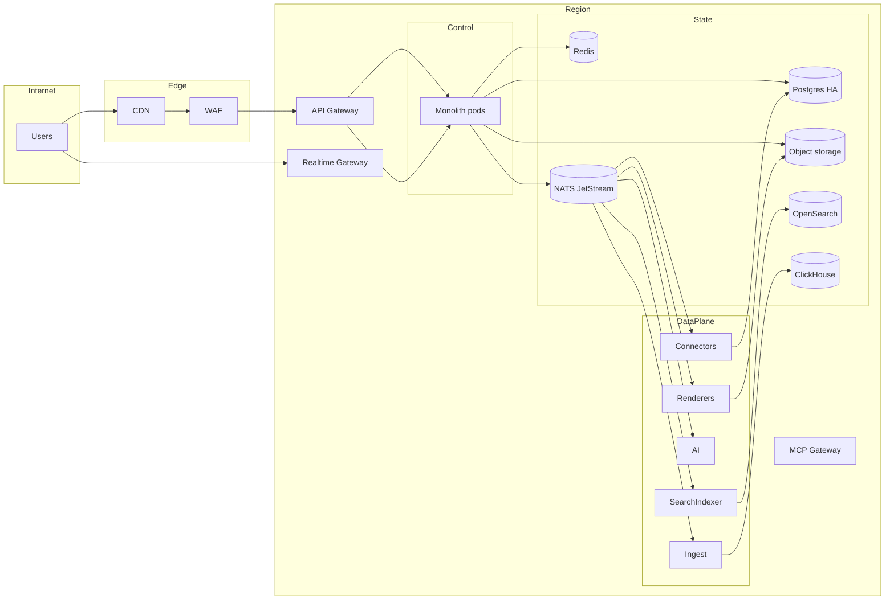
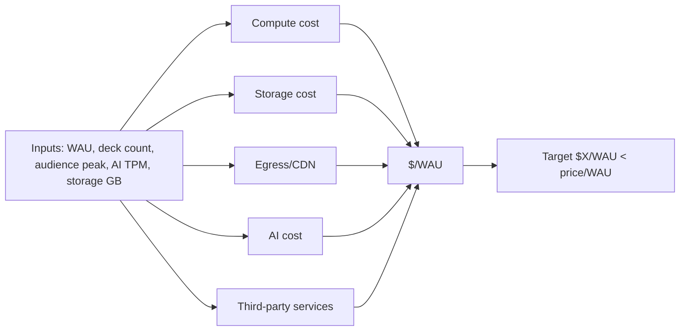

# 08 — Infrastructure & DevOps

> **Purpose:** define environments, deployment topology, CI/CD, autoscaling, multi-region, observability/SLOs, on-call, DR, cost model, local development, dependency mirrors, and runbooks.
> **Cross-references:** `04` (architecture), `05` (data durability), `07` (security), `11` (residency), `12` (BD connectivity).

---

## 8.0 Environments

| Environment | Purpose | Data | Access | Lifespan |
|---|---|---|---|---|
| `local` | Developer sandbox | seeded fake | dev only | per developer |
| `dev` | Shared dev cluster | fake + masked samples | devs | persistent |
| `qa` | Pre-release verification | masked samples | QA + dev | persistent |
| `staging` | Production-like, full integrations | sanitized samples | eng + sales/CS | persistent |
| `canary` | A subset of prod traffic | real | automated gates | continuous |
| `prod` | Customer traffic | real | least privilege | continuous |
| `sandbox` (internal) | Internal exploration | fake | employees | persistent |

Parity rules:
- Same Terraform modules and Helm charts across environments.
- Same migrations pipeline.
- Same observability stack (just lower retention in non-prod).
- Separate KMS keys; same policies.

---

## 8.1 Containerization and Orchestration

- **Container runtime:** containerd.
- **Kubernetes** as the primary orchestration substrate; **Docker Compose** for single-node self-host.
- **GitOps:** ArgoCD; declarative environments; promotion through branches/tags.
- **Namespaces** per tenant class for blast-radius isolation where feasible.
- **Network policies** restrict pod-to-pod traffic.

### 8.1.1 Reference topology

---

## 8.2 Self-Host Baseline

Two reference topologies:

### 8.2.1 Single-node (Docker Compose)

- Postgres, MinIO, NATS, Redis, OpenSearch (optional), workers.
- Designed for SMB / regulated / BD self-host.
- TLS via reverse proxy (Caddy/Nginx + Let's Encrypt).
- Backup cron to local volume + optional S3 target.
- Update via `domio self-host update`.

### 8.2.2 Kubernetes

- Helm chart with sane defaults.
- Ingress: nginx or Traefik; cert-manager.
- Storage: cloud-provider CSI; MinIO inside cluster optional.
- Workers via KEDA or HPA on queue depth.
- Multi-AZ preferred; multi-region for enterprise.

---

## 8.3 CI/CD

### 8.3.1 Build and test

- **Triggers:** PR, push to main, tag.
- **Stages:**
  1. Lint + type check
  2. Unit + property tests
  3. Contract tests (per module)
  4. Integration tests (services + ephemeral DB)
  5. SAST + SCA + secret scan + license check
  6. Build container images (signed)
  7. Publish SBOM
  8. E2E (smoke on staging-equivalent)
  9. Visual regression (Playwright)
  10. A11y (axe + manual)
  11. Performance smoke (k6)
- **Caching:** pnpm cache, Docker layer cache, Turborepo remote cache.

### 8.3.2 Deployment

- **GitOps:** ArgoCD; declarative environments.
- **Promotion:** `dev → qa → staging → canary → prod` via PR to environment branch.
- **Blue/green** for stateless services; **rolling** for stateful.
- **Progressive canary:** 1% → 10% → 50% → 100% with SLO gates.
- **Auto-rollback** on SLO regression (latency, error, saturation).
- **Database migrations** decoupled; pre-deploy in canary + verified before full rollout.

---

## 8.4 Feature Flags

- **Library:** in-house flag service backed by Postgres + cache.
- **Scoping:** tenant, workspace, user, percentage, region.
- **Kill switches** for WebGPU, AI providers, connectors, plugins, novel features.
- **Flag expiry** enforced.
- **Audit log** of flag changes.

---

## 8.5 Autoscaling

| Service | Metric | Min | Max | Notes |
|---|---|---|---|---|
| API gateway | CPU + RPS | 4 | 200 | HPA |
| Control plane | CPU + queue depth | 8 | 400 | HPA |
| Realtime gateway | concurrent connections | 8 | 600 | per-region |
| Connector workers | queue depth | 4 | 200 | KEDA |
| Renderer workers | queue depth + GPU | 2 | 80 | GPU nodes |
| AI workers | TPM + queue | 4 | 200 | KEDA |
| Ingest workers | lag | 4 | 200 | KEDA |
| Search indexer | lag | 2 | 80 | KEDA |
| Audience fan-out | concurrent sessions | 8 | 400 | per session-id |

- **DB connections:** PgBouncer with sane limits per service.
- **Backpressure:** queue depth alarms; degraded mode when overload (see `04` §4.12).

---

## 8.6 Multi-Region

- **Regions:** primary set `ap-south-1` (Bangladesh + South Asia), `us-east-1`, `eu-west-1`, plus APAC extensions as needed.
- **Tenant home region** is configurable; data stays in-region unless transfer policy allows.
- **Realtime:** edge nodes per region; session anchored in presenter region.
- **Read replicas** per region; cross-region only via signed transfer.
- **CDN:** global edge; per-tenant origin allowlist; private origins via signed URLs.
- **Bangladesh local hosting** via partner or own PoP for low-latency BD users (decision pending).

---

## 8.7 Observability

### 8.7.1 Pillars

- **Logs:** structured JSON; tenant/trace correlation; allowlisted fields only.
- **Metrics:** Prometheus; service-level RED metrics.
- **Traces:** OpenTelemetry → Tempo; sampling policy per service.
- **RUM:** browser-side performance; sampled 1% prod, 100% synthetic.
- **Synthetic checks:** 1-minute interval on critical paths (login, present, publish, audience join).
- **Error tracking:** Sentry with PII filters.

### 8.7.2 SLOs

| Service | SLI | Target |
|---|---|---|
| API gateway | availability | 99.95% |
| API gateway | request success rate | ≥ 99.5% |
| API gateway | p95 latency | ≤ 250 ms |
| Control plane | request success | ≥ 99.5% |
| Control plane | p95 latency | ≤ 350 ms |
| Realtime gateway | connection success | ≥ 99.9% |
| Realtime gateway | message p95 | ≤ 120 ms |
| Renderer | job success | ≥ 99% |
| Renderer | p95 job duration | ≤ 30 s |
| AI orchestrator | run success | ≥ 98% |
| AI orchestrator | p95 generate latency | ≤ 12 s |
| Audience channel | join success | ≥ 99% at 10k |
| Audience channel | event p95 | ≤ 500 ms |
| Search | query p95 | ≤ 200 ms |

Error budgets per quarter: 0.05% control plane; 0.1% realtime. Budget burn alerts at 50% and 80%.

### 8.7.3 Alerts

- **Severity Sev1:** customer-facing outage; page on-call immediately.
- **Severity Sev2:** degradation; page within 15 min.
- **Severity Sev3:** risk to SLO; ticket.
- **Severity Sev4:** informational.

Routing: PagerDuty/Opsgenie; chat for Sev3/4.

---

## 8.8 On-Call

- **Rotation:** 1-week shifts; primary + secondary.
- **Compensation:** time-off-in-lieu or pay per policy.
- **Runbooks** for every alert; new alerts require a runbook.
- **Training:** new on-call shadow for 2 weeks; tabletop quarterly.
- **Handoff:** daily standup; documented.

---

## 8.9 Disaster Recovery

| Scenario | RTO | RPO | Strategy |
|---|---|---|---|
| Database primary loss | 1 h | ≤ 5 min | failover to standby with WAL streaming |
| Region outage | 4 h | ≤ 15 min | failover to standby region for stateless; data subject to residency |
| Object storage loss | 1 h | 0 (multi-AZ) | cross-AZ replication; immutable versioning |
| Event bus loss | 30 min | 0 (replay from outbox) | JetStream replay; outbox-driven |
| Build pipeline compromise | 4 h | 0 (signed artifacts) | revert to last signed image; rotate tokens |
| Tenant data corruption | 4 h | ≤ 24 h (PITR) | point-in-time restore + audit |
| Self-host full loss | 8 h | ≤ 24 h (snapshot) | restore from snapshot + WAL |

Drills:
- **Quarterly:** DB failover.
- **Bi-annual:** region failover for staging tenant.
- **Annual:** full DR simulation in staging.

---

## 8.10 Backup Policy

- **Postgres:** continuous WAL streaming + daily snapshot; 30-day retention hot, 1y cold.
- **Object storage:** versioning + lifecycle; cross-region replication for residency.
- **CRDT logs:** 30 days hot.
- **ClickHouse:** monthly snapshots; S3 cold storage.
- **Self-host:** local volume + optional S3-compatible target.
- **Encryption:** separate KMS keys; rotation documented.
- **Restore verification:** automated smoke after restore.

---

## 8.11 Cost Model (methodology)

We model cost at 1k, 10k, 100k, 1M WAU to project ceilings before commitment. Inputs: API calls/s, AI tokens/s, storage GB, realtime connections, render minutes, egress GB.

### 8.11.1 Targets (planning)

| Stage | WAU | $/WAU (target) | Notes |
|---|---|---|---|
| Beta | 10k | ≤ $1.50 | subsidized |
| Growth | 100k | ≤ $1.00 | AI tiering + caching critical |
| Scale | 1M | ≤ $0.60 | heavy caching, regional egress optimization |

### 8.11.2 Major cost levers

- AI cost: caching, prompt compression, model tier per task.
- Egress: CDN for static; signed short-lived URLs for media.
- Storage: tiered retention; aggressive CRDT compaction.
- Realtime: edge nodes + per-tenant connection budgets.
- Self-host customers reduce SaaS compute and egress (priced separately).

---

## 8.12 Local Development

- One command brings up the stack (`pnpm dev:up`).
- Docker Compose profile for control plane + workers.
- Seeded data: tenants, users, decks, sample data sources (mock).
- Hot reload for control plane; webpack/turbo cache shared.
- Mock provider for AI (deterministic).
- **Offline mode:** even with no internet, editor + static rendering works.
- **Connectivity-friendly:** container image pulls via mirror; npm via local registry mirror if needed.

---

## 8.13 Dependency Mirrors

- Internal artifact registry (Harbor/Quay) for self-host customers and for BD low-bandwidth offices.
- npm/pnpm mirror (Verdaccio or JFrog).
- Container image mirror (Harbor replication).
- Mirror availability is part of self-host SLA.

---

## 8.14 Runbooks (catalog)

- API gateway 5xx surge
- Realtime connection spike
- Connector backlog
- AI provider outage / fallback
- Renderer queue saturation
- Postgres replica lag
- NATS JetStream consumer lag
- ClickHouse ingestion lag
- OpenSearch index lag
- Object storage egress spike
- DLP rule false-positive surge
- Residency policy violation (alert from cross-region transfer)
- Audit log tampering (integrity check failure)
- Self-host single-node restore
- Multi-region failover (staging drill)

Each runbook has: trigger conditions, mitigation steps, escalation, comms template, rollback.

---

## 8.15 Decisions Log

| ID | Decision | Rationale | Alternative |
|---|---|---|---|
| D-INFRA-01 | K8s + GitOps (ArgoCD) | Repeatable, auditable | Manual — rejected |
| D-INFRA-02 | Blue/green + progressive canary | Lower risk | Big-bang — rejected |
| D-INFRA-03 | OpenTelemetry everywhere | Vendor-neutral | Vendor-locked — rejected |
| D-INFRA-04 | Self-host single-node Compose is first-class | BD + regulated market | K8s-only — rejected |
| D-INFRA-05 | Edge nodes for realtime in-region | Latency | Single region — rejected |

---

## 8.16 Open Decisions

| ID | Decision | Owner |
|---|---|---|
| OD-INFRA-01 | Primary regions for v1 launch set. | SRE |
| OD-INFRA-02 | Local BD hosting partner (BTCL, local DC, or own). | BD ops + Legal |
| OD-INFRA-03 | Self-host support tiers and SLAs. | Support |
| OD-INFRA-04 | PagerDuty vs Opsgenie. | SRE |
| OD-INFRA-05 | Container base image (distroless vs alpine). | Security + SRE |

---

_End of 08-infrastructure-devops.md._