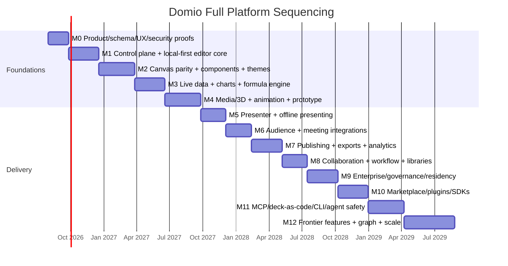
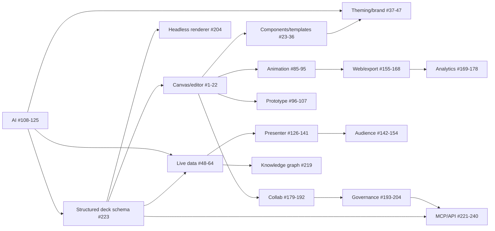

# 10 — Project & Team Planning

> **Purpose:** define a durable team topology, ownership/RACI, architecture decision process, repo ownership, branch/review/commit strategy, documentation governance, a sequenced full-platform roadmap, dependency graph, staffing, vendor evaluation, support, and incident responsibilities.
> **Scope stance:** sequencing is not feature deletion. All feature ranges in `feature-list.md` remain planned; milestones reduce dependencies and risk while preserving the target platform.
> **Cross-references:** `01` (personas, principles, metrics), `02` (FRs and gates), `03` (UX), `04` (modules), `05` (data), `06` (stack), `07` (security), `08` (ops), `09` (tests), feature-domain docs under `docs/`.

---

## 10.0 Team Topology

Domio should be built by durable, capability-aligned teams rather than temporary feature squads. Each team owns a business capability end-to-end: product discovery, implementation, tests, docs, metrics, and on-call. Platform teams provide paved roads; they do not become ticket queues for every other team.

### 10.0.1 Teams

| Team | Owns | Primary feature ranges | Suggested initial staffing |
|---|---|---|---|
| **Canvas & Editor** | renderer, layout, selection, layers, history, keyboard | #1–22 | 1 lead, 4 frontend/graphics, 1 QA |
| **Design Systems & Ecosystem** | components, templates, themes, brand kits, marketplace | #23–47 | 1 PM, 3 frontend, 2 platform, 1 content/QA |
| **Data & Visualization** | connectors, formula engine, charts, scenarios, provenance | #48–64, #215 | 1 lead, 3 backend/data, 2 frontend, 1 QA |
| **Media & Runtime** | 3D, video, animation, embeds, code sandboxes | #65–95 | 1 lead, 3 graphics/media, 1 backend, 1 QA |
| **Prototype & Interaction** | variables, interactions, games, user testing | #96–107 | 2 frontend, 2 backend, 1 QA |
| **AI & Agents** | copilot, AI eval, MCP, CLI, deck-as-code, agent safety | #108–125, #221–240 | 1 lead, 4 applied AI/backend, 2 frontend, 1 eval/security |
| **Presenter & Audience** | presenter, remote, live sessions, audience, meeting integrations | #126–154, #205–214, #217–218 | 1 PM, 3 realtime/backend, 3 frontend, 1 QA |
| **Publishing & Analytics** | web viewer, publishing, exports, analytics, CRM | #155–178, #204 | 1 lead, 3 frontend/backend, 1 data, 1 QA |
| **Collaboration & Workflow** | comments, reviews, branch/merge, libraries, tasks | #179–192 | 1 PM, 3 full-stack, 1 QA |
| **Enterprise & Trust** | SSO/SCIM, DLP, audit, residency, retention, legal hold | #193–204 | 1 PM, 2 backend, 1 security, 1 compliance |
| **Platform Infrastructure** | API gateway, Postgres, event bus, storage, workers, CI/CD | cross-cutting | 1 principal, 4 platform/SRE, 1 DBA |
| **Security & Privacy** | threat model, secure SDLC, incident response | cross-cutting | 1 security lead, 1 appsec, 1 privacy |
| **Design & Research** | design system, UX research, accessibility, localization | cross-cutting | 1 design director, 3 product designers, 1 researcher, 1 content/i18n |
| **Developer Relations** | SDK docs, plugins, marketplace creators, MCP adoption | #200–204, #221–240 | 1 lead, 2 DX engineers, 1 technical writer |
| **Support & Reliability** | support, SRE on-call, customer education | cross-cutting | 1 support lead, 2 support, shared SRE |

### 10.0.2 Durable ownership rules

- Every module has a **primary owner** and a **backup owner**.
- Every critical path has an **on-call owner**.
- Feature-domain docs have an owner; super docs have a cross-functional steward.
- Ownership changes are recorded in `CODEOWNERS` and the ownership registry.

---

## 10.1 Roles

| Role | Accountability |
|---|---|
| Product director | product thesis, sequencing, success metrics |
| Domain PM | requirements, acceptance criteria, customer discovery |
| Principal architect | architecture invariants, ADR process, system seams |
| Tech lead | implementation design, code quality, delivery |
| Product designer | interaction/design decisions, prototypes |
| UX researcher | usability evidence and persona validation |
| Frontend engineer | surface behavior, performance, a11y |
| Graphics engineer | renderer, GPU, scene graph |
| Backend engineer (TS/Node) | control-plane modules in TypeScript/Node, MCP, REST/gRPC, AI orchestration |
| Backend engineer (Go) | realtime gateway, CPU workers, export pipeline, infrastructure services |
| Systems engineer (Rust, optional) | hot-path CPU workers introduced via ADR when profile data justifies |
| Data engineer | connectors, analytics, graph projections |
| Applied AI engineer | model adapters, eval, prompts, confidence |
| ML engineer (Python) | eval harness, dataset prep, ML pipelines (AI/data workers) |
| Security engineer | threat model, secure SDLC, pen tests |
| SRE | production reliability, DR, capacity, on-call |
| DBA/data platform | Postgres, ClickHouse, migrations, backup |
| QA/SDET | automated tests, E2E, load, fixtures |
| Technical writer | API/docs/runbooks, information architecture |
| Localization lead | Bangla and tier-1 locale quality |
| Developer advocate | SDK/MCP/plugin ecosystem |
| Support engineer | customer triage, escalation, self-host support |
| Compliance counsel | PDPA, Cyber Security Ordinance, DPA, contracts |

---

## 10.2 RACI

| Decision / deliverable | Product | Design | Eng lead | Security | SRE | Legal | QA | DX |
|---|---|---|---|---|---|---|---|---|
| Product thesis / scope | A | C | C | C | C | C | I | I |
| FR acceptance criteria | A | C | R | C | I | C | R | I |
| UX flows | C | A/R | C | C | I | I | C | I |
| Schema source of truth | C | C | A/R | C | C | I | C | C |
| Architecture ADR | C | I | A/R | C | C | I | I | C |
| Threat model | I | C | C | A/R | C | C | C | I |
| Residency policy | C | I | R | C | R | A/R | I | I |
| Release gate | A | C | R | R | R | C | R | I |
| Incident comms | I | I | C | C | A/R | A | I | I |
| API/MCP versioning | C | I | A | C | C | I | C | R |
| Marketplace payout | A | I | R | C | I | A | C | R |
| Bangla localization | C | A | R | I | I | C | R | I |

Legend: **R** Responsible, **A** Accountable, **C** Consulted, **I** Informed.

---

## 10.3 Architecture Decision Process

1. Author creates ADR in `/docs/adr/` using template.
2. Affected domain owners comment asynchronously for 2 business days.
3. Architecture Council (principal architect + affected leads + security/SRE) reviews.
4. Decision status: `proposed → accepted/rejected → superseded`.
5. Accepted ADR gets a `DEC-` ID and is linked from relevant super/domain docs.
6. Any data migration or public contract change also requires a rollback plan and compatibility statement.

### ADR template

```markdown
# ADR-YYYY-NNN: <title>

## Context
## Decision
## Alternatives considered
## Consequences
## Security / privacy
## Data migration / rollback
## Verification
## Owners
## Status
```

### Architecture Council cadence

- Weekly scheduled review (45 min).
- Emergency review for Sev1/security decisions within 4 hours.
- Quarterly architecture health review: module cycles, SLOs, cost, dependency drift.

---

## 10.4 Repository, Module, and File Ownership

### 10.4.1 CODEOWNERS boundaries

```text
/apps/editor/          @canvas-team @design-system-team
/packages/canvas/      @canvas-team @graphics-team
/packages/schema/      @platform-team @ai-agents-team
/apps/api/             @platform-team @domain-team
/workers/connectors/   @data-team @security-team
/workers/render/       @media-team @publishing-team
/workers/ai/           @ai-agents-team @security-team
/infrastructure/       @platform-team @sre-team
/docs/feature-domains/ @domain-owners
/docs/super-docs/      @product-director @principal-architect
```

### 10.4.2 Module ownership registry

Each module lists: owner, backup, API contract, event topics, database tables, SLO, runbook, dependency set.

---

## 10.5 Branching, Review, and Commit Strategy

- **Branching:** trunk-based development; short-lived feature branches; no long-lived GitFlow branches.
- **Commits:** Conventional Commits (`feat`, `fix`, `docs`, `test`, `refactor`, `perf`, `chore`); one logical reason per commit; no secrets.
- **PRs:** small enough to review; feature flags enable incomplete work; PR template includes FR IDs, NFR impact, tests, a11y, security, docs.
- **Review:** minimum 1 code owner; 2 for security/data migrations/public API; author responds to all blocking comments.
- **Merge:** squash merge for product code; preserve ADR and migration history; no force-push on protected branches.
- **Release tags:** semantic versioning for packages and API; deploy versions immutable.
- **Backports:** only security and critical production fixes; documented.

### PR checklist

- [ ] FR IDs linked.
- [ ] Acceptance criteria updated.
- [ ] Unit/property/contract/integration/E2E tests.
- [ ] Performance impact.
- [ ] Accessibility and i18n.
- [ ] Threat-model impact.
- [ ] Migration and rollback if schema changes.
- [ ] Domain doc / API docs / runbook updated.
- [ ] Feature flag has owner and expiry.

---

## 10.6 Documentation Governance

- **Super docs** (this package): reviewed quarterly and on strategic architecture change.
- **Feature-domain docs:** owned by domain team; updated with each feature change.
- **ADRs:** immutable; superseded, not overwritten.
- **API docs:** generated from contracts; changelog and deprecation notices required.
- **Runbooks:** updated after every incident or operational change.
- **Release notes:** user-facing (plain language) and engineering-facing (migration/flags).
- **Decision register:** a single index links every decision to the implementing PR and verification evidence.
- **Docs CI:** broken links, missing feature references, stale dates, and unowned docs block release.

---

## 10.7 Full-Platform Milestones (sequenced, no deletion)

Milestones are dependency-driven. The complete scope remains committed.



### M0 — Proofs and contracts

- Lock deck schema v0 and semantic addressing.
- Canvas prototype with 10k nodes; WebGL2/WebGPU benchmark.
- Yjs vs Automerge benchmark.
- Postgres RLS and tenant routing proof.
- UX flows and a11y baseline.
- AI adapter + prompt-injection harness.
- Bangladesh compliance verification kickoff.

### M1 — Foundation

- Identity/tenancy/workspaces/decks/slides/elements.
- Local-first editor: canvas basics, layers, history, autosave, CRDT offline sync (#1–22 core).
- CI/CD and observability baseline.

### M2 — Canvas ecosystem

- Full #1–22 acceptance.
- #23–36 components/templates and #37–47 themes/brand.
- Marketplace catalog skeleton.

### M3 — Data differentiation

- #48–64 live data/charts/scenarios/formula engine.
- Provenance foundations (#215).
- Connector worker isolation and snapshot fallback.

### M4 — Rich interaction

- #65–84 3D/media/maps/embeds.
- #85–95 timeline/animation/export primitives.
- #96–107 prototype interactions.

### M5 — Presenter

- #126–141 presenter, remote, offline, rehearsal, failover.
- Live state event model (#205 foundation).

### M6 — Audience

- #142–154 QR join, polls/Q&A/quizzes, translations, attendance.
- #188 meeting integrations.

### M7 — Distribution and intelligence

- #155–168 web publishing, scroll mode, custom domains, exports.
- #169–178 analytics, CRM, A/B, benchmarks.

### M8 — Workflow

- #179–192 comments, approval, merge requests, assignments, governed slide libraries, integrations.

### M9 — Enterprise trust

- #193–199 SSO/SCIM, DLP, audit, residency, retention, seat analytics.
- #200–204 API, webhooks, plugin runtime, headless renderer GA.

### M10 — Ecosystem

- Marketplace revenue share (#28, #45), creator tools, plugin SDK (#202–203), SDK documentation.

### M11 — Agentic platform

- #221–240 MCP, deck-as-code, CLI, agent permissions/audit/dry-run, agent workflows, lint/simulation/diff.
- Public agent beta and certification.

### M12 — Frontier + scale

- #206–219 living docs, gaze/gesture/voice, two-way slides, inheritance, co-presenting, listener, podcast, haptics, kiosk, knowledge graph.
- Scale, self-host hardening, multi-region active-active where justified.

---

## 10.8 Dependency Graph



---

## 10.9 Staffing Model

### 10.9.1 M0–M2 (foundation)

- 1 product director, 2 PMs.
- 1 principal architect, 2 tech leads.
- 6 frontend/graphics, 5 backend/platform, 2 data, 1 AI, 2 QA/SDET, 1 SRE, 1 security, 3 designers/research, 1 writer.
- Approx. 28 FTE (including leadership/shared).

### 10.9.2 M3–M7 (breadth)

- Add 6–10 engineers across data, realtime, media, publishing.
- Add 2 QA, 1 localization, 1 developer advocate.
- Approx. 42 FTE.

### 10.9.3 M8–M12 (platform/enterprise)

- Add 4 enterprise/security, 3 AI/agents, 2 SRE, 2 support, 2 developer relations, 1 compliance.
- Approx. 56–60 FTE.

### Hiring priorities

1. Graphics/renderer engineer (hardest skill).
2. Distributed systems/realtime engineer.
3. Data connector + OLAP engineer.
4. Applied AI + eval engineer.
5. Security engineer with SaaS/tenant experience.
6. Bangla i18n/accessibility specialist.

---

## 10.10 Vendor Evaluation

| Capability | Build | Buy/managed | Decision criteria |
|---|---|---|---|
| Auth/SSO | core policy | WorkOS/Auth0 | SAML/SCIM, BD data, export, price |
| Realtime | gateway | Ably/Liveblocks | 10k audience, residency, SLA, egress |
| Payments | billing logic | SSLCommerz/ShurjoPay + bKash/Nagad; Stripe Connect | Bangladesh Bank approval, webhooks, payouts |
| AI | orchestration | model providers | data retention, residency, quality, rate limits |
| Email | templates/events | Postmark/SES | deliverability, BD support, DPA |
| Search | query semantics | OpenSearch managed | vector, export, residency |
| Object storage | abstraction | S3/R2/MinIO | egress, locality, portability |
| Observability | OTel + dashboards | Grafana Cloud/Datadog | cost, self-host, PII controls |

Evaluation rubric: 30% functional fit, 20% reliability/SLA, 20% security/compliance, 15% cost at scale, 10% portability, 5% support.

---

## 10.11 Support, Feedback, and Customer Learning

- In-product feedback on every major flow; link to deck/slide/context.
- Design partners per persona and per region (Bangladesh + global).
- Weekly customer advisory review; monthly roadmap synthesis.
- Support tiers: self-serve, standard, enterprise, self-host.
- Feature requests tagged with persona, JTBD, FR ID, revenue impact, and evidence.
- Public changelog for user-facing; private security advisories for vulnerabilities.

---

## 10.12 Incident Responsibilities

| Role | Incident responsibility |
|---|---|
| Incident commander | owns incident timeline and decisions |
| Ops lead | mitigation/deployment/rollback |
| Comms lead | internal/customer updates |
| Security lead | exposure scope, containment, forensics |
| Product lead | user impact and prioritization |
| Scribe | timeline, actions, evidence |
| Legal/privacy | regulator/customer obligations |
| Support lead | ticket triage and customer status |

Every incident results in a postmortem, action items, and a test/runbook update.

---

## 10.13 Risk Register

| ID | Risk | Probability | Impact | Owner | Mitigation |
|---|---|---|---|---|---|
| PRJ-01 | Renderer schedule slips | M | H | Canvas lead | M0 benchmark; hire specialist; fallback renderer |
| PRJ-02 | CRDT scale failure | M | H | Editor lead | shard; benchmark; compact |
| PRJ-03 | Audience 10k not met | L | H | Realtime lead | load weekly; managed fallback |
| PRJ-04 | AI quality insufficient | M | H | AI lead | eval harness; citations; human gates |
| PRJ-05 | PDPA changes | M | H | Legal | quarterly verification; portable architecture |
| PRJ-06 | Marketplace licensing abuse | M | M | Ecosystem | review + takedown + provenance |
| PRJ-07 | BD payment API instability | M | M | Billing | aggregator adapter |
| PRJ-08 | Staffing scarce skills | H | H | People | early hiring + specialist contractors |
| PRJ-09 | Cost exceeds plan | M | H | Finance/SRE | monthly unit-cost review |
| PRJ-10 | Scope creates coordination overload | H | M | Product director | capability teams + dependency graph |

---

## 10.14 Release Governance

- Product council weekly: metrics, milestone gates, customer evidence.
- Architecture council weekly: ADRs and system health.
- Security/privacy review at design, pre-beta, pre-GA, annually.
- Release train every 2 weeks for incremental features; milestone releases after gates.
- No feature can bypass the gates in `02` §2.8 and `09` §9.21.

---

## 10.15 Open Decisions

| ID | Decision | Owner | Deadline |
|---|---|---|---|
| OD-TEAM-01 | Initial team budget / exact headcount. | Founders + Finance | Before hiring |
| OD-TEAM-02 | Whether to hire graphics specialists locally, globally, or both. | Engineering | M0 |
| OD-TEAM-03 | Public marketplace launch vs invited creators first. | Product | M9 |
| OD-TEAM-04 | Self-host enterprise support model (professional services vs productized). | GTM + SRE | M9 |
| OD-TEAM-05 | Formal Architecture Council membership. | CTO/Principal architect | M0 |

---

_End of 10-project-team-planning.md._
