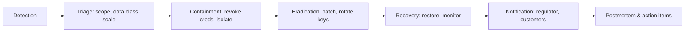

# 11 — Legal & Compliance — Bangladesh Context

> **Status note:** Bangladesh's data-protection regime is newly enacted and being amended. Treat the specifics below as current-but-verify against official sources and Bangladeshi counsel before binding architecture or contract decisions. **This document flags where verification is required.**
> **Cross-references:** `02` (NFR-SEC, NFR-PRIV), `04` (residency), `05` (PII, retention, offboarding), `07` (security/privacy controls), `08` (regional infra), `12` (BD context).

---

## 11.0 Compliance Posture

Domio processes personal data of individuals in Bangladesh (and globally). We operate as a **data fiduciary** under PDPA 2026 for user-driven processing and act as a **data processor** for content-data our customers process via Domio (e.g., when a company uses Domio to present its customers' data). Both roles impose obligations; we design the platform to satisfy the stricter obligations first and adapt per-customer contracts.

### 11.0.1 Principles

1. **Lawful, fair, transparent processing.**
2. **Purpose limitation.**
3. **Data minimization.**
4. **Accuracy.**
5. **Storage limitation.**
6. **Integrity and confidentiality.**
7. **Accountability (records, DPIA, audits).**

### 11.0.2 Verification flags

Every section marked **VERIFY** must be re-validated before each milestone that touches the underlying area. **VERIFY** means: confirm against official BTRC/Ministry of Law/Justice/Bangladesh Bank publications, plus Bangladeshi counsel.

---

## 11.1 Personal Data Protection Act, 2026 (PDPA)

### 11.1.1 Scope and applicability

- PDPA 2026 applies to any entity processing personal data of individuals in Bangladesh, including foreign companies serving BD users.
- Domio is in scope as soon as a BD user uses the platform or BD-resident data is processed.
- **Significant data fiduciary** status may apply at scale; this triggers a designated **Chief Data Officer** and additional record-keeping.

### 11.1.2 Roles

- **Data fiduciary** (controller-equivalent): Domio for personal data of account holders; customers for personal data they process through Domio.
- **Data processor**: Domio when acting on a customer's documented instructions.
- **Sub-processor**: a third-party we engage (e.g., AI provider, payment aggregator). Each must be contracted.

### 11.1.3 Consent

- Voluntary, specific, informed, unambiguous, withdrawable.
- Granular consent per purpose (marketing, analytics, AI training, personalization).
- Consent recorded with timestamp, version, channel.
- Withdrawal mechanism as easy as opt-in.
- Children's data (under 16) requires verifiable parental consent; we set minimum age 16 in v1 and prohibit collection of children without consent.

### 11.1.4 Data subject rights

We support:
- Right to access (subject access request).
- Right to correction.
- Right to erasure (with legal-hold carve-out).
- Right to data portability (export in a structured, commonly used, machine-readable format).
- Right to restriction of processing.
- Right to object to processing (including profiling/marketing).
- Right to withdraw consent without retroactive effect.
- Right to lodge a complaint with the regulator.

DSR workflow is implemented in `04` (DSR service) and `05` (export/offboarding).

### 11.11.5 Breach response

- PDPA-aligned notification: notify the regulator within statutory window (commonly 72 hours for material breaches); notify affected data subjects where there is a high risk to their rights.
- Internal process: incident commander → security → legal/comms → customer.
- Documentation: incident report, decisions, evidence, regulator communications.
- **VERIFY** the current notification timeline and content requirements.

### 11.1.6 Retention

- Retention is purpose-bound; default retention tables in `05`.
- Children: stricter limits.
- Backup/archival data is subject to the same principles and timelines.

### 11.1.7 Cross-border transfer

- Transfers outside Bangladesh require a permitted basis (adequacy, contractual safeguards, consent, etc.).
- We design to enable **regional hosting in Bangladesh** for restricted data and to support SCC-equivalent contracts where transfers occur.
- **VERIFY** the specific permitted bases and required transfer mechanism post-amendment.

### 11.1.8 Significant data fiduciary obligations

If triggered:
- Appoint a Chief Data Officer (resident or designated).
- Annual data protection impact assessment (DPIA).
- Records of processing activities (RoPA).
- Periodic audit and reporting.

We plan for these obligations even if not initially required.

---

## 11.2 Data Localization Requirements

### 11.2.1 Current state (per pre-development-planning-guide §11.2)

- The mandatory **synchronized real-time local copy** applies to **restricted personal data** and **Critical Information Infrastructure (CII)** data.
- General personal data, internal data, and confidential data on foreign clouds are no longer subject to mandatory local mirroring.
- The regulator retains power to order relocation or cessation of cloud infrastructure (domestic or foreign) within 60 days if it finds a breach or "national interest" concern.

### 11.2.2 Implications for Domio

- We must classify customer data correctly (restricted/CII vs general) and design for either case.
- We support a BD-region tenant home with **synchronized local copy** when customer selects that policy or when regulator orders it.
- We avoid deep platform lock-in (proprietary managed services) so a forced migration is not catastrophic.
- The 60-day relocation order power is a real operational risk; we maintain portable data formats and tested migration runbooks.

### 11.2.3 Verification

**VERIFY** before launch:
- Definition of "restricted personal data" tiers and sector mapping.
- Sector-specific CII list (defense, finance, healthcare, telecom, government, etc.).
- Synchronized copy semantics (RPO, write consistency, encryption).
- Order-of-relocation process and notice periods.

---

## 11.3 Cyber Security Ordinance 2025

- Successor to the Digital Security Act 2018 / Cyber Security Act 2023.
- Governs unauthorized access, data breaches, cyber offenses; defines CII and triggers localization obligations where applicable.
- Determines reportable incident criteria and penalties.
- **VERIFY** the reportable categories and timelines before each release.

---

## 11.4 Sector-Specific Regulators

### 11.4.1 Bangladesh Bank (financial services and payments)

- Bangladesh Bank issues data management and cybersecurity guidelines for financial institutions and PSPs/PSOs.
- These are additional to PDPA.
- For Domio's marketplace payouts, banking-related integrations, and any bank-customer data, these guidelines may apply.
- **VERIFY** applicability per integration.

### 11.4.2 BTRC (telecom)

- BTRC has its own data-handling rules for telecom and consumer data; may apply if we integrate with telecom operators or hold telecom user data.
- **VERIFY** applicability.

### 11.4.3 Other regulators

- ICT Division, Ministry of Commerce (e-commerce), NBR (tax/VAT for paid services), and possibly sector regulators depending on customer.
- **VERIFY** applicable overlays.

---

## 11.5 Payment Gateway & Financial Integration

### 11.5.1 Market reality

- ~70%+ of online payments in Bangladesh go through mobile financial services: bKash, Nagad, Rocket, and other MFS providers.
- Cards (Visa, Mastercard) and bank transfers are also relevant.

### 11.5.2 Integration paths

- **Direct integration** with each MFS API.
- **Aggregator** (Bangladesh Bank-approved): SSLCommerz, ShurjoPay, Moneybag, AamarPay — provides one integration covering multiple methods.
- **Aggregator advantage:** faster onboarding, single contract, fewer PCI scopes.
- **Direct advantage:** lower per-transaction cost, deeper feature parity, custom flows.

### 11.5.3 Decision posture

- Default: integrator(s) approved by Bangladesh Bank.
- Direct integrations added as the customer base or margin justifies.
- Marketplace payouts go through approved aggregator for BD creators.

### 11.5.4 Merchant onboarding

- KYC documentation (trade license, NID, bank account).
- For BD: residency, tax registration, and BDT bank account required.
- Cross-check aggregator and Bangladesh Bank approval lists.

### 11.5.5 Compliance

- PCI-DSS where cards are handled.
- AML/CFT obligations on payment flows.
- Fraud monitoring and chargeback handling.
- **VERIFY** applicable AML/CFT guidance.

---

## 11.6 Terms of Service / Privacy Policy / Cookies

### 11.6.1 Terms of Service

- Specify the service, eligibility, acceptable use, IP rights in user content, IP rights in platform, payment terms, termination, liability, indemnity, governing law (BD where BD customers), dispute resolution (BD courts / arbitration), and contact.

### 11.6.2 Privacy Policy

- Reference PDPA explicitly.
- Describe data fiduciary/processor status per context.
- Lawful bases for processing per purpose.
- Categories of data, sources, recipients.
- Cross-border transfer mechanisms.
- Data subject rights and how to exercise them.
- Retention periods.
- Children's data policy.
- Security measures overview.
- Cookies and tracking.
- AI processing disclosures (see §11.9).
- Contact for the data protection officer / Grievance Officer.

### 11.6.3 Cookie/tracking notice

- Categorize cookies (strictly necessary, functional, analytics, marketing).
- Granular consent where required; consent management platform integrated.
- Third-party cookies disclosed; opt-out.

### 11.6.4 Localization

- Translate key legal documents into Bangla for BD users.
- Use plain Bangla; native review.

---

## 11.7 Licensing

### 11.7.1 Dependency licensing

- Check every dependency license (MIT/Apache-2/BSD/MPL/LGPL allowed by default; AGPL requires legal review and runtime isolation; commercial licenses are permitted but tracked).
- SBOM generated and archived per release.
- License conflicts flagged in CI.

### 11.7.2 User-supplied assets

- Users represent they have rights to user-supplied assets.
- We provide a license-management UX: tag assets with their source/license; warn when usage conflicts with license terms.
- A "license registry" surfaces per-asset license and obligations.

### 11.7.3 Marketplace IP

- Creator contract: ownership, license to platform, revenue share, takedown.
- DMCA-style takedown workflow with counter-notice.
- Prohibited content: hate speech, defamation, illegal content, unauthorized personal data.

### 11.7.4 Fonts

- Font license metadata required for any uploaded font.
- Web-font embedding compliance tracked.
- Fallback fonts configured when license missing.

### 11.7.5 Stock media

- License tracking per asset; expired licenses flag the asset.
- Audit logs of access.

---

## 11.8 AI Disclosures

### 11.8.1 Disclosures to users

- When AI is used in a workflow, the user is informed (visible badge and disclosure in docs).
- AI-generated content is marked (e.g., "AI-assisted" on slide footers where relevant).
- Confidence/uncertainty flags (#238) shown for AI-derived claims.

### 11.8.2 Data inputs and outputs

- We do not train on customer-deck content without explicit consent (per workspace).
- AI providers are sub-processors; contracts require data-handling controls aligned to PDPA.
- Customers can disable AI features per workspace.

### 11.8.3 Bias and accessibility

- AI features tested for accessibility (e.g., alt-text quality, translation preservation).
- Bias evaluation across locales.
- AI-generated numeric claims must tie back to data with citations.

### 11.8.4 Voice and video processing

- Voice-to-deck (#115), rehearsal coach (#117), AI meeting listener (#214), live translation captions (#153) process audio/video.
- Opt-in flows; clear retention; on-device processing where feasible.
- Audio never used for model training unless explicit consent.

### 11.8.5 Eye-tracking / biometric data

- Gaze-guided highlighting (#207) processes webcam frames locally; if cloud processing ever added, requires explicit consent and biometric-data classification.
- **VERIFY** biometric-data specific rules under PDPA/Cyber Security Ordinance.

### 11.8.6 Generative content provenance

- Provenance chips (#215) for any stat tying back to a source.
- Watermarking for AI-generated media (C2PA-style where feasible).
- Audit log distinguishes human from AI edits (#227).

---

## 11.9 Data Breach Response (detailed)

- DPO coordinates with security and legal.
- Regulator: notify within statutory window; affected customers where high risk.
- Evidence preserved for legal proceedings; chain of custody recorded.
- Communications templates pre-approved by legal.
- Tabletop drills quarterly.

---

## 11.10 Legal Hold & Retention

- A legal hold freezes data deletion for a target (deck/workspace/tenant).
- Admins initiate and release holds; all actions audited.
- Holds override soft delete and retention policies until released.
- Visualized in admin; status reported on demand.

---

## 11.11 Data Processing Agreement (DPA) and Vendor Contracts

- DPA template references PDPA obligations.
- Sub-processor list maintained publicly; 30-day notice for additions.
- Customer right to object to new sub-processors.
- Vendor risk assessment per tier (high/medium/low).
- DPA addenda for cross-border transfers.

---

## 11.12 Audit & Evidence

- Internal audit annual; external audit per regulatory or customer need.
- Audit artifacts: RoPA, DPIA, security policies, access logs, breach history, training records.
- Customer-facing audit pack for enterprise tier.

---

## 11.13 Accessibility (Legal)

- Bangladesh has accessibility commitments via the Rights and Protection of Persons with Disabilities Act 2013 and global CRPD alignment.
- Our product conforms to WCAG 2.2 AA (NFR-A11Y).
- Accessibility statement published; contact for accessibility issues.
- Procurement clauses include accessibility in vendor contracts.

---

## 11.14 Export Controls

- We may serve customers in jurisdictions subject to export controls.
- Items (encryption, certain features) tracked against applicable control lists.
- Customer screening where required (sanctions lists).
- **VERIFY** applicable export control regime.

---

## 11.15 Tax, E-commerce, Local Registration

- BD VAT/turnover obligations for digital services: **VERIFY** current thresholds and applicability to SaaS.
- Local entity registration where required for selling to BD enterprise/government.
- Marketplace facilitator obligations: tax collection on sales where required.

---

## 11.16 Compliance Roadmap

| Phase | Activity |
|---|---|
| Pre-M0 | Counsel engaged; baseline PDPA review; data map drafted |
| M0–M2 | Consent flows; DSR; breach runbook; data classification |
| M3–M5 | Sub-processor list; DPIA for live data; BD-region proof |
| M6–M8 | RoPA finalized; CII assessment; audit pack v1 |
| M9–M10 | Annual DPIA; significant fiduciary readiness; cross-border DPA |
| M11–M12 | External audit; certifications (ISO 27001/SOC 2) on roadmap |

---

## 11.17 Decisions Log

| ID | Decision | Rationale | Alternative |
|---|---|---|---|
| D-LEG-01 | Treat Domio as data fiduciary for account-holder data; data processor for customer content | Aligned with PDPA | Single role — rejected |
| D-LEG-02 | BD-region tenant home available from M3 | Localization agility | SaaS-only — rejected |
| D-LEG-03 | Sub-processor changes notified 30 days | Customer trust | Implicit — rejected |
| D-LEG-04 | Default to PCI-DSS-via-aggregator for BD payments | Faster, lower risk | Direct integration at launch — rejected |
| D-LEG-05 | AI training opt-out is default | Privacy posture | Opt-in — rejected |
| D-LEG-06 | Children's minimum age 16 | Conservative under PDPA | Lower — rejected |
| D-LEG-07 | AI features disclosed with badges and footer | Transparency | Hidden — rejected |
| D-LEG-08 | Marketplace DMCA-style takedown with counter-notice | Standard IP remedy | Custom — rejected |

---

## 11.18 Open Decisions

| ID | Decision | Owner |
|---|---|---|
| OD-LEG-01 | Engagement of Bangladeshi counsel and counsel firm. | Founders |
| OD-LEG-02 | Whether to establish a local BD entity before commercial launch. | Finance + Legal |
| OD-LEG-03 | Significant fiduciary assessment and threshold analysis. | DPO + Legal |
| OD-LEG-04 | Final list of approved payment aggregators. | BD ops + Legal |
| OD-LEG-05 | Final residency policy defaults per tenant tier. | Product + DPO |
| OD-LEG-06 | AI-on-device vs cloud-by-default for webcam features. | Privacy + AI |

---

## 11.19 Verification Checklist (run before each milestone that touches the area)

- [ ] PDPA latest version reviewed.
- [ ] Cyber Security Ordinance latest reviewed.
- [ ] CII and restricted-data definitions verified.
- [ ] Bangladesh Bank/BTRC overlays verified.
- [ ] Sub-processor list current.
- [ ] DPIA updated.
- [ ] Breach notification timeline confirmed.
- [ ] Cross-border transfer basis confirmed.
- [ ] Children's data limits confirmed.
- [ ] Cookie/tracking rules confirmed.
- [ ] AI disclosures current.
- [ ] Audit pack refreshed.

---

_End of 11-legal-compliance-bangladesh.md._