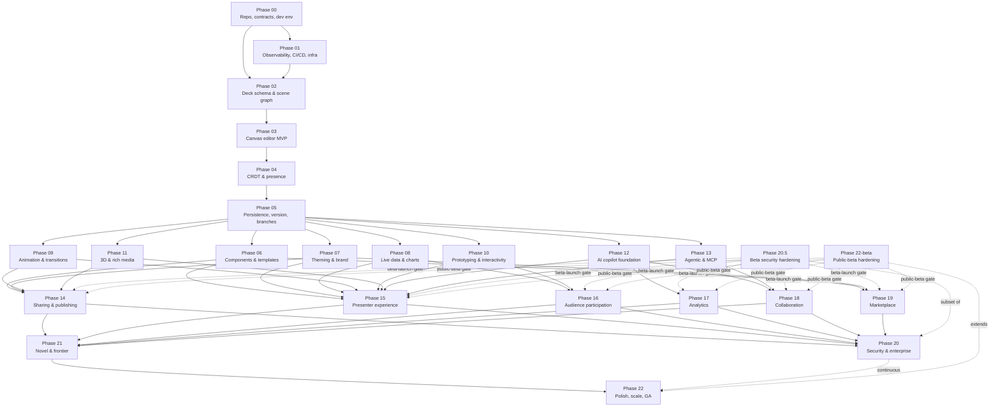
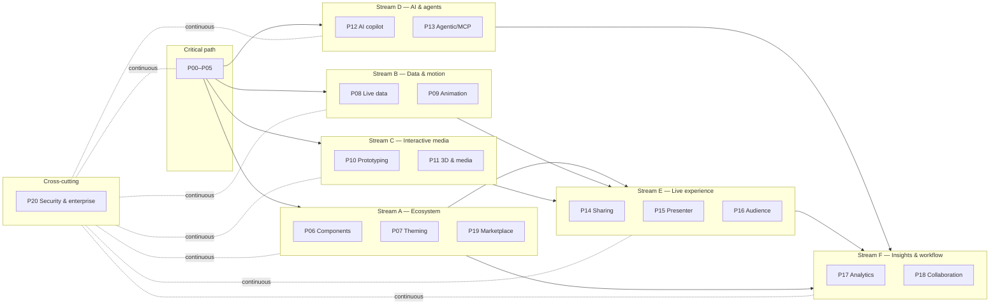

# Phase Graph — Dependency Visualization

> **Purpose:** single-page view of all 23 phases and their dependencies. Use this to identify critical path, parallel workstreams, and bottlenecks at a glance.

## High-level dependency graph



## Critical path

```
P00 → P01 → P02 → P03 → P04 → P05 → P14 → P20 → P21 → P22
```

The critical path is ~10 phases long. Every other phase hangs off this spine as a parallel branch.

## Parallel stream map

After phase 05 ships, the work splits into six parallel streams plus the cross-cutting security/enterprise track:



## Cross-phase contract dependencies

Most phases share contracts defined in earlier phases. The minimum contract surface each phase must respect:

| Phase | Consumes contracts from | Produces contracts consumed by |
|---|---|---|
| 00 | (none) | `contracts/proto/domio/v1/common.proto`, `contracts/openapi/v1/health.yaml`, repo conventions |
| 01 | 00 | CI/CD pipeline, telemetry SDK, infra Terraform modules, container images |
| 02 | 00, 01 | `contracts/schema/deck.schema.json`, `contracts/schema/scene-graph.schema.json`, `packages/schema` |
| 03 | 02 | canvas packages, scene-graph render pipeline |
| 04 | 03 | CRDT protocol, presence channel |
| 05 | 03, 04 | versioning events, branch/merge API |
| 06 | 05 | component prop schema, marketplace listing events |
| 07 | 05 | design token schema, theme API, brand extraction events |
| 08 | 05 | data source adapter interface, query gateway, snapshot API |
| 09 | 05 | timeline schema, animation preset library |
| 10 | 05 | variable store, interaction schema, deep-link state codec |
| 11 | 05 | model asset API, render/embed API |
| 12 | 05 | AI job/run API, citation schema |
| 13 | 05, 12 | MCP tool surface, deck-as-code YAML schema, agent audit events |
| 14 | 06, 07, 11 | share-link API, export-job API |
| 15 | 06, 07, 08, 09, 10, 11, 13 | presenter session API, stage signaling, recap API |
| 16 | 15 | audience session API, poll/Q&A APIs |
| 17 | 14, 15, 16 | analytics event schema, dashboard query API |
| 18 | 05, 13 | comment/approval/MR APIs |
| 19 | 06, 07, 20 | marketplace billing & payout events |
| 20 | (all) | governance, DLP, audit, residency APIs |
| 20.5 | 00, 01, 03, 05 | policy-engine API, audit-event API, dlp-warn API, rate-limit middleware; gates public beta |
| 21 | (most) | novel state timeline, gaze/voice consent APIs, knowledge graph API |
| 22 | (all) | (closes gaps) |

## Bottleneck watch

The most likely bottlenecks:

- **Phase 02 (deck schema).** Everything depends on it. If the schema is wrong, every later phase re-plays its data migration. Mitigate with a schema review board and an internal "schema freeze" before phase 03 starts.
- **Phase 04 (CRDT).** Real-time collab is the hardest technical milestone and blocks parallel streams that need live presence (#142 audience, #126 presenter). Mitigate by de-risking with a spike in phase 00 or 02.
- **Phase 14 (sharing).** Many streams converge here. The publishing pipeline is also where revenue, compliance, and CDN meet. Mitigate by limiting the phase 14 scope to "minimum publishable deck" and deferring polish.
- **Phase 20 (security & enterprise).** This runs continuously, but enterprise pilots cannot start without it. Mitigate by setting an "enterprise-ready" gate earlier than "GA".
- **Phase 20.5 (beta security hardening).** This is the beta-launch cut of P20 and must complete before public signup opens. It is a subset of P20's application-security work; the rest (SSO/SCIM, residency, DLP hard-blocks, audit hash chain, etc.) is deferred to full P20 after product-market fit.

## Critical-path minimization

If the team must ship something demonstrable faster:

- **Minimum Demo 1 (end of P03):** single-user editor with one slide, autosave, no collab.
- **Minimum Demo 2 (end of P05):** multi-user collab with version history, no AI, no data.
- **Minimum Demo 3 (end of P14 + P15):** publish a deck, present it with phone remote. This is the smallest "design partner" deliverable.
- **Minimum Demo 4 (end of P22):** GA.

The phases are organized so a small team (3–5 engineers) can reach Demo 1 inside one quarter, Demo 2 inside two quarters, Demo 3 inside three quarters, and GA inside ~1.5–2 years.
